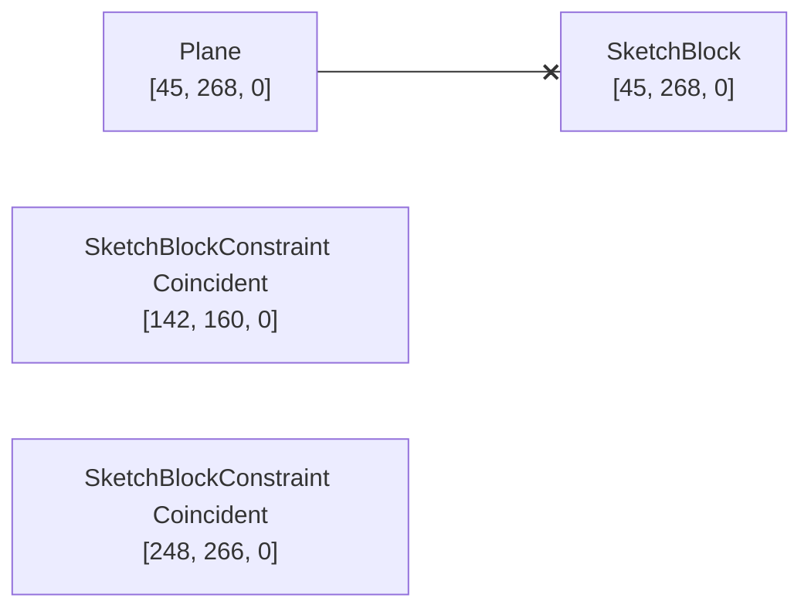

```mermaid
flowchart LR
  1["Plane<br>[45, 268, 0]"]
    %% [ProgramBodyItem { index: 0 }, VariableDeclarationDeclaration, VariableDeclarationInit]
  2["SketchBlock<br>[45, 268, 0]"]
    %% [ProgramBodyItem { index: 0 }, VariableDeclarationDeclaration, VariableDeclarationInit]
  3["SketchBlockConstraint Coincident<br>[142, 160, 0]"]
    %% [ProgramBodyItem { index: 0 }, VariableDeclarationDeclaration, VariableDeclarationInit, CallKwBlock, BlockItem { index: 2 }, ExpressionStatementExpr]
  4["SketchBlockConstraint Coincident<br>[248, 266, 0]"]
    %% [ProgramBodyItem { index: 0 }, VariableDeclarationDeclaration, VariableDeclarationInit, CallKwBlock, BlockItem { index: 5 }, ExpressionStatementExpr]
  1 <--x 2
```
