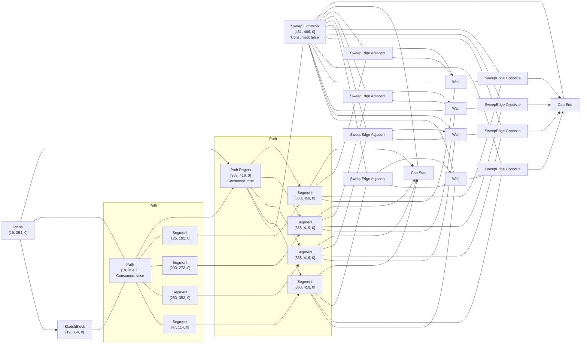

```mermaid
flowchart LR
  subgraph path4 [Path]
    4["Path<br>[19, 354, 0]<br>Consumed: false"]
      %% [ProgramBodyItem { index: 1 }, VariableDeclarationDeclaration, VariableDeclarationInit]
    13["Segment<br>[47, 114, 0]"]
      %% [ProgramBodyItem { index: 1 }, VariableDeclarationDeclaration, VariableDeclarationInit, SketchBlockBody, SketchBlockBodyItem { index: 0 }, VariableDeclarationDeclaration, VariableDeclarationInit]
    6["Segment<br>[125, 192, 0]"]
      %% [ProgramBodyItem { index: 1 }, VariableDeclarationDeclaration, VariableDeclarationInit, SketchBlockBody, SketchBlockBodyItem { index: 1 }, VariableDeclarationDeclaration, VariableDeclarationInit]
    7["Segment<br>[203, 272, 0]"]
      %% [ProgramBodyItem { index: 1 }, VariableDeclarationDeclaration, VariableDeclarationInit, SketchBlockBody, SketchBlockBodyItem { index: 2 }, VariableDeclarationDeclaration, VariableDeclarationInit]
    8["Segment<br>[283, 352, 0]"]
      %% [ProgramBodyItem { index: 1 }, VariableDeclarationDeclaration, VariableDeclarationInit, SketchBlockBody, SketchBlockBodyItem { index: 3 }, VariableDeclarationDeclaration, VariableDeclarationInit]
  end
  subgraph path3 [Path]
    3["Path Region<br>[368, 416, 0]<br>Consumed: true"]
      %% [ProgramBodyItem { index: 2 }, VariableDeclarationDeclaration, VariableDeclarationInit]
    12["Segment<br>[368, 416, 0]"]
      %% [ProgramBodyItem { index: 2 }, VariableDeclarationDeclaration, VariableDeclarationInit]
    9["Segment<br>[368, 416, 0]"]
      %% [ProgramBodyItem { index: 2 }, VariableDeclarationDeclaration, VariableDeclarationInit]
    10["Segment<br>[368, 416, 0]"]
      %% [ProgramBodyItem { index: 2 }, VariableDeclarationDeclaration, VariableDeclarationInit]
    11["Segment<br>[368, 416, 0]"]
      %% [ProgramBodyItem { index: 2 }, VariableDeclarationDeclaration, VariableDeclarationInit]
  end
  5["Plane<br>[19, 354, 0]"]
    %% [ProgramBodyItem { index: 1 }, VariableDeclarationDeclaration, VariableDeclarationInit]
  15["Sweep Extrusion<br>[431, 466, 0]<br>Consumed: false"]
    %% [ProgramBodyItem { index: 3 }, VariableDeclarationDeclaration, VariableDeclarationInit]
  24[Wall]
    %% face_code_ref=Missing NodePath
  25[Wall]
    %% face_code_ref=Missing NodePath
  26[Wall]
    %% face_code_ref=Missing NodePath
  27[Wall]
    %% face_code_ref=Missing NodePath
  2["Cap Start"]
    %% face_code_ref=Missing NodePath
  1["Cap End"]
    %% face_code_ref=Missing NodePath
  20["SweepEdge Opposite"]
  16["SweepEdge Adjacent"]
  21["SweepEdge Opposite"]
  17["SweepEdge Adjacent"]
  22["SweepEdge Opposite"]
  18["SweepEdge Adjacent"]
  23["SweepEdge Opposite"]
  19["SweepEdge Adjacent"]
  14["SketchBlock<br>[19, 354, 0]"]
    %% [ProgramBodyItem { index: 1 }, VariableDeclarationDeclaration, VariableDeclarationInit]
  15 --- 1
  20 <--x 1
  21 <--x 1
  22 <--x 1
  23 <--x 1
  9 <--x 2
  10 <--x 2
  11 <--x 2
  12 <--x 2
  15 --- 2
  4 x--> 3
  5 x--> 3
  3 <--x 9
  3 <--x 10
  3 <--x 11
  3 <--x 12
  3 ---- 15
  5 --- 4
  4 --- 6
  4 --- 7
  4 --- 8
  4 --- 13
  14 --- 4
  5 <--x 14
  6 <--x 9
  7 <--x 10
  8 <--x 11
  9 --- 16
  9 --- 20
  9 --- 24
  10 --- 17
  10 --- 21
  10 --- 25
  11 --- 18
  11 --- 22
  11 --- 26
  13 x--> 12
  12 --- 19
  12 --- 23
  12 --- 27
  15 --- 16
  15 --- 17
  15 --- 18
  15 --- 19
  15 --- 20
  15 --- 21
  15 --- 22
  15 --- 23
  15 --- 24
  15 --- 25
  15 --- 26
  15 --- 27
  24 --- 16
  16 x--> 24
  25 --- 17
  17 x--> 25
  26 --- 18
  18 x--> 26
  27 --- 19
  19 x--> 27
  24 --- 20
  25 --- 21
  26 --- 22
  27 --- 23
```
