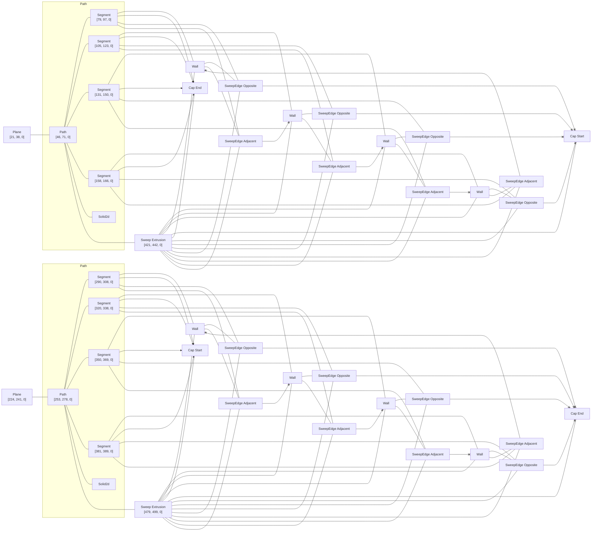

```mermaid
flowchart LR
  subgraph path3 [Path]
    3["Path<br>[46, 71, 0]"]
      %% [ProgramBodyItem { index: 0 }, VariableDeclarationDeclaration, VariableDeclarationInit, FunctionExpressionBody, FunctionExpressionBodyItem { index: 0 }, ReturnStatementArg, PipeBodyItem { index: 1 }]
    5["Segment<br>[79, 97, 0]"]
      %% [ProgramBodyItem { index: 0 }, VariableDeclarationDeclaration, VariableDeclarationInit, FunctionExpressionBody, FunctionExpressionBodyItem { index: 0 }, ReturnStatementArg, PipeBodyItem { index: 2 }]
    6["Segment<br>[105, 123, 0]"]
      %% [ProgramBodyItem { index: 0 }, VariableDeclarationDeclaration, VariableDeclarationInit, FunctionExpressionBody, FunctionExpressionBodyItem { index: 0 }, ReturnStatementArg, PipeBodyItem { index: 3 }]
    7["Segment<br>[131, 150, 0]"]
      %% [ProgramBodyItem { index: 0 }, VariableDeclarationDeclaration, VariableDeclarationInit, FunctionExpressionBody, FunctionExpressionBodyItem { index: 0 }, ReturnStatementArg, PipeBodyItem { index: 4 }]
    8["Segment<br>[158, 166, 0]"]
      %% [ProgramBodyItem { index: 0 }, VariableDeclarationDeclaration, VariableDeclarationInit, FunctionExpressionBody, FunctionExpressionBodyItem { index: 0 }, ReturnStatementArg, PipeBodyItem { index: 5 }]
    13[Solid2d]
  end
  subgraph path4 [Path]
    4["Path<br>[253, 278, 0]"]
      %% [ProgramBodyItem { index: 1 }, VariableDeclarationDeclaration, VariableDeclarationInit, FunctionExpressionBody, FunctionExpressionBodyItem { index: 0 }, ReturnStatementArg, ObjectProperty { index: 0 }, ObjectPropertyValue, ObjectProperty { index: 0 }, ObjectPropertyValue, PipeBodyItem { index: 1 }]
    9["Segment<br>[290, 308, 0]"]
      %% [ProgramBodyItem { index: 1 }, VariableDeclarationDeclaration, VariableDeclarationInit, FunctionExpressionBody, FunctionExpressionBodyItem { index: 0 }, ReturnStatementArg, ObjectProperty { index: 0 }, ObjectPropertyValue, ObjectProperty { index: 0 }, ObjectPropertyValue, PipeBodyItem { index: 2 }]
    10["Segment<br>[320, 338, 0]"]
      %% [ProgramBodyItem { index: 1 }, VariableDeclarationDeclaration, VariableDeclarationInit, FunctionExpressionBody, FunctionExpressionBodyItem { index: 0 }, ReturnStatementArg, ObjectProperty { index: 0 }, ObjectPropertyValue, ObjectProperty { index: 0 }, ObjectPropertyValue, PipeBodyItem { index: 3 }]
    11["Segment<br>[350, 369, 0]"]
      %% [ProgramBodyItem { index: 1 }, VariableDeclarationDeclaration, VariableDeclarationInit, FunctionExpressionBody, FunctionExpressionBodyItem { index: 0 }, ReturnStatementArg, ObjectProperty { index: 0 }, ObjectPropertyValue, ObjectProperty { index: 0 }, ObjectPropertyValue, PipeBodyItem { index: 4 }]
    12["Segment<br>[381, 389, 0]"]
      %% [ProgramBodyItem { index: 1 }, VariableDeclarationDeclaration, VariableDeclarationInit, FunctionExpressionBody, FunctionExpressionBodyItem { index: 0 }, ReturnStatementArg, ObjectProperty { index: 0 }, ObjectPropertyValue, ObjectProperty { index: 0 }, ObjectPropertyValue, PipeBodyItem { index: 5 }]
    14[Solid2d]
  end
  1["Plane<br>[21, 38, 0]"]
    %% [ProgramBodyItem { index: 0 }, VariableDeclarationDeclaration, VariableDeclarationInit, FunctionExpressionBody, FunctionExpressionBodyItem { index: 0 }, ReturnStatementArg, PipeBodyItem { index: 0 }]
  2["Plane<br>[224, 241, 0]"]
    %% [ProgramBodyItem { index: 1 }, VariableDeclarationDeclaration, VariableDeclarationInit, FunctionExpressionBody, FunctionExpressionBodyItem { index: 0 }, ReturnStatementArg, ObjectProperty { index: 0 }, ObjectPropertyValue, ObjectProperty { index: 0 }, ObjectPropertyValue, PipeBodyItem { index: 0 }]
  15["Sweep Extrusion<br>[421, 442, 0]"]
    %% [ProgramBodyItem { index: 3 }, ExpressionStatementExpr, PipeBodyItem { index: 1 }]
  16["Sweep Extrusion<br>[479, 499, 0]"]
    %% [ProgramBodyItem { index: 5 }, ExpressionStatementExpr, PipeBodyItem { index: 1 }]
  17[Wall]
  18[Wall]
  19[Wall]
  20[Wall]
  21[Wall]
  22[Wall]
  23[Wall]
  24[Wall]
  25["Cap Start"]
  26["Cap Start"]
  27["Cap End"]
  28["Cap End"]
  29["SweepEdge Opposite"]
  30["SweepEdge Opposite"]
  31["SweepEdge Opposite"]
  32["SweepEdge Opposite"]
  33["SweepEdge Opposite"]
  34["SweepEdge Opposite"]
  35["SweepEdge Opposite"]
  36["SweepEdge Opposite"]
  37["SweepEdge Adjacent"]
  38["SweepEdge Adjacent"]
  39["SweepEdge Adjacent"]
  40["SweepEdge Adjacent"]
  41["SweepEdge Adjacent"]
  42["SweepEdge Adjacent"]
  43["SweepEdge Adjacent"]
  44["SweepEdge Adjacent"]
  1 --- 3
  2 --- 4
  3 --- 5
  3 --- 6
  3 --- 7
  3 --- 8
  3 --- 13
  3 ---- 15
  4 --- 9
  4 --- 10
  4 --- 11
  4 --- 12
  4 --- 14
  4 ---- 16
  5 --- 20
  5 x--> 28
  5 --- 32
  5 --- 40
  6 --- 18
  6 x--> 28
  6 --- 31
  6 --- 39
  7 --- 17
  7 x--> 28
  7 --- 30
  7 --- 38
  8 --- 19
  8 x--> 28
  8 --- 29
  8 --- 37
  9 --- 23
  9 x--> 25
  9 --- 36
  9 --- 44
  10 --- 22
  10 x--> 25
  10 --- 35
  10 --- 43
  11 --- 24
  11 x--> 25
  11 --- 34
  11 --- 42
  12 --- 21
  12 x--> 25
  12 --- 33
  12 --- 41
  15 --- 17
  15 --- 18
  15 --- 19
  15 --- 20
  15 --- 26
  15 --- 28
  15 --- 29
  15 --- 30
  15 --- 31
  15 --- 32
  15 --- 37
  15 --- 38
  15 --- 39
  15 --- 40
  16 --- 21
  16 --- 22
  16 --- 23
  16 --- 24
  16 --- 25
  16 --- 27
  16 --- 33
  16 --- 34
  16 --- 35
  16 --- 36
  16 --- 41
  16 --- 42
  16 --- 43
  16 --- 44
  17 --- 30
  17 --- 38
  39 <--x 17
  18 --- 31
  18 --- 39
  40 <--x 18
  19 --- 29
  19 --- 37
  38 <--x 19
  20 --- 32
  37 <--x 20
  20 --- 40
  21 --- 33
  21 --- 41
  42 <--x 21
  22 --- 35
  22 --- 43
  44 <--x 22
  23 --- 36
  41 <--x 23
  23 --- 44
  24 --- 34
  24 --- 42
  43 <--x 24
  29 <--x 26
  30 <--x 26
  31 <--x 26
  32 <--x 26
  33 <--x 27
  34 <--x 27
  35 <--x 27
  36 <--x 27
```
