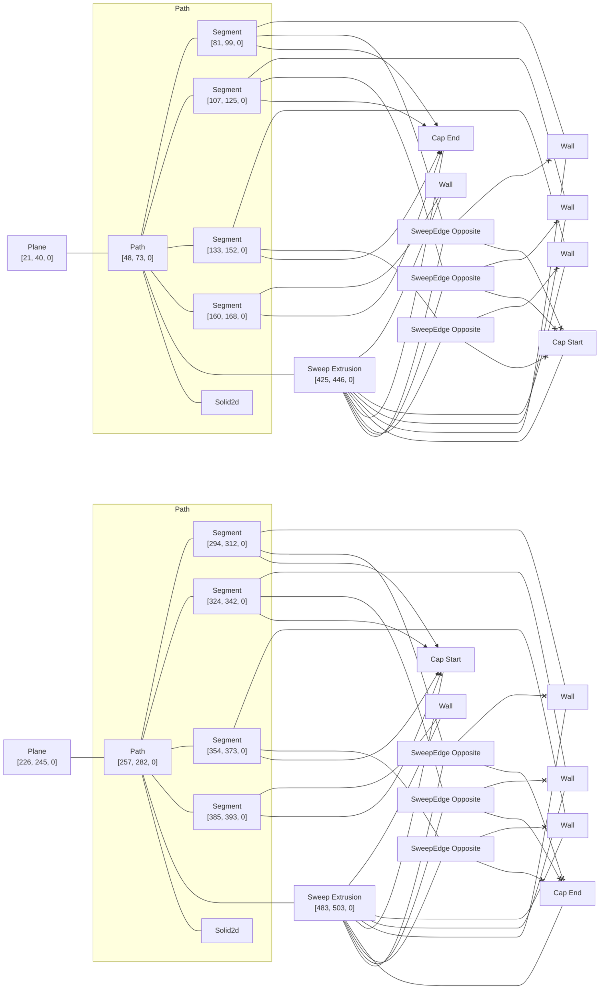

```mermaid
flowchart LR
  subgraph path2 [Path]
    2["Path<br>[48, 73, 0]"]
    3["Segment<br>[81, 99, 0]"]
    4["Segment<br>[107, 125, 0]"]
    5["Segment<br>[133, 152, 0]"]
    6["Segment<br>[160, 168, 0]"]
    7[Solid2d]
  end
  subgraph path19 [Path]
    19["Path<br>[257, 282, 0]"]
    20["Segment<br>[294, 312, 0]"]
    21["Segment<br>[324, 342, 0]"]
    22["Segment<br>[354, 373, 0]"]
    23["Segment<br>[385, 393, 0]"]
    24[Solid2d]
  end
  1["Plane<br>[21, 40, 0]"]
  8["Sweep Extrusion<br>[425, 446, 0]"]
  9[Wall]
  10[Wall]
  11[Wall]
  12[Wall]
  13["Cap Start"]
  14["Cap End"]
  15["SweepEdge Opposite"]
  16["SweepEdge Opposite"]
  17["SweepEdge Opposite"]
  18["Plane<br>[226, 245, 0]"]
  25["Sweep Extrusion<br>[483, 503, 0]"]
  26[Wall]
  27[Wall]
  28[Wall]
  29[Wall]
  30["Cap Start"]
  31["Cap End"]
  32["SweepEdge Opposite"]
  33["SweepEdge Opposite"]
  34["SweepEdge Opposite"]
  1 --- 2
  2 --- 3
  2 --- 4
  2 --- 5
  2 --- 6
  2 ---- 8
  2 --- 7
  3 --- 12
  3 --- 17
  3 x--> 14
  4 --- 11
  4 --- 16
  4 x--> 14
  5 --- 10
  5 --- 15
  5 x--> 14
  6 --- 9
  6 x--> 14
  8 --- 9
  8 --- 10
  8 --- 11
  8 --- 12
  8 --- 13
  8 --- 14
  8 --- 15
  8 --- 16
  8 --- 17
  15 <--x 10
  15 <--x 13
  16 <--x 11
  16 <--x 13
  17 <--x 12
  17 <--x 13
  18 --- 19
  19 --- 20
  19 --- 21
  19 --- 22
  19 --- 23
  19 ---- 25
  19 --- 24
  20 --- 29
  20 --- 34
  20 x--> 30
  21 --- 28
  21 --- 33
  21 x--> 30
  22 --- 27
  22 --- 32
  22 x--> 30
  23 --- 26
  23 x--> 30
  25 --- 26
  25 --- 27
  25 --- 28
  25 --- 29
  25 --- 30
  25 --- 31
  25 --- 32
  25 --- 33
  25 --- 34
  32 <--x 27
  32 <--x 31
  33 <--x 28
  33 <--x 31
  34 <--x 29
  34 <--x 31
```
