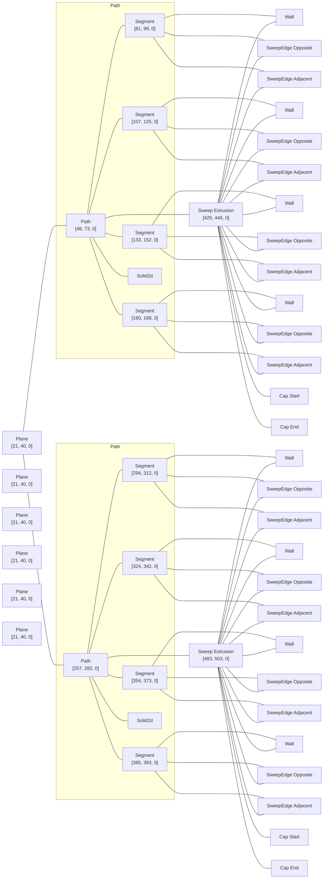

```mermaid
flowchart LR
  subgraph path7 [Path]
    7["Path<br>[48, 73, 0]"]
    8["Segment<br>[81, 99, 0]"]
    9["Segment<br>[107, 125, 0]"]
    10["Segment<br>[133, 152, 0]"]
    11["Segment<br>[160, 168, 0]"]
    12[Solid2d]
  end
  subgraph path28 [Path]
    28["Path<br>[257, 282, 0]"]
    29["Segment<br>[294, 312, 0]"]
    30["Segment<br>[324, 342, 0]"]
    31["Segment<br>[354, 373, 0]"]
    32["Segment<br>[385, 393, 0]"]
    33[Solid2d]
  end
  1["Plane<br>[21, 40, 0]"]
  2["Plane<br>[21, 40, 0]"]
  3["Plane<br>[21, 40, 0]"]
  4["Plane<br>[21, 40, 0]"]
  5["Plane<br>[21, 40, 0]"]
  6["Plane<br>[21, 40, 0]"]
  13["Sweep Extrusion<br>[425, 446, 0]"]
  14[Wall]
  15[Wall]
  16[Wall]
  17[Wall]
  18["Cap Start"]
  19["Cap End"]
  20["SweepEdge Opposite"]
  21["SweepEdge Adjacent"]
  22["SweepEdge Opposite"]
  23["SweepEdge Adjacent"]
  24["SweepEdge Opposite"]
  25["SweepEdge Adjacent"]
  26["SweepEdge Opposite"]
  27["SweepEdge Adjacent"]
  34["Sweep Extrusion<br>[483, 503, 0]"]
  35[Wall]
  36[Wall]
  37[Wall]
  38[Wall]
  39["Cap Start"]
  40["Cap End"]
  41["SweepEdge Opposite"]
  42["SweepEdge Adjacent"]
  43["SweepEdge Opposite"]
  44["SweepEdge Adjacent"]
  45["SweepEdge Opposite"]
  46["SweepEdge Adjacent"]
  47["SweepEdge Opposite"]
  48["SweepEdge Adjacent"]
  1 --- 7
  1 --- 28
  7 --- 8
  7 --- 9
  7 --- 10
  7 --- 11
  7 ---- 13
  7 --- 12
  8 --- 17
  8 --- 26
  8 --- 27
  9 --- 16
  9 --- 24
  9 --- 25
  10 --- 15
  10 --- 22
  10 --- 23
  11 --- 14
  11 --- 20
  11 --- 21
  13 --- 14
  13 --- 15
  13 --- 16
  13 --- 17
  13 --- 18
  13 --- 19
  13 --- 20
  13 --- 21
  13 --- 22
  13 --- 23
  13 --- 24
  13 --- 25
  13 --- 26
  13 --- 27
  28 --- 29
  28 --- 30
  28 --- 31
  28 --- 32
  28 ---- 34
  28 --- 33
  29 --- 38
  29 --- 47
  29 --- 48
  30 --- 37
  30 --- 45
  30 --- 46
  31 --- 36
  31 --- 43
  31 --- 44
  32 --- 35
  32 --- 41
  32 --- 42
  34 --- 35
  34 --- 36
  34 --- 37
  34 --- 38
  34 --- 39
  34 --- 40
  34 --- 41
  34 --- 42
  34 --- 43
  34 --- 44
  34 --- 45
  34 --- 46
  34 --- 47
  34 --- 48
```
