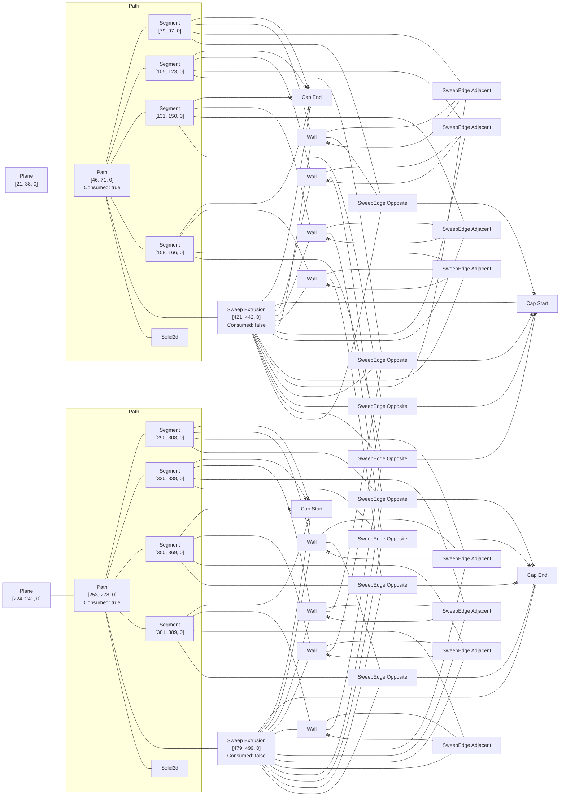

```mermaid
flowchart LR
  subgraph path14 [Path]
    14["Path<br>[46, 71, 0]<br>Consumed: true"]
      %% [ProgramBodyItem { index: 0 }, VariableDeclarationDeclaration, VariableDeclarationInit, FunctionExpressionBody, FunctionExpressionBodyItem { index: 0 }, ReturnStatementArg, PipeBodyItem { index: 1 }]
    15["Segment<br>[79, 97, 0]"]
      %% [ProgramBodyItem { index: 0 }, VariableDeclarationDeclaration, VariableDeclarationInit, FunctionExpressionBody, FunctionExpressionBodyItem { index: 0 }, ReturnStatementArg, PipeBodyItem { index: 2 }]
    16["Segment<br>[105, 123, 0]"]
      %% [ProgramBodyItem { index: 0 }, VariableDeclarationDeclaration, VariableDeclarationInit, FunctionExpressionBody, FunctionExpressionBodyItem { index: 0 }, ReturnStatementArg, PipeBodyItem { index: 3 }]
    17["Segment<br>[131, 150, 0]"]
      %% [ProgramBodyItem { index: 0 }, VariableDeclarationDeclaration, VariableDeclarationInit, FunctionExpressionBody, FunctionExpressionBodyItem { index: 0 }, ReturnStatementArg, PipeBodyItem { index: 4 }]
    18["Segment<br>[158, 166, 0]"]
      %% [ProgramBodyItem { index: 0 }, VariableDeclarationDeclaration, VariableDeclarationInit, FunctionExpressionBody, FunctionExpressionBodyItem { index: 0 }, ReturnStatementArg, PipeBodyItem { index: 5 }]
    28[Solid2d]
  end
  subgraph path20 [Path]
    20["Path<br>[253, 278, 0]<br>Consumed: true"]
      %% [ProgramBodyItem { index: 1 }, VariableDeclarationDeclaration, VariableDeclarationInit, FunctionExpressionBody, FunctionExpressionBodyItem { index: 0 }, ReturnStatementArg, ObjectProperty { index: 0 }, ObjectPropertyValue, ObjectProperty { index: 0 }, ObjectPropertyValue, PipeBodyItem { index: 1 }]
    21["Segment<br>[290, 308, 0]"]
      %% [ProgramBodyItem { index: 1 }, VariableDeclarationDeclaration, VariableDeclarationInit, FunctionExpressionBody, FunctionExpressionBodyItem { index: 0 }, ReturnStatementArg, ObjectProperty { index: 0 }, ObjectPropertyValue, ObjectProperty { index: 0 }, ObjectPropertyValue, PipeBodyItem { index: 2 }]
    22["Segment<br>[320, 338, 0]"]
      %% [ProgramBodyItem { index: 1 }, VariableDeclarationDeclaration, VariableDeclarationInit, FunctionExpressionBody, FunctionExpressionBodyItem { index: 0 }, ReturnStatementArg, ObjectProperty { index: 0 }, ObjectPropertyValue, ObjectProperty { index: 0 }, ObjectPropertyValue, PipeBodyItem { index: 3 }]
    23["Segment<br>[350, 369, 0]"]
      %% [ProgramBodyItem { index: 1 }, VariableDeclarationDeclaration, VariableDeclarationInit, FunctionExpressionBody, FunctionExpressionBodyItem { index: 0 }, ReturnStatementArg, ObjectProperty { index: 0 }, ObjectPropertyValue, ObjectProperty { index: 0 }, ObjectPropertyValue, PipeBodyItem { index: 4 }]
    24["Segment<br>[381, 389, 0]"]
      %% [ProgramBodyItem { index: 1 }, VariableDeclarationDeclaration, VariableDeclarationInit, FunctionExpressionBody, FunctionExpressionBodyItem { index: 0 }, ReturnStatementArg, ObjectProperty { index: 0 }, ObjectPropertyValue, ObjectProperty { index: 0 }, ObjectPropertyValue, PipeBodyItem { index: 5 }]
    27[Solid2d]
  end
  1["Cap End"]
    %% face_code_ref=Missing NodePath
  2["Cap End"]
    %% face_code_ref=Missing NodePath
  3["Cap Start"]
    %% face_code_ref=Missing NodePath
  4["Cap Start"]
    %% face_code_ref=Missing NodePath
  5[Wall]
    %% face_code_ref=Missing NodePath
  6[Wall]
    %% face_code_ref=Missing NodePath
  7[Wall]
    %% face_code_ref=Missing NodePath
  8[Wall]
    %% face_code_ref=Missing NodePath
  9[Wall]
    %% face_code_ref=Missing NodePath
  10[Wall]
    %% face_code_ref=Missing NodePath
  11[Wall]
    %% face_code_ref=Missing NodePath
  12[Wall]
    %% face_code_ref=Missing NodePath
  13["Plane<br>[21, 38, 0]"]
    %% [ProgramBodyItem { index: 0 }, VariableDeclarationDeclaration, VariableDeclarationInit, FunctionExpressionBody, FunctionExpressionBodyItem { index: 0 }, ReturnStatementArg, PipeBodyItem { index: 0 }]
  19["Plane<br>[224, 241, 0]"]
    %% [ProgramBodyItem { index: 1 }, VariableDeclarationDeclaration, VariableDeclarationInit, FunctionExpressionBody, FunctionExpressionBodyItem { index: 0 }, ReturnStatementArg, ObjectProperty { index: 0 }, ObjectPropertyValue, ObjectProperty { index: 0 }, ObjectPropertyValue, PipeBodyItem { index: 0 }]
  25["Sweep Extrusion<br>[421, 442, 0]<br>Consumed: false"]
    %% [ProgramBodyItem { index: 3 }, ExpressionStatementExpr, PipeBodyItem { index: 1 }]
  26["Sweep Extrusion<br>[479, 499, 0]<br>Consumed: false"]
    %% [ProgramBodyItem { index: 5 }, ExpressionStatementExpr, PipeBodyItem { index: 1 }]
  29["SweepEdge Adjacent"]
  30["SweepEdge Adjacent"]
  31["SweepEdge Adjacent"]
  32["SweepEdge Adjacent"]
  33["SweepEdge Adjacent"]
  34["SweepEdge Adjacent"]
  35["SweepEdge Adjacent"]
  36["SweepEdge Adjacent"]
  37["SweepEdge Opposite"]
  38["SweepEdge Opposite"]
  39["SweepEdge Opposite"]
  40["SweepEdge Opposite"]
  41["SweepEdge Opposite"]
  42["SweepEdge Opposite"]
  43["SweepEdge Opposite"]
  44["SweepEdge Opposite"]
  15 <--x 1
  16 <--x 1
  17 <--x 1
  18 <--x 1
  25 --- 1
  26 --- 2
  37 <--x 2
  38 <--x 2
  39 <--x 2
  40 <--x 2
  25 --- 3
  41 <--x 3
  42 <--x 3
  43 <--x 3
  44 <--x 3
  21 <--x 4
  22 <--x 4
  23 <--x 4
  24 <--x 4
  26 --- 4
  16 --- 5
  25 --- 5
  5 --- 29
  29 <--x 5
  5 --- 37
  17 --- 6
  25 --- 6
  6 --- 30
  30 <--x 6
  6 --- 38
  18 --- 7
  25 --- 7
  7 --- 31
  31 <--x 7
  7 --- 39
  21 --- 8
  26 --- 8
  8 --- 32
  32 <--x 8
  8 --- 40
  22 --- 9
  26 --- 9
  9 --- 33
  33 <--x 9
  9 --- 41
  23 --- 10
  26 --- 10
  10 --- 34
  34 <--x 10
  10 --- 42
  24 --- 11
  26 --- 11
  11 --- 35
  35 <--x 11
  11 --- 43
  15 --- 12
  25 --- 12
  12 --- 36
  36 <--x 12
  12 --- 44
  13 --- 14
  14 --- 15
  14 --- 16
  14 --- 17
  14 --- 18
  14 ---- 25
  14 --- 28
  15 --- 36
  15 --- 44
  16 --- 29
  16 --- 41
  17 --- 30
  17 --- 42
  18 --- 31
  18 --- 43
  19 --- 20
  20 --- 21
  20 --- 22
  20 --- 23
  20 --- 24
  20 ---- 26
  20 --- 27
  21 --- 32
  21 --- 37
  22 --- 33
  22 --- 38
  23 --- 34
  23 --- 39
  24 --- 35
  24 --- 40
  25 --- 29
  25 --- 30
  25 --- 31
  25 --- 36
  25 --- 41
  25 --- 42
  25 --- 43
  25 --- 44
  26 --- 32
  26 --- 33
  26 --- 34
  26 --- 35
  26 --- 37
  26 --- 38
  26 --- 39
  26 --- 40
```
