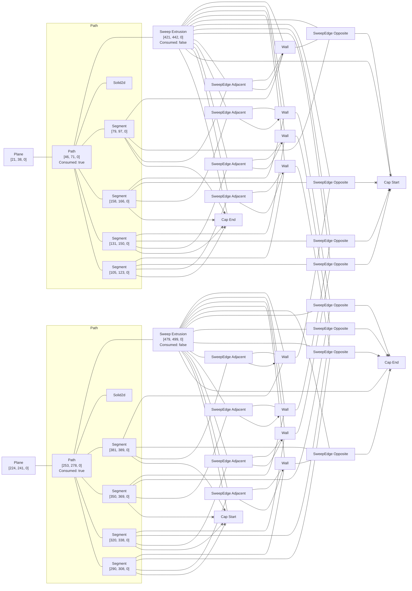

```mermaid
flowchart LR
  subgraph path5 [Path]
    5["Path<br>[253, 278, 0]<br>Consumed: true"]
      %% [ProgramBodyItem { index: 1 }, VariableDeclarationDeclaration, VariableDeclarationInit, FunctionExpressionBody, FunctionExpressionBodyItem { index: 0 }, ReturnStatementArg, ObjectProperty { index: 0 }, ObjectPropertyValue, ObjectProperty { index: 0 }, ObjectPropertyValue, PipeBodyItem { index: 1 }]
    12["Segment<br>[290, 308, 0]"]
      %% [ProgramBodyItem { index: 1 }, VariableDeclarationDeclaration, VariableDeclarationInit, FunctionExpressionBody, FunctionExpressionBodyItem { index: 0 }, ReturnStatementArg, ObjectProperty { index: 0 }, ObjectPropertyValue, ObjectProperty { index: 0 }, ObjectPropertyValue, PipeBodyItem { index: 2 }]
    13["Segment<br>[320, 338, 0]"]
      %% [ProgramBodyItem { index: 1 }, VariableDeclarationDeclaration, VariableDeclarationInit, FunctionExpressionBody, FunctionExpressionBodyItem { index: 0 }, ReturnStatementArg, ObjectProperty { index: 0 }, ObjectPropertyValue, ObjectProperty { index: 0 }, ObjectPropertyValue, PipeBodyItem { index: 3 }]
    14["Segment<br>[350, 369, 0]"]
      %% [ProgramBodyItem { index: 1 }, VariableDeclarationDeclaration, VariableDeclarationInit, FunctionExpressionBody, FunctionExpressionBodyItem { index: 0 }, ReturnStatementArg, ObjectProperty { index: 0 }, ObjectPropertyValue, ObjectProperty { index: 0 }, ObjectPropertyValue, PipeBodyItem { index: 4 }]
    15["Segment<br>[381, 389, 0]"]
      %% [ProgramBodyItem { index: 1 }, VariableDeclarationDeclaration, VariableDeclarationInit, FunctionExpressionBody, FunctionExpressionBodyItem { index: 0 }, ReturnStatementArg, ObjectProperty { index: 0 }, ObjectPropertyValue, ObjectProperty { index: 0 }, ObjectPropertyValue, PipeBodyItem { index: 5 }]
    17[Solid2d]
  end
  subgraph path6 [Path]
    6["Path<br>[46, 71, 0]<br>Consumed: true"]
      %% [ProgramBodyItem { index: 0 }, VariableDeclarationDeclaration, VariableDeclarationInit, FunctionExpressionBody, FunctionExpressionBodyItem { index: 0 }, ReturnStatementArg, PipeBodyItem { index: 1 }]
    9["Segment<br>[105, 123, 0]"]
      %% [ProgramBodyItem { index: 0 }, VariableDeclarationDeclaration, VariableDeclarationInit, FunctionExpressionBody, FunctionExpressionBodyItem { index: 0 }, ReturnStatementArg, PipeBodyItem { index: 3 }]
    10["Segment<br>[131, 150, 0]"]
      %% [ProgramBodyItem { index: 0 }, VariableDeclarationDeclaration, VariableDeclarationInit, FunctionExpressionBody, FunctionExpressionBodyItem { index: 0 }, ReturnStatementArg, PipeBodyItem { index: 4 }]
    11["Segment<br>[158, 166, 0]"]
      %% [ProgramBodyItem { index: 0 }, VariableDeclarationDeclaration, VariableDeclarationInit, FunctionExpressionBody, FunctionExpressionBodyItem { index: 0 }, ReturnStatementArg, PipeBodyItem { index: 5 }]
    16["Segment<br>[79, 97, 0]"]
      %% [ProgramBodyItem { index: 0 }, VariableDeclarationDeclaration, VariableDeclarationInit, FunctionExpressionBody, FunctionExpressionBodyItem { index: 0 }, ReturnStatementArg, PipeBodyItem { index: 2 }]
    18[Solid2d]
  end
  1["Cap End"]
    %% face_code_ref=Missing NodePath
  2["Cap End"]
    %% face_code_ref=Missing NodePath
  3["Cap Start"]
    %% face_code_ref=Missing NodePath
  4["Cap Start"]
    %% face_code_ref=Missing NodePath
  7["Plane<br>[21, 38, 0]"]
    %% [ProgramBodyItem { index: 0 }, VariableDeclarationDeclaration, VariableDeclarationInit, FunctionExpressionBody, FunctionExpressionBodyItem { index: 0 }, ReturnStatementArg, PipeBodyItem { index: 0 }]
  8["Plane<br>[224, 241, 0]"]
    %% [ProgramBodyItem { index: 1 }, VariableDeclarationDeclaration, VariableDeclarationInit, FunctionExpressionBody, FunctionExpressionBodyItem { index: 0 }, ReturnStatementArg, ObjectProperty { index: 0 }, ObjectPropertyValue, ObjectProperty { index: 0 }, ObjectPropertyValue, PipeBodyItem { index: 0 }]
  19["Sweep Extrusion<br>[421, 442, 0]<br>Consumed: false"]
    %% [ProgramBodyItem { index: 3 }, ExpressionStatementExpr, PipeBodyItem { index: 1 }]
  20["Sweep Extrusion<br>[479, 499, 0]<br>Consumed: false"]
    %% [ProgramBodyItem { index: 5 }, ExpressionStatementExpr, PipeBodyItem { index: 1 }]
  21["SweepEdge Adjacent"]
  22["SweepEdge Adjacent"]
  23["SweepEdge Adjacent"]
  24["SweepEdge Adjacent"]
  25["SweepEdge Adjacent"]
  26["SweepEdge Adjacent"]
  27["SweepEdge Adjacent"]
  28["SweepEdge Adjacent"]
  29["SweepEdge Opposite"]
  30["SweepEdge Opposite"]
  31["SweepEdge Opposite"]
  32["SweepEdge Opposite"]
  33["SweepEdge Opposite"]
  34["SweepEdge Opposite"]
  35["SweepEdge Opposite"]
  36["SweepEdge Opposite"]
  37[Wall]
    %% face_code_ref=Missing NodePath
  38[Wall]
    %% face_code_ref=Missing NodePath
  39[Wall]
    %% face_code_ref=Missing NodePath
  40[Wall]
    %% face_code_ref=Missing NodePath
  41[Wall]
    %% face_code_ref=Missing NodePath
  42[Wall]
    %% face_code_ref=Missing NodePath
  43[Wall]
    %% face_code_ref=Missing NodePath
  44[Wall]
    %% face_code_ref=Missing NodePath
  9 <--x 1
  10 <--x 1
  11 <--x 1
  16 <--x 1
  19 --- 1
  20 --- 2
  29 <--x 2
  30 <--x 2
  31 <--x 2
  32 <--x 2
  19 --- 3
  33 <--x 3
  34 <--x 3
  35 <--x 3
  36 <--x 3
  12 <--x 4
  13 <--x 4
  14 <--x 4
  15 <--x 4
  20 --- 4
  8 --- 5
  5 --- 12
  5 --- 13
  5 --- 14
  5 --- 15
  5 --- 17
  5 ---- 20
  7 --- 6
  6 --- 9
  6 --- 10
  6 --- 11
  6 --- 16
  6 --- 18
  6 ---- 19
  9 --- 21
  9 --- 33
  9 --- 37
  10 --- 22
  10 --- 34
  10 --- 38
  11 --- 23
  11 --- 35
  11 --- 39
  12 --- 24
  12 --- 29
  12 --- 40
  13 --- 25
  13 --- 30
  13 --- 41
  14 --- 26
  14 --- 31
  14 --- 42
  15 --- 27
  15 --- 32
  15 --- 43
  16 --- 28
  16 --- 36
  16 --- 44
  19 --- 21
  19 --- 22
  19 --- 23
  19 --- 28
  19 --- 33
  19 --- 34
  19 --- 35
  19 --- 36
  19 --- 37
  19 --- 38
  19 --- 39
  19 --- 44
  20 --- 24
  20 --- 25
  20 --- 26
  20 --- 27
  20 --- 29
  20 --- 30
  20 --- 31
  20 --- 32
  20 --- 40
  20 --- 41
  20 --- 42
  20 --- 43
  37 --- 21
  21 x--> 37
  38 --- 22
  22 x--> 38
  39 --- 23
  23 x--> 39
  40 --- 24
  24 x--> 40
  41 --- 25
  25 x--> 41
  42 --- 26
  26 x--> 42
  27 x--> 43
  43 --- 27
  28 x--> 44
  44 --- 28
  37 --- 29
  38 --- 30
  39 --- 31
  40 --- 32
  41 --- 33
  42 --- 34
  43 --- 35
  44 --- 36
```
