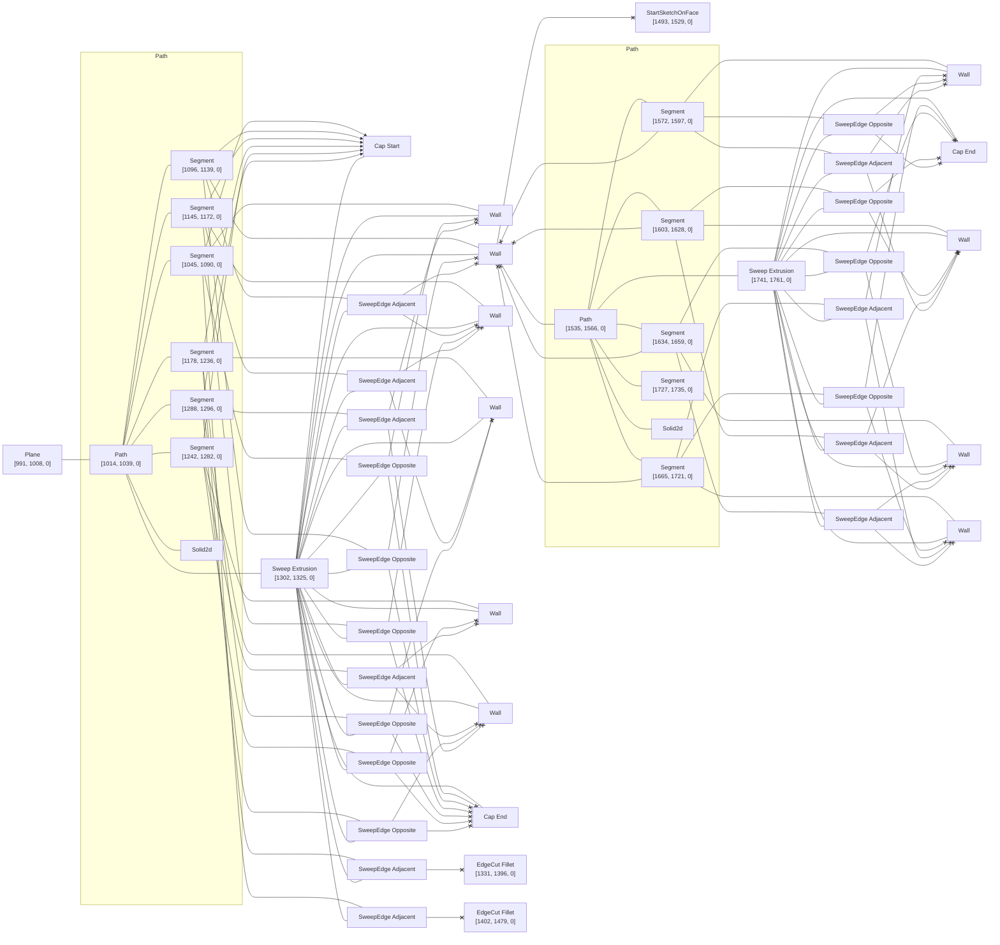

```mermaid
flowchart LR
  subgraph path2 [Path]
    2["Path<br>[1014, 1039, 0]"]
    3["Segment<br>[1045, 1090, 0]"]
    4["Segment<br>[1096, 1139, 0]"]
    5["Segment<br>[1145, 1172, 0]"]
    6["Segment<br>[1178, 1236, 0]"]
    7["Segment<br>[1242, 1282, 0]"]
    8["Segment<br>[1288, 1296, 0]"]
    9[Solid2d]
  end
  subgraph path33 [Path]
    33["Path<br>[1535, 1566, 0]"]
    34["Segment<br>[1572, 1597, 0]"]
    35["Segment<br>[1603, 1628, 0]"]
    36["Segment<br>[1634, 1659, 0]"]
    37["Segment<br>[1665, 1721, 0]"]
    38["Segment<br>[1727, 1735, 0]"]
    39[Solid2d]
  end
  1["Plane<br>[991, 1008, 0]"]
  10["Sweep Extrusion<br>[1302, 1325, 0]"]
  11[Wall]
  12[Wall]
  13[Wall]
  14[Wall]
  15[Wall]
  16[Wall]
  17["Cap Start"]
  18["Cap End"]
  19["SweepEdge Opposite"]
  20["SweepEdge Adjacent"]
  21["SweepEdge Opposite"]
  22["SweepEdge Adjacent"]
  23["SweepEdge Opposite"]
  24["SweepEdge Adjacent"]
  25["SweepEdge Opposite"]
  26["SweepEdge Adjacent"]
  27["SweepEdge Opposite"]
  28["SweepEdge Adjacent"]
  29["SweepEdge Opposite"]
  30["SweepEdge Adjacent"]
  31["EdgeCut Fillet<br>[1331, 1396, 0]"]
  32["EdgeCut Fillet<br>[1402, 1479, 0]"]
  40["Sweep Extrusion<br>[1741, 1761, 0]"]
  41[Wall]
  42[Wall]
  43[Wall]
  44[Wall]
  45["Cap End"]
  46["SweepEdge Opposite"]
  47["SweepEdge Adjacent"]
  48["SweepEdge Opposite"]
  49["SweepEdge Adjacent"]
  50["SweepEdge Opposite"]
  51["SweepEdge Adjacent"]
  52["SweepEdge Opposite"]
  53["SweepEdge Adjacent"]
  54["StartSketchOnFace<br>[1493, 1529, 0]"]
  1 --- 2
  2 --- 3
  2 --- 4
  2 --- 5
  2 --- 6
  2 --- 7
  2 --- 8
  2 ---- 10
  2 --- 9
  3 --- 11
  3 --- 19
  3 --- 20
  3 x--> 17
  4 --- 12
  4 --- 21
  4 --- 22
  4 x--> 17
  5 --- 13
  5 --- 23
  5 --- 24
  5 x--> 17
  6 --- 14
  6 --- 25
  6 --- 26
  6 x--> 17
  7 --- 15
  7 --- 27
  7 --- 28
  7 x--> 17
  8 --- 16
  8 --- 29
  8 --- 30
  8 x--> 17
  10 --- 11
  10 --- 12
  10 --- 13
  10 --- 14
  10 --- 15
  10 --- 16
  10 --- 17
  10 --- 18
  10 --- 19
  10 --- 20
  10 --- 21
  10 --- 22
  10 --- 23
  10 --- 24
  10 --- 25
  10 --- 26
  10 --- 27
  10 --- 28
  10 --- 29
  10 --- 30
  12 --- 33
  19 <--x 11
  19 <--x 18
  21 <--x 12
  21 <--x 18
  22 <--x 12
  22 <--x 13
  23 <--x 13
  23 <--x 18
  24 <--x 13
  24 <--x 14
  25 <--x 14
  25 <--x 18
  27 <--x 15
  27 <--x 18
  28 <--x 15
  28 <--x 16
  29 <--x 16
  29 <--x 18
  30 <--x 11
  30 <--x 16
  26 <--x 31
  20 <--x 32
  33 --- 34
  33 --- 35
  33 --- 36
  33 --- 37
  33 --- 38
  33 ---- 40
  33 --- 39
  34 --- 44
  34 --- 52
  34 --- 53
  34 <--x 12
  35 --- 43
  35 --- 50
  35 --- 51
  35 <--x 12
  36 --- 42
  36 --- 48
  36 --- 49
  36 <--x 12
  37 --- 41
  37 --- 46
  37 --- 47
  37 <--x 12
  40 --- 41
  40 --- 42
  40 --- 43
  40 --- 44
  40 --- 45
  40 --- 46
  40 --- 47
  40 --- 48
  40 --- 49
  40 --- 50
  40 --- 51
  40 --- 52
  40 --- 53
  46 <--x 41
  46 <--x 45
  47 <--x 41
  47 <--x 44
  48 <--x 42
  48 <--x 45
  49 <--x 41
  49 <--x 42
  50 <--x 43
  50 <--x 45
  51 <--x 42
  51 <--x 43
  52 <--x 44
  52 <--x 45
  53 <--x 43
  53 <--x 44
  12 <--x 54
```
