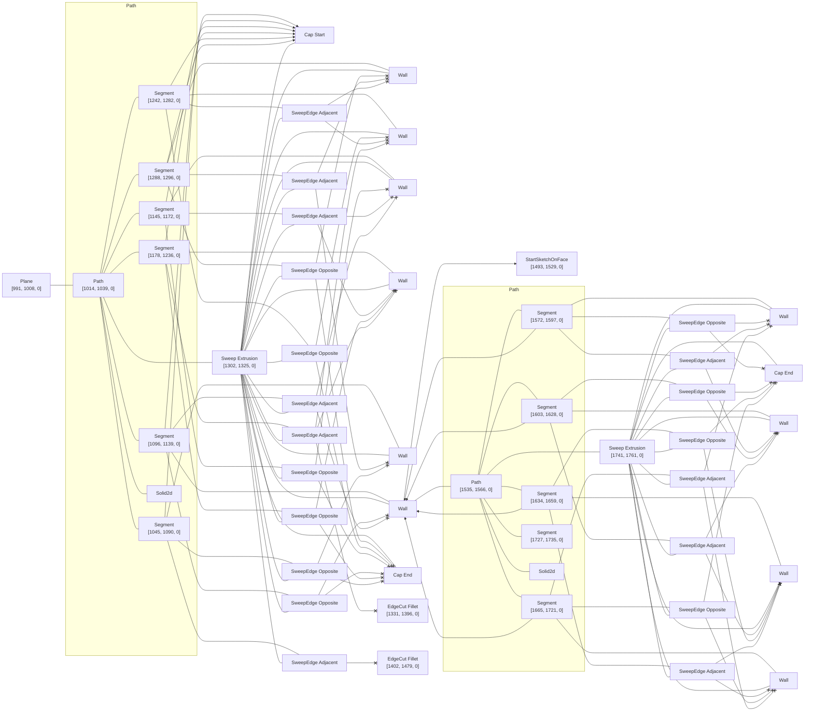

```mermaid
flowchart LR
  subgraph path3 [Path]
    3["Path<br>[1014, 1039, 0]"]
    5["Segment<br>[1045, 1090, 0]"]
    6["Segment<br>[1096, 1139, 0]"]
    7["Segment<br>[1145, 1172, 0]"]
    8["Segment<br>[1178, 1236, 0]"]
    9["Segment<br>[1242, 1282, 0]"]
    10["Segment<br>[1288, 1296, 0]"]
    17[Solid2d]
  end
  subgraph path4 [Path]
    4["Path<br>[1535, 1566, 0]"]
    11["Segment<br>[1572, 1597, 0]"]
    12["Segment<br>[1603, 1628, 0]"]
    13["Segment<br>[1634, 1659, 0]"]
    14["Segment<br>[1665, 1721, 0]"]
    15["Segment<br>[1727, 1735, 0]"]
    16[Solid2d]
  end
  1["Plane<br>[991, 1008, 0]"]
  2["StartSketchOnFace<br>[1493, 1529, 0]"]
  18["Sweep Extrusion<br>[1302, 1325, 0]"]
  19["Sweep Extrusion<br>[1741, 1761, 0]"]
  20[Wall]
  21[Wall]
  22[Wall]
  23[Wall]
  24[Wall]
  25[Wall]
  26[Wall]
  27[Wall]
  28[Wall]
  29[Wall]
  30["Cap End"]
  31["Cap Start"]
  32["Cap End"]
  33["SweepEdge Opposite"]
  34["SweepEdge Adjacent"]
  35["SweepEdge Opposite"]
  36["SweepEdge Adjacent"]
  37["SweepEdge Opposite"]
  38["SweepEdge Adjacent"]
  39["SweepEdge Opposite"]
  40["SweepEdge Adjacent"]
  41["SweepEdge Opposite"]
  42["SweepEdge Adjacent"]
  43["SweepEdge Opposite"]
  44["SweepEdge Adjacent"]
  45["SweepEdge Opposite"]
  46["SweepEdge Adjacent"]
  47["SweepEdge Opposite"]
  48["SweepEdge Adjacent"]
  49["SweepEdge Opposite"]
  50["SweepEdge Adjacent"]
  51["SweepEdge Opposite"]
  52["SweepEdge Adjacent"]
  53["EdgeCut Fillet<br>[1331, 1396, 0]"]
  54["EdgeCut Fillet<br>[1402, 1479, 0]"]
  1 --- 3
  29 x--> 2
  3 --- 5
  3 --- 6
  3 --- 7
  3 --- 8
  3 --- 9
  3 --- 10
  3 --- 17
  3 ---- 18
  4 --- 11
  4 --- 12
  4 --- 13
  4 --- 14
  4 --- 15
  4 --- 16
  4 ---- 19
  29 --- 4
  5 --- 28
  5 x--> 31
  5 --- 51
  5 --- 52
  6 --- 29
  6 x--> 31
  6 --- 47
  6 --- 48
  7 --- 26
  7 x--> 31
  7 --- 45
  7 --- 46
  8 --- 27
  8 x--> 31
  8 --- 49
  8 --- 50
  9 --- 25
  9 x--> 31
  9 --- 43
  9 --- 44
  10 --- 24
  10 x--> 31
  10 --- 41
  10 --- 42
  11 --- 20
  11 x--> 29
  11 --- 33
  11 --- 34
  12 --- 21
  12 x--> 29
  12 --- 35
  12 --- 36
  13 --- 22
  13 x--> 29
  13 --- 37
  13 --- 38
  14 --- 23
  14 x--> 29
  14 --- 39
  14 --- 40
  18 --- 24
  18 --- 25
  18 --- 26
  18 --- 27
  18 --- 28
  18 --- 29
  18 --- 31
  18 --- 32
  18 --- 41
  18 --- 42
  18 --- 43
  18 --- 44
  18 --- 45
  18 --- 46
  18 --- 47
  18 --- 48
  18 --- 49
  18 --- 50
  18 --- 51
  18 --- 52
  19 --- 20
  19 --- 21
  19 --- 22
  19 --- 23
  19 --- 30
  19 --- 33
  19 --- 34
  19 --- 35
  19 --- 36
  19 --- 37
  19 --- 38
  19 --- 39
  19 --- 40
  33 <--x 20
  34 <--x 20
  40 <--x 20
  34 <--x 21
  35 <--x 21
  36 <--x 21
  36 <--x 22
  37 <--x 22
  38 <--x 22
  38 <--x 23
  39 <--x 23
  40 <--x 23
  41 <--x 24
  42 <--x 24
  44 <--x 24
  43 <--x 25
  44 <--x 25
  50 <--x 25
  45 <--x 26
  46 <--x 26
  48 <--x 26
  46 <--x 27
  49 <--x 27
  50 <--x 27
  42 <--x 28
  51 <--x 28
  47 <--x 29
  48 <--x 29
  33 <--x 30
  35 <--x 30
  37 <--x 30
  39 <--x 30
  41 <--x 32
  43 <--x 32
  45 <--x 32
  47 <--x 32
  49 <--x 32
  51 <--x 32
  50 <--x 53
  52 <--x 54
```
