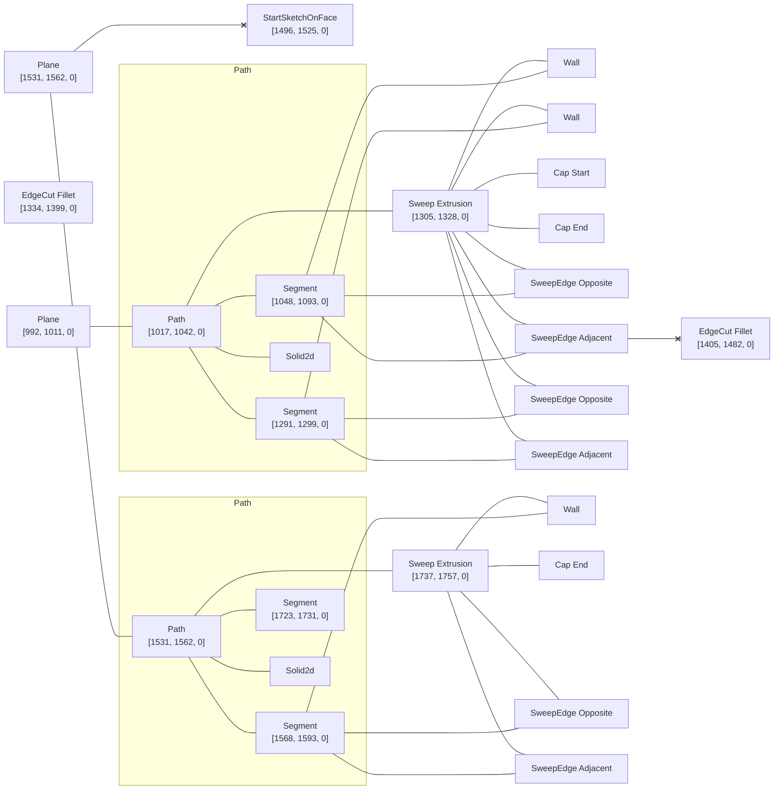

```mermaid
flowchart LR
  subgraph path2 [Path]
    2["Path<br>[1017, 1042, 0]"]
    3["Segment<br>[1048, 1093, 0]"]
    4["Segment<br>[1291, 1299, 0]"]
    5[Solid2d]
  end
  subgraph path18 [Path]
    18["Path<br>[1531, 1562, 0]"]
    19["Segment<br>[1568, 1593, 0]"]
    20["Segment<br>[1723, 1731, 0]"]
    21[Solid2d]
  end
  1["Plane<br>[992, 1011, 0]"]
  6["Sweep Extrusion<br>[1305, 1328, 0]"]
  7[Wall]
  8[Wall]
  9["Cap Start"]
  10["Cap End"]
  11["SweepEdge Opposite"]
  12["SweepEdge Adjacent"]
  13["SweepEdge Opposite"]
  14["SweepEdge Adjacent"]
  15["EdgeCut Fillet<br>[1334, 1399, 0]"]
  16["EdgeCut Fillet<br>[1405, 1482, 0]"]
  17["Plane<br>[1531, 1562, 0]"]
  22["Sweep Extrusion<br>[1737, 1757, 0]"]
  23[Wall]
  24["Cap End"]
  25["SweepEdge Opposite"]
  26["SweepEdge Adjacent"]
  27["StartSketchOnFace<br>[1496, 1525, 0]"]
  1 --- 2
  2 --- 3
  2 --- 4
  2 ---- 6
  2 --- 5
  3 --- 7
  3 --- 11
  3 --- 12
  4 --- 8
  4 --- 13
  4 --- 14
  6 --- 7
  6 --- 8
  6 --- 9
  6 --- 10
  6 --- 11
  6 --- 12
  6 --- 13
  6 --- 14
  12 <--x 16
  17 --- 18
  18 --- 19
  18 --- 20
  18 ---- 22
  18 --- 21
  19 --- 23
  19 --- 25
  19 --- 26
  22 --- 23
  22 --- 24
  22 --- 25
  22 --- 26
  17 <--x 27
```
