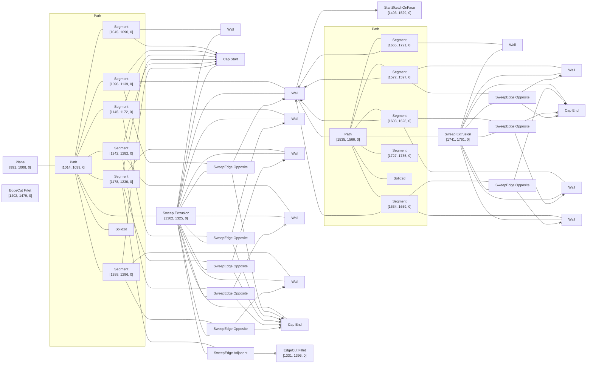

```mermaid
flowchart LR
  subgraph path2 [Path]
    2["Path<br>[1014, 1039, 0]"]
    3["Segment<br>[1045, 1090, 0]"]
    4["Segment<br>[1096, 1139, 0]"]
    5["Segment<br>[1145, 1172, 0]"]
    6["Segment<br>[1178, 1236, 0]"]
    7["Segment<br>[1242, 1282, 0]"]
    8["Segment<br>[1288, 1296, 0]"]
    9[Solid2d]
  end
  subgraph path27 [Path]
    27["Path<br>[1535, 1566, 0]"]
    28["Segment<br>[1572, 1597, 0]"]
    29["Segment<br>[1603, 1628, 0]"]
    30["Segment<br>[1634, 1659, 0]"]
    31["Segment<br>[1665, 1721, 0]"]
    32["Segment<br>[1727, 1735, 0]"]
    33[Solid2d]
  end
  1["Plane<br>[991, 1008, 0]"]
  10["Sweep Extrusion<br>[1302, 1325, 0]"]
  11[Wall]
  12[Wall]
  13[Wall]
  14[Wall]
  15[Wall]
  16[Wall]
  17["Cap Start"]
  18["Cap End"]
  19["SweepEdge Opposite"]
  20["SweepEdge Opposite"]
  21["SweepEdge Opposite"]
  22["SweepEdge Opposite"]
  23["SweepEdge Opposite"]
  24["SweepEdge Adjacent"]
  25["EdgeCut Fillet<br>[1331, 1396, 0]"]
  26["EdgeCut Fillet<br>[1402, 1479, 0]"]
  34["Sweep Extrusion<br>[1741, 1761, 0]"]
  35[Wall]
  36[Wall]
  37[Wall]
  38[Wall]
  39["Cap End"]
  40["SweepEdge Opposite"]
  41["SweepEdge Opposite"]
  42["SweepEdge Opposite"]
  43["StartSketchOnFace<br>[1493, 1529, 0]"]
  1 --- 2
  2 --- 3
  2 --- 4
  2 --- 5
  2 --- 6
  2 --- 7
  2 --- 8
  2 ---- 10
  2 --- 9
  3 --- 11
  3 x--> 17
  4 --- 12
  4 --- 19
  4 x--> 17
  5 --- 13
  5 --- 20
  5 x--> 17
  6 --- 14
  6 --- 21
  6 --- 24
  6 x--> 17
  7 --- 15
  7 --- 22
  7 x--> 17
  8 --- 16
  8 --- 23
  8 x--> 17
  10 --- 11
  10 --- 12
  10 --- 13
  10 --- 14
  10 --- 15
  10 --- 16
  10 --- 17
  10 --- 18
  10 --- 19
  10 --- 20
  10 --- 21
  10 --- 22
  10 --- 23
  10 --- 24
  12 --- 27
  19 <--x 12
  19 <--x 18
  20 <--x 13
  20 <--x 18
  21 <--x 14
  21 <--x 18
  22 <--x 15
  22 <--x 18
  23 <--x 16
  23 <--x 18
  24 <--x 25
  27 --- 28
  27 --- 29
  27 --- 30
  27 --- 31
  27 --- 32
  27 ---- 34
  27 --- 33
  28 --- 38
  28 --- 42
  28 <--x 12
  29 --- 37
  29 --- 41
  29 <--x 12
  30 --- 36
  30 --- 40
  30 <--x 12
  31 --- 35
  31 <--x 12
  34 --- 35
  34 --- 36
  34 --- 37
  34 --- 38
  34 --- 39
  34 --- 40
  34 --- 41
  34 --- 42
  40 <--x 36
  40 <--x 39
  41 <--x 37
  41 <--x 39
  42 <--x 38
  42 <--x 39
  12 <--x 43
```
