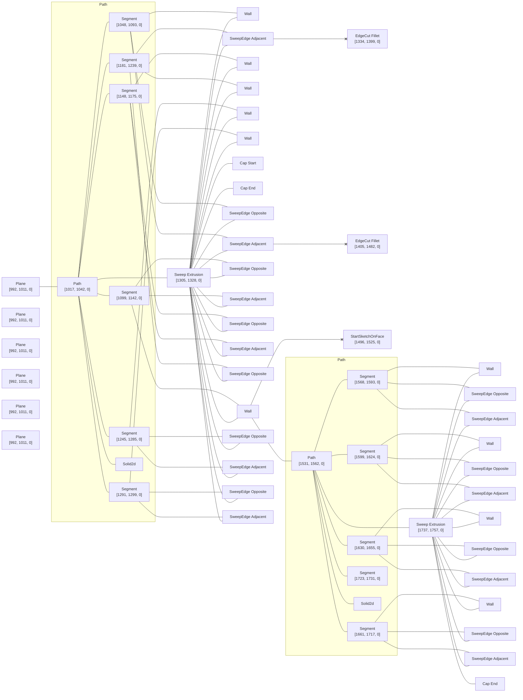

```mermaid
flowchart LR
  subgraph path7 [Path]
    7["Path<br>[1017, 1042, 0]"]
    8["Segment<br>[1048, 1093, 0]"]
    9["Segment<br>[1099, 1142, 0]"]
    10["Segment<br>[1148, 1175, 0]"]
    11["Segment<br>[1181, 1239, 0]"]
    12["Segment<br>[1245, 1285, 0]"]
    13["Segment<br>[1291, 1299, 0]"]
    14[Solid2d]
  end
  subgraph path38 [Path]
    38["Path<br>[1531, 1562, 0]"]
    39["Segment<br>[1568, 1593, 0]"]
    40["Segment<br>[1599, 1624, 0]"]
    41["Segment<br>[1630, 1655, 0]"]
    42["Segment<br>[1661, 1717, 0]"]
    43["Segment<br>[1723, 1731, 0]"]
    44[Solid2d]
  end
  1["Plane<br>[992, 1011, 0]"]
  2["Plane<br>[992, 1011, 0]"]
  3["Plane<br>[992, 1011, 0]"]
  4["Plane<br>[992, 1011, 0]"]
  5["Plane<br>[992, 1011, 0]"]
  6["Plane<br>[992, 1011, 0]"]
  15["Sweep Extrusion<br>[1305, 1328, 0]"]
  16[Wall]
  17[Wall]
  18[Wall]
  19[Wall]
  20[Wall]
  21[Wall]
  22["Cap Start"]
  23["Cap End"]
  24["SweepEdge Opposite"]
  25["SweepEdge Adjacent"]
  26["SweepEdge Opposite"]
  27["SweepEdge Adjacent"]
  28["SweepEdge Opposite"]
  29["SweepEdge Adjacent"]
  30["SweepEdge Opposite"]
  31["SweepEdge Adjacent"]
  32["SweepEdge Opposite"]
  33["SweepEdge Adjacent"]
  34["SweepEdge Opposite"]
  35["SweepEdge Adjacent"]
  36["EdgeCut Fillet<br>[1334, 1399, 0]"]
  37["EdgeCut Fillet<br>[1405, 1482, 0]"]
  45["Sweep Extrusion<br>[1737, 1757, 0]"]
  46[Wall]
  47[Wall]
  48[Wall]
  49[Wall]
  50["Cap End"]
  51["SweepEdge Opposite"]
  52["SweepEdge Adjacent"]
  53["SweepEdge Opposite"]
  54["SweepEdge Adjacent"]
  55["SweepEdge Opposite"]
  56["SweepEdge Adjacent"]
  57["SweepEdge Opposite"]
  58["SweepEdge Adjacent"]
  59["StartSketchOnFace<br>[1496, 1525, 0]"]
  1 --- 7
  7 --- 8
  7 --- 9
  7 --- 10
  7 --- 11
  7 --- 12
  7 --- 13
  7 ---- 15
  7 --- 14
  8 --- 16
  8 --- 24
  8 --- 25
  9 --- 17
  9 --- 26
  9 --- 27
  10 --- 18
  10 --- 28
  10 --- 29
  11 --- 19
  11 --- 30
  11 --- 31
  12 --- 20
  12 --- 32
  12 --- 33
  13 --- 21
  13 --- 34
  13 --- 35
  15 --- 16
  15 --- 17
  15 --- 18
  15 --- 19
  15 --- 20
  15 --- 21
  15 --- 22
  15 --- 23
  15 --- 24
  15 --- 25
  15 --- 26
  15 --- 27
  15 --- 28
  15 --- 29
  15 --- 30
  15 --- 31
  15 --- 32
  15 --- 33
  15 --- 34
  15 --- 35
  17 --- 38
  31 <--x 36
  25 <--x 37
  38 --- 39
  38 --- 40
  38 --- 41
  38 --- 42
  38 --- 43
  38 ---- 45
  38 --- 44
  39 --- 49
  39 --- 57
  39 --- 58
  40 --- 48
  40 --- 55
  40 --- 56
  41 --- 47
  41 --- 53
  41 --- 54
  42 --- 46
  42 --- 51
  42 --- 52
  45 --- 46
  45 --- 47
  45 --- 48
  45 --- 49
  45 --- 50
  45 --- 51
  45 --- 52
  45 --- 53
  45 --- 54
  45 --- 55
  45 --- 56
  45 --- 57
  45 --- 58
  17 <--x 59
```
