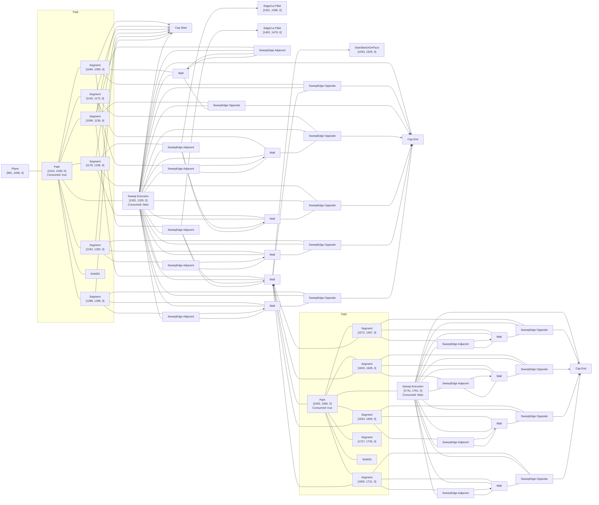

```mermaid
flowchart LR
  subgraph path6 [Path]
    6["Path<br>[1014, 1039, 0]<br>Consumed: true"]
      %% [ProgramBodyItem { index: 10 }, VariableDeclarationDeclaration, VariableDeclarationInit, PipeBodyItem { index: 1 }]
    9["Segment<br>[1045, 1090, 0]"]
      %% [ProgramBodyItem { index: 10 }, VariableDeclarationDeclaration, VariableDeclarationInit, PipeBodyItem { index: 2 }]
    10["Segment<br>[1096, 1139, 0]"]
      %% [ProgramBodyItem { index: 10 }, VariableDeclarationDeclaration, VariableDeclarationInit, PipeBodyItem { index: 3 }]
    11["Segment<br>[1145, 1172, 0]"]
      %% [ProgramBodyItem { index: 10 }, VariableDeclarationDeclaration, VariableDeclarationInit, PipeBodyItem { index: 4 }]
    12["Segment<br>[1178, 1236, 0]"]
      %% [ProgramBodyItem { index: 10 }, VariableDeclarationDeclaration, VariableDeclarationInit, PipeBodyItem { index: 5 }]
    13["Segment<br>[1242, 1282, 0]"]
      %% [ProgramBodyItem { index: 10 }, VariableDeclarationDeclaration, VariableDeclarationInit, PipeBodyItem { index: 6 }]
    14["Segment<br>[1288, 1296, 0]"]
      %% [ProgramBodyItem { index: 10 }, VariableDeclarationDeclaration, VariableDeclarationInit, PipeBodyItem { index: 7 }]
    20[Solid2d]
  end
  subgraph path7 [Path]
    7["Path<br>[1535, 1566, 0]<br>Consumed: true"]
      %% [ProgramBodyItem { index: 11 }, VariableDeclarationDeclaration, VariableDeclarationInit, PipeBodyItem { index: 1 }]
    15["Segment<br>[1572, 1597, 0]"]
      %% [ProgramBodyItem { index: 11 }, VariableDeclarationDeclaration, VariableDeclarationInit, PipeBodyItem { index: 2 }]
    16["Segment<br>[1603, 1628, 0]"]
      %% [ProgramBodyItem { index: 11 }, VariableDeclarationDeclaration, VariableDeclarationInit, PipeBodyItem { index: 3 }]
    17["Segment<br>[1634, 1659, 0]"]
      %% [ProgramBodyItem { index: 11 }, VariableDeclarationDeclaration, VariableDeclarationInit, PipeBodyItem { index: 4 }]
    18["Segment<br>[1665, 1721, 0]"]
      %% [ProgramBodyItem { index: 11 }, VariableDeclarationDeclaration, VariableDeclarationInit, PipeBodyItem { index: 5 }]
    19["Segment<br>[1727, 1735, 0]"]
      %% [ProgramBodyItem { index: 11 }, VariableDeclarationDeclaration, VariableDeclarationInit, PipeBodyItem { index: 6 }]
    21[Solid2d]
  end
  1["Cap End"]
    %% face_code_ref=Missing NodePath
  2["Cap End"]
    %% face_code_ref=Missing NodePath
  3["Cap Start"]
    %% face_code_ref=Missing NodePath
  4["EdgeCut Fillet<br>[1331, 1396, 0]"]
    %% [ProgramBodyItem { index: 10 }, VariableDeclarationDeclaration, VariableDeclarationInit, PipeBodyItem { index: 9 }]
  5["EdgeCut Fillet<br>[1402, 1479, 0]"]
    %% [ProgramBodyItem { index: 10 }, VariableDeclarationDeclaration, VariableDeclarationInit, PipeBodyItem { index: 10 }]
  8["Plane<br>[991, 1008, 0]"]
    %% [ProgramBodyItem { index: 10 }, VariableDeclarationDeclaration, VariableDeclarationInit, PipeBodyItem { index: 0 }]
  22["StartSketchOnFace<br>[1493, 1529, 0]"]
    %% [ProgramBodyItem { index: 11 }, VariableDeclarationDeclaration, VariableDeclarationInit, PipeBodyItem { index: 0 }]
  23["Sweep Extrusion<br>[1302, 1325, 0]<br>Consumed: false"]
    %% [ProgramBodyItem { index: 10 }, VariableDeclarationDeclaration, VariableDeclarationInit, PipeBodyItem { index: 8 }]
  24["Sweep Extrusion<br>[1741, 1761, 0]<br>Consumed: false"]
    %% [ProgramBodyItem { index: 11 }, VariableDeclarationDeclaration, VariableDeclarationInit, PipeBodyItem { index: 7 }]
  25["SweepEdge Adjacent"]
  26["SweepEdge Adjacent"]
  27["SweepEdge Adjacent"]
  28["SweepEdge Adjacent"]
  29["SweepEdge Adjacent"]
  30["SweepEdge Adjacent"]
  31["SweepEdge Adjacent"]
  32["SweepEdge Adjacent"]
  33["SweepEdge Adjacent"]
  34["SweepEdge Adjacent"]
  35["SweepEdge Opposite"]
  36["SweepEdge Opposite"]
  37["SweepEdge Opposite"]
  38["SweepEdge Opposite"]
  39["SweepEdge Opposite"]
  40["SweepEdge Opposite"]
  41["SweepEdge Opposite"]
  42["SweepEdge Opposite"]
  43["SweepEdge Opposite"]
  44["SweepEdge Opposite"]
  45[Wall]
    %% face_code_ref=[ProgramBodyItem { index: 11 }, VariableDeclarationDeclaration, VariableDeclarationInit, PipeBodyItem { index: 0 }]
  46[Wall]
    %% face_code_ref=Missing NodePath
  47[Wall]
    %% face_code_ref=Missing NodePath
  48[Wall]
    %% face_code_ref=Missing NodePath
  49[Wall]
    %% face_code_ref=Missing NodePath
  50[Wall]
    %% face_code_ref=Missing NodePath
  51[Wall]
    %% face_code_ref=Missing NodePath
  52[Wall]
    %% face_code_ref=Missing NodePath
  53[Wall]
    %% face_code_ref=Missing NodePath
  54[Wall]
    %% face_code_ref=Missing NodePath
  23 --- 1
  35 <--x 1
  36 <--x 1
  37 <--x 1
  38 <--x 1
  39 <--x 1
  40 <--x 1
  24 --- 2
  41 <--x 2
  42 <--x 2
  43 <--x 2
  44 <--x 2
  9 <--x 3
  10 <--x 3
  11 <--x 3
  12 <--x 3
  13 <--x 3
  14 <--x 3
  23 --- 3
  28 x--> 4
  25 x--> 5
  8 --- 6
  6 --- 9
  6 --- 10
  6 --- 11
  6 --- 12
  6 --- 13
  6 --- 14
  6 --- 20
  6 ---- 23
  7 --- 15
  7 --- 16
  7 --- 17
  7 --- 18
  7 --- 19
  7 --- 21
  7 ---- 24
  45 --- 7
  9 --- 25
  9 --- 35
  9 --- 46
  10 --- 26
  10 --- 36
  10 --- 45
  11 --- 27
  11 --- 37
  11 --- 47
  12 --- 28
  12 --- 38
  12 --- 48
  13 --- 29
  13 --- 39
  13 --- 49
  14 --- 30
  14 --- 40
  14 --- 50
  15 --- 31
  15 --- 41
  15 x--> 45
  15 --- 51
  16 --- 32
  16 --- 42
  16 x--> 45
  16 --- 52
  17 --- 33
  17 --- 43
  17 x--> 45
  17 --- 53
  18 --- 34
  18 --- 44
  18 x--> 45
  18 --- 54
  45 x--> 22
  23 --- 25
  23 --- 26
  23 --- 27
  23 --- 28
  23 --- 29
  23 --- 30
  23 --- 35
  23 --- 36
  23 --- 37
  23 --- 38
  23 --- 39
  23 --- 40
  23 --- 45
  23 --- 46
  23 --- 47
  23 --- 48
  23 --- 49
  23 --- 50
  24 --- 31
  24 --- 32
  24 --- 33
  24 --- 34
  24 --- 41
  24 --- 42
  24 --- 43
  24 --- 44
  24 --- 51
  24 --- 52
  24 --- 53
  24 --- 54
  25 x--> 45
  45 --- 25
  46 --- 26
  26 x--> 46
  47 --- 27
  27 x--> 47
  48 --- 28
  28 x--> 48
  49 --- 29
  29 x--> 49
  30 x--> 50
  50 --- 30
  51 --- 31
  31 x--> 51
  52 --- 32
  32 x--> 52
  53 --- 33
  33 x--> 53
  34 x--> 54
  54 --- 34
  45 --- 35
  46 --- 36
  47 --- 37
  48 --- 38
  49 --- 39
  50 --- 40
  51 --- 41
  52 --- 42
  53 --- 43
  54 --- 44
```
