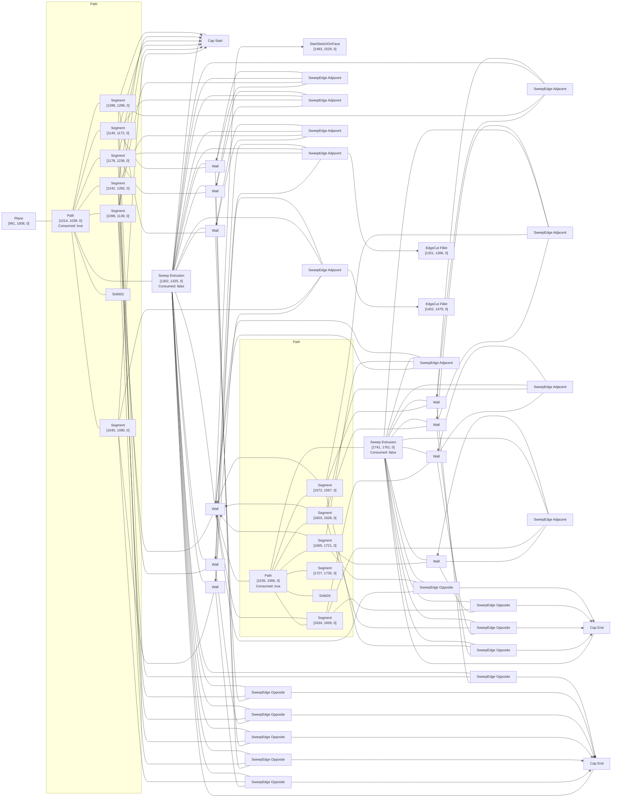

```mermaid
flowchart LR
  subgraph path14 [Path]
    14["Path<br>[1014, 1039, 0]<br>Consumed: true"]
      %% [ProgramBodyItem { index: 10 }, VariableDeclarationDeclaration, VariableDeclarationInit, PipeBodyItem { index: 1 }]
    15["Segment<br>[1045, 1090, 0]"]
      %% [ProgramBodyItem { index: 10 }, VariableDeclarationDeclaration, VariableDeclarationInit, PipeBodyItem { index: 2 }]
    16["Segment<br>[1096, 1139, 0]"]
      %% [ProgramBodyItem { index: 10 }, VariableDeclarationDeclaration, VariableDeclarationInit, PipeBodyItem { index: 3 }]
    17["Segment<br>[1145, 1172, 0]"]
      %% [ProgramBodyItem { index: 10 }, VariableDeclarationDeclaration, VariableDeclarationInit, PipeBodyItem { index: 4 }]
    18["Segment<br>[1178, 1236, 0]"]
      %% [ProgramBodyItem { index: 10 }, VariableDeclarationDeclaration, VariableDeclarationInit, PipeBodyItem { index: 5 }]
    19["Segment<br>[1242, 1282, 0]"]
      %% [ProgramBodyItem { index: 10 }, VariableDeclarationDeclaration, VariableDeclarationInit, PipeBodyItem { index: 6 }]
    20["Segment<br>[1288, 1296, 0]"]
      %% [ProgramBodyItem { index: 10 }, VariableDeclarationDeclaration, VariableDeclarationInit, PipeBodyItem { index: 7 }]
    33[Solid2d]
  end
  subgraph path26 [Path]
    26["Path<br>[1535, 1566, 0]<br>Consumed: true"]
      %% [ProgramBodyItem { index: 11 }, VariableDeclarationDeclaration, VariableDeclarationInit, PipeBodyItem { index: 1 }]
    27["Segment<br>[1572, 1597, 0]"]
      %% [ProgramBodyItem { index: 11 }, VariableDeclarationDeclaration, VariableDeclarationInit, PipeBodyItem { index: 2 }]
    28["Segment<br>[1603, 1628, 0]"]
      %% [ProgramBodyItem { index: 11 }, VariableDeclarationDeclaration, VariableDeclarationInit, PipeBodyItem { index: 3 }]
    29["Segment<br>[1634, 1659, 0]"]
      %% [ProgramBodyItem { index: 11 }, VariableDeclarationDeclaration, VariableDeclarationInit, PipeBodyItem { index: 4 }]
    30["Segment<br>[1665, 1721, 0]"]
      %% [ProgramBodyItem { index: 11 }, VariableDeclarationDeclaration, VariableDeclarationInit, PipeBodyItem { index: 5 }]
    31["Segment<br>[1727, 1735, 0]"]
      %% [ProgramBodyItem { index: 11 }, VariableDeclarationDeclaration, VariableDeclarationInit, PipeBodyItem { index: 6 }]
    34[Solid2d]
  end
  1["Cap End"]
    %% face_code_ref=Missing NodePath
  2["Cap End"]
    %% face_code_ref=Missing NodePath
  3["Cap Start"]
    %% face_code_ref=Missing NodePath
  4[Wall]
    %% face_code_ref=Missing NodePath
  5[Wall]
    %% face_code_ref=Missing NodePath
  6[Wall]
    %% face_code_ref=Missing NodePath
  7[Wall]
    %% face_code_ref=Missing NodePath
  8[Wall]
    %% face_code_ref=Missing NodePath
  9[Wall]
    %% face_code_ref=Missing NodePath
  10[Wall]
    %% face_code_ref=Missing NodePath
  11[Wall]
    %% face_code_ref=Missing NodePath
  12[Wall]
    %% face_code_ref=Missing NodePath
  13["Plane<br>[991, 1008, 0]"]
    %% [ProgramBodyItem { index: 10 }, VariableDeclarationDeclaration, VariableDeclarationInit, PipeBodyItem { index: 0 }]
  21["Sweep Extrusion<br>[1302, 1325, 0]<br>Consumed: false"]
    %% [ProgramBodyItem { index: 10 }, VariableDeclarationDeclaration, VariableDeclarationInit, PipeBodyItem { index: 8 }]
  22["EdgeCut Fillet<br>[1331, 1396, 0]"]
    %% [ProgramBodyItem { index: 10 }, VariableDeclarationDeclaration, VariableDeclarationInit, PipeBodyItem { index: 9 }]
  23["EdgeCut Fillet<br>[1402, 1479, 0]"]
    %% [ProgramBodyItem { index: 10 }, VariableDeclarationDeclaration, VariableDeclarationInit, PipeBodyItem { index: 10 }]
  24["StartSketchOnFace<br>[1493, 1529, 0]"]
    %% [ProgramBodyItem { index: 11 }, VariableDeclarationDeclaration, VariableDeclarationInit, PipeBodyItem { index: 0 }]
  25[Wall]
    %% face_code_ref=[ProgramBodyItem { index: 11 }, VariableDeclarationDeclaration, VariableDeclarationInit, PipeBodyItem { index: 0 }]
  32["Sweep Extrusion<br>[1741, 1761, 0]<br>Consumed: false"]
    %% [ProgramBodyItem { index: 11 }, VariableDeclarationDeclaration, VariableDeclarationInit, PipeBodyItem { index: 7 }]
  35["SweepEdge Adjacent"]
  36["SweepEdge Adjacent"]
  37["SweepEdge Adjacent"]
  38["SweepEdge Adjacent"]
  39["SweepEdge Adjacent"]
  40["SweepEdge Adjacent"]
  41["SweepEdge Adjacent"]
  42["SweepEdge Adjacent"]
  43["SweepEdge Adjacent"]
  44["SweepEdge Adjacent"]
  45["SweepEdge Opposite"]
  46["SweepEdge Opposite"]
  47["SweepEdge Opposite"]
  48["SweepEdge Opposite"]
  49["SweepEdge Opposite"]
  50["SweepEdge Opposite"]
  51["SweepEdge Opposite"]
  52["SweepEdge Opposite"]
  53["SweepEdge Opposite"]
  54["SweepEdge Opposite"]
  21 --- 1
  45 <--x 1
  46 <--x 1
  47 <--x 1
  48 <--x 1
  49 <--x 1
  50 <--x 1
  32 --- 2
  51 <--x 2
  52 <--x 2
  53 <--x 2
  54 <--x 2
  15 <--x 3
  16 <--x 3
  17 <--x 3
  18 <--x 3
  19 <--x 3
  20 <--x 3
  21 --- 3
  15 --- 4
  21 --- 4
  4 --- 35
  35 <--x 4
  4 --- 45
  17 --- 5
  21 --- 5
  5 --- 36
  36 <--x 5
  5 --- 46
  18 --- 6
  21 --- 6
  6 --- 37
  37 <--x 6
  6 --- 47
  19 --- 7
  21 --- 7
  7 --- 38
  38 <--x 7
  7 --- 48
  20 --- 8
  21 --- 8
  8 --- 39
  39 <--x 8
  8 --- 49
  27 --- 9
  32 --- 9
  9 --- 40
  40 <--x 9
  9 --- 50
  28 --- 10
  32 --- 10
  10 --- 41
  41 <--x 10
  10 --- 51
  29 --- 11
  32 --- 11
  11 --- 42
  42 <--x 11
  11 --- 52
  30 --- 12
  32 --- 12
  12 --- 43
  43 <--x 12
  12 --- 53
  13 --- 14
  14 --- 15
  14 --- 16
  14 --- 17
  14 --- 18
  14 --- 19
  14 --- 20
  14 ---- 21
  14 --- 33
  15 --- 35
  15 --- 45
  16 --- 25
  16 --- 36
  16 --- 46
  17 --- 37
  17 --- 47
  18 --- 38
  18 --- 48
  19 --- 39
  19 --- 49
  20 --- 40
  20 --- 50
  21 --- 25
  21 --- 35
  21 --- 36
  21 --- 37
  21 --- 38
  21 --- 39
  21 --- 40
  21 --- 45
  21 --- 46
  21 --- 47
  21 --- 48
  21 --- 49
  21 --- 50
  38 x--> 22
  35 x--> 23
  25 x--> 24
  25 --- 26
  27 <--x 25
  28 <--x 25
  29 <--x 25
  30 <--x 25
  25 --- 44
  44 <--x 25
  25 --- 54
  26 --- 27
  26 --- 28
  26 --- 29
  26 --- 30
  26 --- 31
  26 ---- 32
  26 --- 34
  27 --- 41
  27 --- 51
  28 --- 42
  28 --- 52
  29 --- 43
  29 --- 53
  30 --- 44
  30 --- 54
  32 --- 41
  32 --- 42
  32 --- 43
  32 --- 44
  32 --- 51
  32 --- 52
  32 --- 53
  32 --- 54
```
