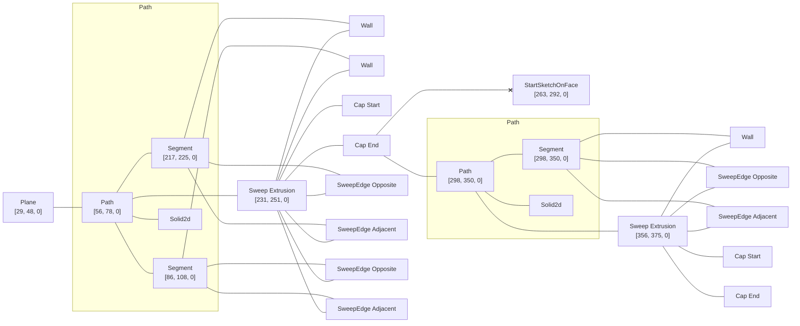

```mermaid
flowchart LR
  subgraph path2 [Path]
    2["Path<br>[56, 78, 0]"]
    3["Segment<br>[86, 108, 0]"]
    4["Segment<br>[217, 225, 0]"]
    5[Solid2d]
  end
  subgraph path15 [Path]
    15["Path<br>[298, 350, 0]"]
    16["Segment<br>[298, 350, 0]"]
    17[Solid2d]
  end
  1["Plane<br>[29, 48, 0]"]
  6["Sweep Extrusion<br>[231, 251, 0]"]
  7[Wall]
  8[Wall]
  9["Cap Start"]
  10["Cap End"]
  11["SweepEdge Opposite"]
  12["SweepEdge Adjacent"]
  13["SweepEdge Opposite"]
  14["SweepEdge Adjacent"]
  18["Sweep Extrusion<br>[356, 375, 0]"]
  19[Wall]
  20["Cap Start"]
  21["Cap End"]
  22["SweepEdge Opposite"]
  23["SweepEdge Adjacent"]
  24["StartSketchOnFace<br>[263, 292, 0]"]
  1 --- 2
  2 --- 3
  2 --- 4
  2 ---- 6
  2 --- 5
  3 --- 8
  3 --- 13
  3 --- 14
  4 --- 7
  4 --- 11
  4 --- 12
  6 --- 7
  6 --- 8
  6 --- 9
  6 --- 10
  6 --- 11
  6 --- 12
  6 --- 13
  6 --- 14
  10 --- 15
  15 --- 16
  15 ---- 18
  15 --- 17
  16 --- 19
  16 --- 22
  16 --- 23
  18 --- 19
  18 --- 20
  18 --- 21
  18 --- 22
  18 --- 23
  10 <--x 24
```
