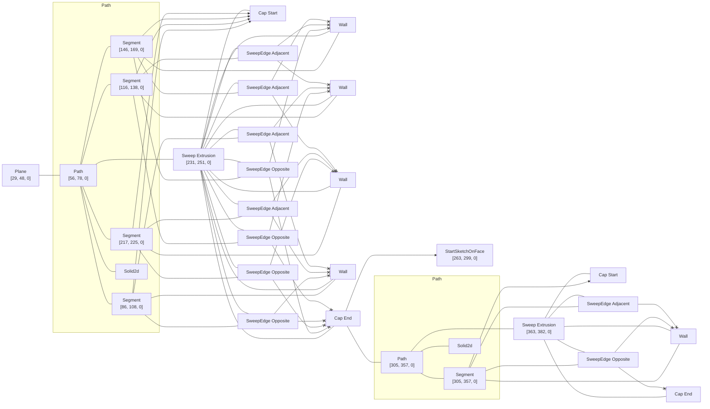

```mermaid
flowchart LR
  subgraph path3 [Path]
    3["Path<br>[56, 78, 0]"]
    5["Segment<br>[86, 108, 0]"]
    6["Segment<br>[116, 138, 0]"]
    7["Segment<br>[146, 169, 0]"]
    8["Segment<br>[217, 225, 0]"]
    11[Solid2d]
  end
  subgraph path4 [Path]
    4["Path<br>[305, 357, 0]"]
    9["Segment<br>[305, 357, 0]"]
    10[Solid2d]
  end
  1["Plane<br>[29, 48, 0]"]
  2["StartSketchOnFace<br>[263, 299, 0]"]
  12["Sweep Extrusion<br>[231, 251, 0]"]
  13["Sweep Extrusion<br>[363, 382, 0]"]
  14[Wall]
  15[Wall]
  16[Wall]
  17[Wall]
  18[Wall]
  19["Cap Start"]
  20["Cap Start"]
  21["Cap End"]
  22["Cap End"]
  23["SweepEdge Opposite"]
  24["SweepEdge Opposite"]
  25["SweepEdge Opposite"]
  26["SweepEdge Opposite"]
  27["SweepEdge Opposite"]
  28["SweepEdge Adjacent"]
  29["SweepEdge Adjacent"]
  30["SweepEdge Adjacent"]
  31["SweepEdge Adjacent"]
  32["SweepEdge Adjacent"]
  1 --- 3
  21 x--> 2
  3 --- 5
  3 --- 6
  3 --- 7
  3 --- 8
  3 --- 11
  3 ---- 12
  4 --- 9
  4 --- 10
  4 ---- 13
  21 --- 4
  5 --- 17
  5 x--> 19
  5 --- 25
  5 --- 29
  6 --- 15
  6 x--> 19
  6 --- 26
  6 --- 30
  7 --- 14
  7 x--> 19
  7 --- 23
  7 --- 31
  8 --- 16
  8 x--> 19
  8 --- 24
  8 --- 28
  9 --- 18
  9 x--> 20
  9 --- 27
  9 --- 32
  12 --- 14
  12 --- 15
  12 --- 16
  12 --- 17
  12 --- 19
  12 --- 21
  12 --- 23
  12 --- 24
  12 --- 25
  12 --- 26
  12 --- 28
  12 --- 29
  12 --- 30
  12 --- 31
  13 --- 18
  13 --- 20
  13 --- 22
  13 --- 27
  13 --- 32
  23 <--x 14
  30 <--x 14
  31 <--x 14
  26 <--x 15
  29 <--x 15
  30 <--x 15
  24 <--x 16
  28 <--x 16
  31 <--x 16
  25 <--x 17
  28 <--x 17
  29 <--x 17
  27 <--x 18
  32 <--x 18
  23 <--x 21
  24 <--x 21
  25 <--x 21
  26 <--x 21
  27 <--x 22
```
