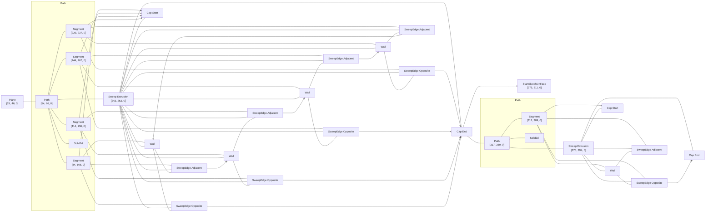

```mermaid
flowchart LR
  subgraph path3 [Path]
    3["Path<br>[54, 76, 0]"]
      %% [ProgramBodyItem { index: 0 }, VariableDeclarationDeclaration, VariableDeclarationInit, FunctionExpressionBody, FunctionExpressionBodyItem { index: 0 }, VariableDeclarationDeclaration, VariableDeclarationInit, PipeBodyItem { index: 1 }]
    5["Segment<br>[84, 106, 0]"]
      %% [ProgramBodyItem { index: 0 }, VariableDeclarationDeclaration, VariableDeclarationInit, FunctionExpressionBody, FunctionExpressionBodyItem { index: 0 }, VariableDeclarationDeclaration, VariableDeclarationInit, PipeBodyItem { index: 2 }]
    6["Segment<br>[114, 136, 0]"]
      %% [ProgramBodyItem { index: 0 }, VariableDeclarationDeclaration, VariableDeclarationInit, FunctionExpressionBody, FunctionExpressionBodyItem { index: 0 }, VariableDeclarationDeclaration, VariableDeclarationInit, PipeBodyItem { index: 3 }]
    7["Segment<br>[144, 167, 0]"]
      %% [ProgramBodyItem { index: 0 }, VariableDeclarationDeclaration, VariableDeclarationInit, FunctionExpressionBody, FunctionExpressionBodyItem { index: 0 }, VariableDeclarationDeclaration, VariableDeclarationInit, PipeBodyItem { index: 4 }]
    8["Segment<br>[229, 237, 0]"]
      %% [ProgramBodyItem { index: 1 }, VariableDeclarationDeclaration, VariableDeclarationInit, PipeBodyItem { index: 1 }]
    10[Solid2d]
  end
  subgraph path4 [Path]
    4["Path<br>[317, 369, 0]"]
      %% [ProgramBodyItem { index: 2 }, VariableDeclarationDeclaration, VariableDeclarationInit, PipeBodyItem { index: 1 }]
    9["Segment<br>[317, 369, 0]"]
      %% [ProgramBodyItem { index: 2 }, VariableDeclarationDeclaration, VariableDeclarationInit, PipeBodyItem { index: 1 }]
    11[Solid2d]
  end
  1["Plane<br>[29, 46, 0]"]
    %% [ProgramBodyItem { index: 0 }, VariableDeclarationDeclaration, VariableDeclarationInit, FunctionExpressionBody, FunctionExpressionBodyItem { index: 0 }, VariableDeclarationDeclaration, VariableDeclarationInit, PipeBodyItem { index: 0 }]
  2["StartSketchOnFace<br>[275, 311, 0]"]
    %% Missing NodePath
  12["Sweep Extrusion<br>[243, 263, 0]"]
    %% [ProgramBodyItem { index: 1 }, VariableDeclarationDeclaration, VariableDeclarationInit, PipeBodyItem { index: 2 }]
  13["Sweep Extrusion<br>[375, 394, 0]"]
    %% [ProgramBodyItem { index: 2 }, VariableDeclarationDeclaration, VariableDeclarationInit, PipeBodyItem { index: 2 }]
  14[Wall]
  15[Wall]
  16[Wall]
  17[Wall]
  18[Wall]
  19["Cap Start"]
  20["Cap Start"]
  21["Cap End"]
  22["Cap End"]
  23["SweepEdge Opposite"]
  24["SweepEdge Opposite"]
  25["SweepEdge Opposite"]
  26["SweepEdge Opposite"]
  27["SweepEdge Opposite"]
  28["SweepEdge Adjacent"]
  29["SweepEdge Adjacent"]
  30["SweepEdge Adjacent"]
  31["SweepEdge Adjacent"]
  32["SweepEdge Adjacent"]
  1 --- 3
  22 x--> 2
  3 --- 5
  3 --- 6
  3 --- 7
  3 --- 8
  3 --- 10
  3 ---- 12
  4 --- 9
  4 --- 11
  4 ---- 13
  22 --- 4
  5 --- 18
  5 x--> 20
  5 --- 27
  5 --- 32
  6 --- 16
  6 x--> 20
  6 --- 26
  6 --- 31
  7 --- 15
  7 x--> 20
  7 --- 25
  7 --- 30
  8 --- 17
  8 x--> 20
  8 --- 24
  8 --- 29
  9 --- 14
  9 x--> 19
  9 --- 23
  9 --- 28
  12 --- 15
  12 --- 16
  12 --- 17
  12 --- 18
  12 --- 20
  12 --- 22
  12 --- 24
  12 --- 25
  12 --- 26
  12 --- 27
  12 --- 29
  12 --- 30
  12 --- 31
  12 --- 32
  13 --- 14
  13 --- 19
  13 --- 21
  13 --- 23
  13 --- 28
  14 --- 23
  14 --- 28
  15 --- 25
  15 --- 30
  31 <--x 15
  16 --- 26
  16 --- 31
  32 <--x 16
  17 --- 24
  17 --- 29
  30 <--x 17
  18 --- 27
  29 <--x 18
  18 --- 32
  23 <--x 21
  24 <--x 22
  25 <--x 22
  26 <--x 22
  27 <--x 22
```
