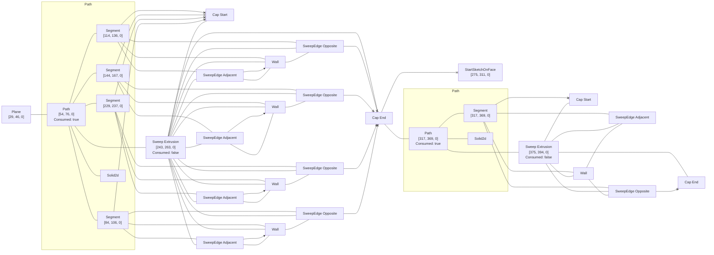

```mermaid
flowchart LR
  subgraph path6 [Path]
    6["Path<br>[54, 76, 0]<br>Consumed: true"]
      %% [ProgramBodyItem { index: 0 }, VariableDeclarationDeclaration, VariableDeclarationInit, FunctionExpressionBody, FunctionExpressionBodyItem { index: 0 }, VariableDeclarationDeclaration, VariableDeclarationInit, PipeBodyItem { index: 1 }]
    12["Segment<br>[84, 106, 0]"]
      %% [ProgramBodyItem { index: 0 }, VariableDeclarationDeclaration, VariableDeclarationInit, FunctionExpressionBody, FunctionExpressionBodyItem { index: 0 }, VariableDeclarationDeclaration, VariableDeclarationInit, PipeBodyItem { index: 2 }]
    8["Segment<br>[114, 136, 0]"]
      %% [ProgramBodyItem { index: 0 }, VariableDeclarationDeclaration, VariableDeclarationInit, FunctionExpressionBody, FunctionExpressionBodyItem { index: 0 }, VariableDeclarationDeclaration, VariableDeclarationInit, PipeBodyItem { index: 3 }]
    9["Segment<br>[144, 167, 0]"]
      %% [ProgramBodyItem { index: 0 }, VariableDeclarationDeclaration, VariableDeclarationInit, FunctionExpressionBody, FunctionExpressionBodyItem { index: 0 }, VariableDeclarationDeclaration, VariableDeclarationInit, PipeBodyItem { index: 4 }]
    10["Segment<br>[229, 237, 0]"]
      %% [ProgramBodyItem { index: 1 }, VariableDeclarationDeclaration, VariableDeclarationInit, PipeBodyItem { index: 1 }]
    14[Solid2d]
  end
  subgraph path5 [Path]
    5["Path<br>[317, 369, 0]<br>Consumed: true"]
      %% [ProgramBodyItem { index: 2 }, VariableDeclarationDeclaration, VariableDeclarationInit, PipeBodyItem { index: 1 }]
    11["Segment<br>[317, 369, 0]"]
      %% [ProgramBodyItem { index: 2 }, VariableDeclarationDeclaration, VariableDeclarationInit, PipeBodyItem { index: 1 }]
    13[Solid2d]
  end
  7["Plane<br>[29, 46, 0]"]
    %% [ProgramBodyItem { index: 0 }, VariableDeclarationDeclaration, VariableDeclarationInit, FunctionExpressionBody, FunctionExpressionBodyItem { index: 0 }, VariableDeclarationDeclaration, VariableDeclarationInit, PipeBodyItem { index: 0 }]
  16["Sweep Extrusion<br>[243, 263, 0]<br>Consumed: false"]
    %% [ProgramBodyItem { index: 1 }, VariableDeclarationDeclaration, VariableDeclarationInit, PipeBodyItem { index: 2 }]
  30[Wall]
    %% face_code_ref=Missing NodePath
  29[Wall]
    %% face_code_ref=Missing NodePath
  28[Wall]
    %% face_code_ref=Missing NodePath
  32[Wall]
    %% face_code_ref=Missing NodePath
  3["Cap Start"]
    %% face_code_ref=Missing NodePath
  1["Cap End"]
    %% face_code_ref=[ProgramBodyItem { index: 2 }, VariableDeclarationDeclaration, VariableDeclarationInit, PipeBodyItem { index: 0 }]
  25["SweepEdge Opposite"]
  20["SweepEdge Adjacent"]
  24["SweepEdge Opposite"]
  19["SweepEdge Adjacent"]
  23["SweepEdge Opposite"]
  18["SweepEdge Adjacent"]
  27["SweepEdge Opposite"]
  22["SweepEdge Adjacent"]
  17["Sweep Extrusion<br>[375, 394, 0]<br>Consumed: false"]
    %% [ProgramBodyItem { index: 2 }, VariableDeclarationDeclaration, VariableDeclarationInit, PipeBodyItem { index: 2 }]
  31[Wall]
    %% face_code_ref=Missing NodePath
  4["Cap Start"]
    %% face_code_ref=Missing NodePath
  2["Cap End"]
    %% face_code_ref=Missing NodePath
  26["SweepEdge Opposite"]
  21["SweepEdge Adjacent"]
  15["StartSketchOnFace<br>[275, 311, 0]"]
    %% [ProgramBodyItem { index: 2 }, VariableDeclarationDeclaration, VariableDeclarationInit, PipeBodyItem { index: 0 }]
  1 --- 5
  1 <--x 15
  16 --- 1
  23 <--x 1
  24 <--x 1
  25 <--x 1
  27 <--x 1
  17 --- 2
  26 <--x 2
  8 <--x 3
  9 <--x 3
  10 <--x 3
  12 <--x 3
  16 --- 3
  11 <--x 4
  17 --- 4
  5 --- 11
  5 --- 13
  5 ---- 17
  7 --- 6
  6 --- 8
  6 --- 9
  6 --- 10
  6 --- 12
  6 --- 14
  6 ---- 16
  8 --- 18
  8 --- 23
  8 --- 28
  9 --- 19
  9 --- 24
  9 --- 29
  10 --- 20
  10 --- 25
  10 --- 30
  11 --- 21
  11 --- 26
  11 --- 31
  12 --- 22
  12 --- 27
  12 --- 32
  16 --- 18
  16 --- 19
  16 --- 20
  16 --- 22
  16 --- 23
  16 --- 24
  16 --- 25
  16 --- 27
  16 --- 28
  16 --- 29
  16 --- 30
  16 --- 32
  17 --- 21
  17 --- 26
  17 --- 31
  28 --- 18
  18 x--> 28
  29 --- 19
  19 x--> 29
  30 --- 20
  20 x--> 30
  31 --- 21
  32 --- 22
  22 x--> 32
  28 --- 23
  29 --- 24
  30 --- 25
  31 --- 26
  32 --- 27
```
