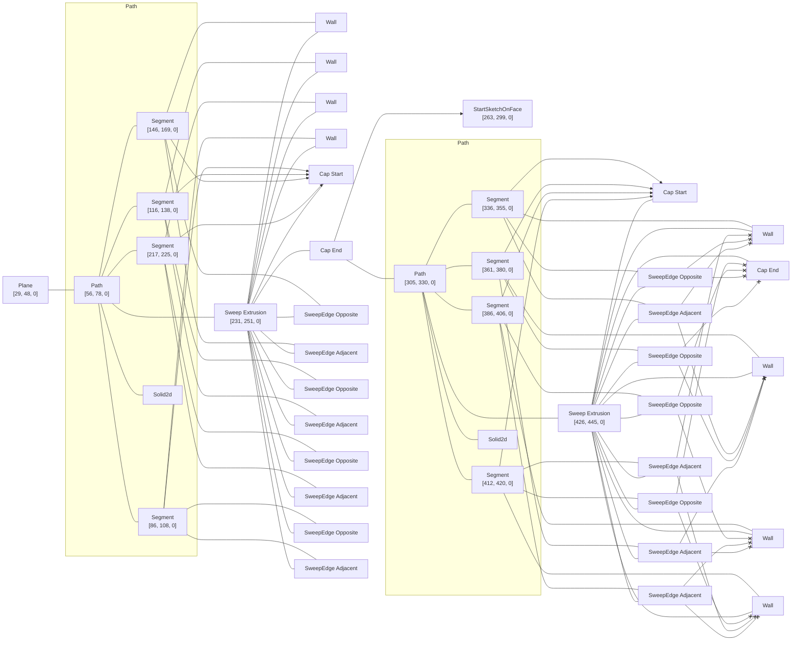

```mermaid
flowchart LR
  subgraph path3 [Path]
    3["Path<br>[56, 78, 0]"]
    5["Segment<br>[86, 108, 0]"]
    6["Segment<br>[116, 138, 0]"]
    7["Segment<br>[146, 169, 0]"]
    8["Segment<br>[217, 225, 0]"]
    14[Solid2d]
  end
  subgraph path4 [Path]
    4["Path<br>[305, 330, 0]"]
    9["Segment<br>[336, 355, 0]"]
    10["Segment<br>[361, 380, 0]"]
    11["Segment<br>[386, 406, 0]"]
    12["Segment<br>[412, 420, 0]"]
    13[Solid2d]
  end
  1["Plane<br>[29, 48, 0]"]
  2["StartSketchOnFace<br>[263, 299, 0]"]
  15["Sweep Extrusion<br>[231, 251, 0]"]
  16["Sweep Extrusion<br>[426, 445, 0]"]
  17[Wall]
  18[Wall]
  19[Wall]
  20[Wall]
  21[Wall]
  22[Wall]
  23[Wall]
  24[Wall]
  25["Cap Start"]
  26["Cap Start"]
  27["Cap End"]
  28["Cap End"]
  29["SweepEdge Opposite"]
  30["SweepEdge Adjacent"]
  31["SweepEdge Opposite"]
  32["SweepEdge Adjacent"]
  33["SweepEdge Opposite"]
  34["SweepEdge Adjacent"]
  35["SweepEdge Opposite"]
  36["SweepEdge Adjacent"]
  37["SweepEdge Opposite"]
  38["SweepEdge Adjacent"]
  39["SweepEdge Opposite"]
  40["SweepEdge Adjacent"]
  41["SweepEdge Opposite"]
  42["SweepEdge Adjacent"]
  43["SweepEdge Opposite"]
  44["SweepEdge Adjacent"]
  1 --- 3
  27 x--> 2
  3 --- 5
  3 --- 6
  3 --- 7
  3 --- 8
  3 --- 14
  3 ---- 15
  4 --- 9
  4 --- 10
  4 --- 11
  4 --- 12
  4 --- 13
  4 ---- 16
  27 --- 4
  5 --- 20
  5 x--> 25
  5 --- 35
  5 --- 36
  6 --- 18
  6 x--> 25
  6 --- 31
  6 --- 32
  7 --- 17
  7 x--> 25
  7 --- 29
  7 --- 30
  8 --- 19
  8 x--> 25
  8 --- 33
  8 --- 34
  9 --- 23
  9 x--> 26
  9 --- 41
  9 --- 42
  10 --- 24
  10 x--> 26
  10 --- 43
  10 --- 44
  11 --- 22
  11 x--> 26
  11 --- 39
  11 --- 40
  12 --- 21
  12 x--> 26
  12 --- 37
  12 --- 38
  15 --- 17
  15 --- 18
  15 --- 19
  15 --- 20
  15 --- 25
  15 --- 27
  15 --- 29
  15 --- 30
  15 --- 31
  15 --- 32
  15 --- 33
  15 --- 34
  15 --- 35
  15 --- 36
  16 --- 21
  16 --- 22
  16 --- 23
  16 --- 24
  16 --- 26
  16 --- 28
  16 --- 37
  16 --- 38
  16 --- 39
  16 --- 40
  16 --- 41
  16 --- 42
  16 --- 43
  16 --- 44
  37 <--x 21
  38 <--x 21
  40 <--x 21
  39 <--x 22
  40 <--x 22
  44 <--x 22
  38 <--x 23
  41 <--x 23
  42 <--x 23
  42 <--x 24
  43 <--x 24
  44 <--x 24
  37 <--x 28
  39 <--x 28
  41 <--x 28
  43 <--x 28
```
