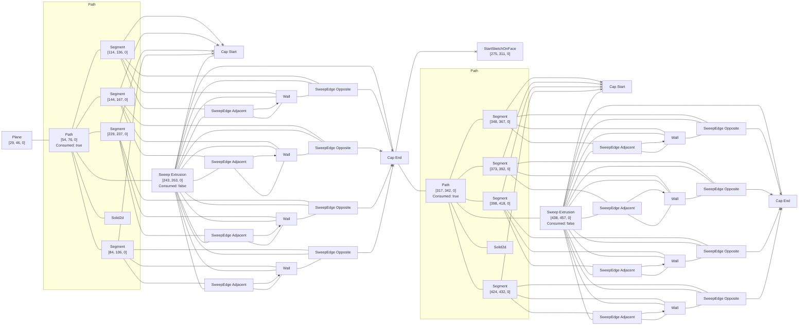

```mermaid
flowchart LR
  subgraph path5 [Path]
    5["Path<br>[317, 342, 0]<br>Consumed: true"]
      %% [ProgramBodyItem { index: 2 }, VariableDeclarationDeclaration, VariableDeclarationInit, PipeBodyItem { index: 1 }]
    11["Segment<br>[348, 367, 0]"]
      %% [ProgramBodyItem { index: 2 }, VariableDeclarationDeclaration, VariableDeclarationInit, PipeBodyItem { index: 2 }]
    12["Segment<br>[373, 392, 0]"]
      %% [ProgramBodyItem { index: 2 }, VariableDeclarationDeclaration, VariableDeclarationInit, PipeBodyItem { index: 3 }]
    13["Segment<br>[398, 418, 0]"]
      %% [ProgramBodyItem { index: 2 }, VariableDeclarationDeclaration, VariableDeclarationInit, PipeBodyItem { index: 4 }]
    14["Segment<br>[424, 432, 0]"]
      %% [ProgramBodyItem { index: 2 }, VariableDeclarationDeclaration, VariableDeclarationInit, PipeBodyItem { index: 5 }]
    16[Solid2d]
  end
  subgraph path6 [Path]
    6["Path<br>[54, 76, 0]<br>Consumed: true"]
      %% [ProgramBodyItem { index: 0 }, VariableDeclarationDeclaration, VariableDeclarationInit, FunctionExpressionBody, FunctionExpressionBodyItem { index: 0 }, VariableDeclarationDeclaration, VariableDeclarationInit, PipeBodyItem { index: 1 }]
    8["Segment<br>[114, 136, 0]"]
      %% [ProgramBodyItem { index: 0 }, VariableDeclarationDeclaration, VariableDeclarationInit, FunctionExpressionBody, FunctionExpressionBodyItem { index: 0 }, VariableDeclarationDeclaration, VariableDeclarationInit, PipeBodyItem { index: 3 }]
    9["Segment<br>[144, 167, 0]"]
      %% [ProgramBodyItem { index: 0 }, VariableDeclarationDeclaration, VariableDeclarationInit, FunctionExpressionBody, FunctionExpressionBodyItem { index: 0 }, VariableDeclarationDeclaration, VariableDeclarationInit, PipeBodyItem { index: 4 }]
    10["Segment<br>[229, 237, 0]"]
      %% [ProgramBodyItem { index: 1 }, VariableDeclarationDeclaration, VariableDeclarationInit, PipeBodyItem { index: 1 }]
    15["Segment<br>[84, 106, 0]"]
      %% [ProgramBodyItem { index: 0 }, VariableDeclarationDeclaration, VariableDeclarationInit, FunctionExpressionBody, FunctionExpressionBodyItem { index: 0 }, VariableDeclarationDeclaration, VariableDeclarationInit, PipeBodyItem { index: 2 }]
    17[Solid2d]
  end
  1["Cap End"]
    %% face_code_ref=[ProgramBodyItem { index: 2 }, VariableDeclarationDeclaration, VariableDeclarationInit, PipeBodyItem { index: 0 }]
  2["Cap End"]
    %% face_code_ref=Missing NodePath
  3["Cap Start"]
    %% face_code_ref=Missing NodePath
  4["Cap Start"]
    %% face_code_ref=Missing NodePath
  7["Plane<br>[29, 46, 0]"]
    %% [ProgramBodyItem { index: 0 }, VariableDeclarationDeclaration, VariableDeclarationInit, FunctionExpressionBody, FunctionExpressionBodyItem { index: 0 }, VariableDeclarationDeclaration, VariableDeclarationInit, PipeBodyItem { index: 0 }]
  18["StartSketchOnFace<br>[275, 311, 0]"]
    %% [ProgramBodyItem { index: 2 }, VariableDeclarationDeclaration, VariableDeclarationInit, PipeBodyItem { index: 0 }]
  19["Sweep Extrusion<br>[243, 263, 0]<br>Consumed: false"]
    %% [ProgramBodyItem { index: 1 }, VariableDeclarationDeclaration, VariableDeclarationInit, PipeBodyItem { index: 2 }]
  20["Sweep Extrusion<br>[438, 457, 0]<br>Consumed: false"]
    %% [ProgramBodyItem { index: 2 }, VariableDeclarationDeclaration, VariableDeclarationInit, PipeBodyItem { index: 6 }]
  21["SweepEdge Adjacent"]
  22["SweepEdge Adjacent"]
  23["SweepEdge Adjacent"]
  24["SweepEdge Adjacent"]
  25["SweepEdge Adjacent"]
  26["SweepEdge Adjacent"]
  27["SweepEdge Adjacent"]
  28["SweepEdge Adjacent"]
  29["SweepEdge Opposite"]
  30["SweepEdge Opposite"]
  31["SweepEdge Opposite"]
  32["SweepEdge Opposite"]
  33["SweepEdge Opposite"]
  34["SweepEdge Opposite"]
  35["SweepEdge Opposite"]
  36["SweepEdge Opposite"]
  37[Wall]
    %% face_code_ref=Missing NodePath
  38[Wall]
    %% face_code_ref=Missing NodePath
  39[Wall]
    %% face_code_ref=Missing NodePath
  40[Wall]
    %% face_code_ref=Missing NodePath
  41[Wall]
    %% face_code_ref=Missing NodePath
  42[Wall]
    %% face_code_ref=Missing NodePath
  43[Wall]
    %% face_code_ref=Missing NodePath
  44[Wall]
    %% face_code_ref=Missing NodePath
  1 --- 5
  1 <--x 18
  19 --- 1
  29 <--x 1
  30 <--x 1
  31 <--x 1
  36 <--x 1
  20 --- 2
  32 <--x 2
  33 <--x 2
  34 <--x 2
  35 <--x 2
  8 <--x 3
  9 <--x 3
  10 <--x 3
  15 <--x 3
  19 --- 3
  11 <--x 4
  12 <--x 4
  13 <--x 4
  14 <--x 4
  20 --- 4
  5 --- 11
  5 --- 12
  5 --- 13
  5 --- 14
  5 --- 16
  5 ---- 20
  7 --- 6
  6 --- 8
  6 --- 9
  6 --- 10
  6 --- 15
  6 --- 17
  6 ---- 19
  8 --- 21
  8 --- 29
  8 --- 37
  9 --- 22
  9 --- 30
  9 --- 38
  10 --- 23
  10 --- 31
  10 --- 39
  11 --- 24
  11 --- 32
  11 --- 40
  12 --- 25
  12 --- 33
  12 --- 41
  13 --- 26
  13 --- 34
  13 --- 42
  14 --- 27
  14 --- 35
  14 --- 43
  15 --- 28
  15 --- 36
  15 --- 44
  19 --- 21
  19 --- 22
  19 --- 23
  19 --- 28
  19 --- 29
  19 --- 30
  19 --- 31
  19 --- 36
  19 --- 37
  19 --- 38
  19 --- 39
  19 --- 44
  20 --- 24
  20 --- 25
  20 --- 26
  20 --- 27
  20 --- 32
  20 --- 33
  20 --- 34
  20 --- 35
  20 --- 40
  20 --- 41
  20 --- 42
  20 --- 43
  37 --- 21
  21 x--> 37
  38 --- 22
  22 x--> 38
  39 --- 23
  23 x--> 39
  40 --- 24
  24 x--> 40
  41 --- 25
  25 x--> 41
  42 --- 26
  26 x--> 42
  27 x--> 43
  43 --- 27
  28 x--> 44
  44 --- 28
  37 --- 29
  38 --- 30
  39 --- 31
  40 --- 32
  41 --- 33
  42 --- 34
  43 --- 35
  44 --- 36
```
