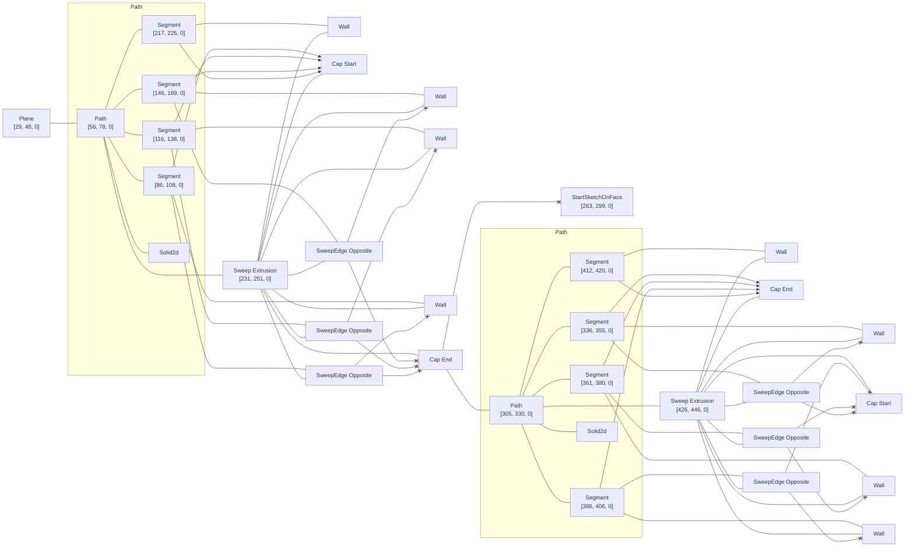

```mermaid
flowchart LR
  subgraph path2 [Path]
    2["Path<br>[56, 78, 0]"]
    3["Segment<br>[86, 108, 0]"]
    4["Segment<br>[116, 138, 0]"]
    5["Segment<br>[146, 169, 0]"]
    6["Segment<br>[217, 225, 0]"]
    7[Solid2d]
  end
  subgraph path18 [Path]
    18["Path<br>[305, 330, 0]"]
    19["Segment<br>[336, 355, 0]"]
    20["Segment<br>[361, 380, 0]"]
    21["Segment<br>[386, 406, 0]"]
    22["Segment<br>[412, 420, 0]"]
    23[Solid2d]
  end
  1["Plane<br>[29, 48, 0]"]
  8["Sweep Extrusion<br>[231, 251, 0]"]
  9[Wall]
  10[Wall]
  11[Wall]
  12[Wall]
  13["Cap Start"]
  14["Cap End"]
  15["SweepEdge Opposite"]
  16["SweepEdge Opposite"]
  17["SweepEdge Opposite"]
  24["Sweep Extrusion<br>[426, 446, 0]"]
  25[Wall]
  26[Wall]
  27[Wall]
  28[Wall]
  29["Cap Start"]
  30["Cap End"]
  31["SweepEdge Opposite"]
  32["SweepEdge Opposite"]
  33["SweepEdge Opposite"]
  34["StartSketchOnFace<br>[263, 299, 0]"]
  1 --- 2
  2 --- 3
  2 --- 4
  2 --- 5
  2 --- 6
  2 ---- 8
  2 --- 7
  3 --- 12
  3 --- 17
  3 x--> 13
  4 --- 11
  4 --- 16
  4 x--> 13
  5 --- 10
  5 --- 15
  5 x--> 13
  6 --- 9
  6 x--> 13
  8 --- 9
  8 --- 10
  8 --- 11
  8 --- 12
  8 --- 13
  8 --- 14
  8 --- 15
  8 --- 16
  8 --- 17
  14 --- 18
  15 <--x 10
  15 <--x 14
  16 <--x 11
  16 <--x 14
  17 <--x 12
  17 <--x 14
  18 --- 19
  18 --- 20
  18 --- 21
  18 --- 22
  18 ---- 24
  18 --- 23
  19 --- 28
  19 --- 33
  19 x--> 30
  20 --- 27
  20 --- 32
  20 x--> 30
  21 --- 26
  21 --- 31
  21 x--> 30
  22 --- 25
  22 x--> 30
  24 --- 25
  24 --- 26
  24 --- 27
  24 --- 28
  24 --- 29
  24 --- 30
  24 --- 31
  24 --- 32
  24 --- 33
  31 <--x 26
  31 <--x 29
  32 <--x 27
  32 <--x 29
  33 <--x 28
  33 <--x 29
  14 <--x 34
```
