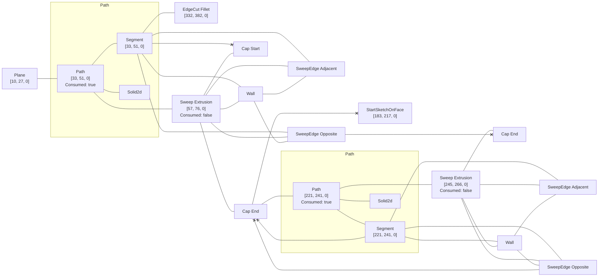

```mermaid
flowchart LR
  subgraph path5 [Path]
    5["Path<br>[221, 241, 0]<br>Consumed: true"]
      %% [ProgramBodyItem { index: 2 }, ExpressionStatementExpr, PipeBodyItem { index: 1 }]
    8["Segment<br>[221, 241, 0]"]
      %% [ProgramBodyItem { index: 2 }, ExpressionStatementExpr, PipeBodyItem { index: 1 }]
    10[Solid2d]
  end
  subgraph path6 [Path]
    6["Path<br>[33, 51, 0]<br>Consumed: true"]
      %% [ProgramBodyItem { index: 0 }, VariableDeclarationDeclaration, VariableDeclarationInit, PipeBodyItem { index: 1 }]
    9["Segment<br>[33, 51, 0]"]
      %% [ProgramBodyItem { index: 0 }, VariableDeclarationDeclaration, VariableDeclarationInit, PipeBodyItem { index: 1 }]
    11[Solid2d]
  end
  1["Cap End"]
    %% face_code_ref=[ProgramBodyItem { index: 2 }, ExpressionStatementExpr, PipeBodyItem { index: 0 }]
  2["Cap End"]
    %% face_code_ref=Missing NodePath
  3["Cap Start"]
    %% face_code_ref=Missing NodePath
  4["EdgeCut Fillet<br>[332, 382, 0]"]
    %% [ProgramBodyItem { index: 4 }, ExpressionStatementExpr]
  7["Plane<br>[10, 27, 0]"]
    %% [ProgramBodyItem { index: 0 }, VariableDeclarationDeclaration, VariableDeclarationInit, PipeBodyItem { index: 0 }]
  12["StartSketchOnFace<br>[183, 217, 0]"]
    %% [ProgramBodyItem { index: 2 }, ExpressionStatementExpr, PipeBodyItem { index: 0 }]
  13["Sweep Extrusion<br>[245, 266, 0]<br>Consumed: false"]
    %% [ProgramBodyItem { index: 2 }, ExpressionStatementExpr, PipeBodyItem { index: 2 }]
  14["Sweep Extrusion<br>[57, 76, 0]<br>Consumed: false"]
    %% [ProgramBodyItem { index: 0 }, VariableDeclarationDeclaration, VariableDeclarationInit, PipeBodyItem { index: 2 }]
  15["SweepEdge Adjacent"]
  16["SweepEdge Adjacent"]
  17["SweepEdge Opposite"]
  18["SweepEdge Opposite"]
  19[Wall]
    %% face_code_ref=Missing NodePath
  20[Wall]
    %% face_code_ref=Missing NodePath
  1 --- 5
  8 <--x 1
  1 <--x 12
  14 --- 1
  17 <--x 1
  13 --- 2
  18 <--x 2
  9 <--x 3
  14 --- 3
  9 --- 4
  5 --- 8
  5 --- 10
  5 ---- 13
  7 --- 6
  6 --- 9
  6 --- 11
  6 ---- 14
  8 --- 15
  8 --- 17
  8 --- 19
  9 --- 16
  9 --- 18
  9 --- 20
  13 --- 15
  13 --- 17
  13 --- 19
  14 --- 16
  14 --- 18
  14 --- 20
  19 --- 15
  20 --- 16
  19 --- 17
  20 --- 18
```
