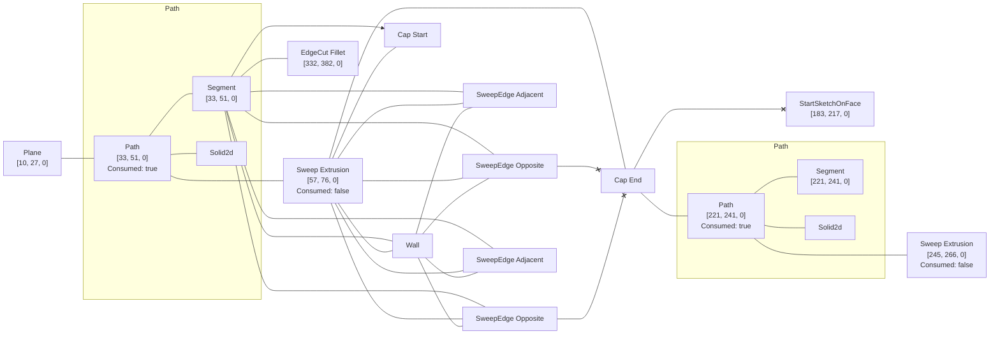

```mermaid
flowchart LR
  subgraph path2 [Path]
    2["Path<br>[33, 51, 0]<br>Consumed: true"]
      %% [ProgramBodyItem { index: 0 }, VariableDeclarationDeclaration, VariableDeclarationInit, PipeBodyItem { index: 1 }]
    3["Segment<br>[33, 51, 0]"]
      %% [ProgramBodyItem { index: 0 }, VariableDeclarationDeclaration, VariableDeclarationInit, PipeBodyItem { index: 1 }]
    4[Solid2d]
  end
  subgraph path11 [Path]
    11["Path<br>[221, 241, 0]<br>Consumed: true"]
      %% [ProgramBodyItem { index: 2 }, ExpressionStatementExpr, PipeBodyItem { index: 1 }]
    12["Segment<br>[221, 241, 0]"]
      %% [ProgramBodyItem { index: 2 }, ExpressionStatementExpr, PipeBodyItem { index: 1 }]
    13[Solid2d]
  end
  1["Plane<br>[10, 27, 0]"]
    %% [ProgramBodyItem { index: 0 }, VariableDeclarationDeclaration, VariableDeclarationInit, PipeBodyItem { index: 0 }]
  5["Sweep Extrusion<br>[57, 76, 0]<br>Consumed: false"]
    %% [ProgramBodyItem { index: 0 }, VariableDeclarationDeclaration, VariableDeclarationInit, PipeBodyItem { index: 2 }]
  6[Wall]
    %% face_code_ref=Missing NodePath
  7["Cap Start"]
    %% face_code_ref=Missing NodePath
  8["Cap End"]
    %% face_code_ref=[ProgramBodyItem { index: 2 }, ExpressionStatementExpr, PipeBodyItem { index: 0 }]
  9["SweepEdge Opposite"]
  10["SweepEdge Adjacent"]
  14["Sweep Extrusion<br>[245, 266, 0]<br>Consumed: false"]
    %% [ProgramBodyItem { index: 2 }, ExpressionStatementExpr, PipeBodyItem { index: 2 }]
  15["SweepEdge Opposite"]
  16["SweepEdge Adjacent"]
  17["EdgeCut Fillet<br>[332, 382, 0]"]
    %% [ProgramBodyItem { index: 4 }, ExpressionStatementExpr]
  18["StartSketchOnFace<br>[183, 217, 0]"]
    %% [ProgramBodyItem { index: 2 }, ExpressionStatementExpr, PipeBodyItem { index: 0 }]
  1 --- 2
  2 --- 3
  2 --- 4
  2 ---- 5
  3 --- 6
  3 x--> 7
  3 --- 9
  3 --- 10
  3 --- 15
  3 --- 16
  3 --- 17
  5 --- 6
  5 --- 7
  5 --- 8
  5 --- 9
  5 --- 10
  5 --- 15
  5 --- 16
  6 --- 9
  6 --- 10
  6 --- 15
  6 --- 16
  9 <--x 8
  8 --- 11
  15 <--x 8
  8 <--x 18
  11 --- 12
  11 --- 13
  11 ---- 14
```
