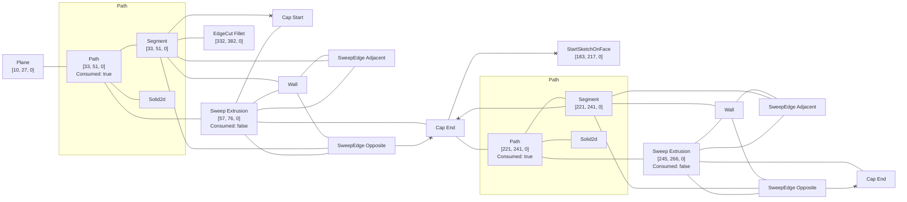

```mermaid
flowchart LR
  subgraph path6 [Path]
    6["Path<br>[33, 51, 0]<br>Consumed: true"]
      %% [ProgramBodyItem { index: 0 }, VariableDeclarationDeclaration, VariableDeclarationInit, PipeBodyItem { index: 1 }]
    7["Segment<br>[33, 51, 0]"]
      %% [ProgramBodyItem { index: 0 }, VariableDeclarationDeclaration, VariableDeclarationInit, PipeBodyItem { index: 1 }]
    16[Solid2d]
  end
  subgraph path11 [Path]
    11["Path<br>[221, 241, 0]<br>Consumed: true"]
      %% [ProgramBodyItem { index: 2 }, ExpressionStatementExpr, PipeBodyItem { index: 1 }]
    12["Segment<br>[221, 241, 0]"]
      %% [ProgramBodyItem { index: 2 }, ExpressionStatementExpr, PipeBodyItem { index: 1 }]
    15[Solid2d]
  end
  1["Cap End"]
    %% face_code_ref=Missing NodePath
  2["Cap Start"]
    %% face_code_ref=Missing NodePath
  3[Wall]
    %% face_code_ref=Missing NodePath
  4[Wall]
    %% face_code_ref=Missing NodePath
  5["Plane<br>[10, 27, 0]"]
    %% [ProgramBodyItem { index: 0 }, VariableDeclarationDeclaration, VariableDeclarationInit, PipeBodyItem { index: 0 }]
  8["Sweep Extrusion<br>[57, 76, 0]<br>Consumed: false"]
    %% [ProgramBodyItem { index: 0 }, VariableDeclarationDeclaration, VariableDeclarationInit, PipeBodyItem { index: 2 }]
  9["Cap End"]
    %% face_code_ref=[ProgramBodyItem { index: 2 }, ExpressionStatementExpr, PipeBodyItem { index: 0 }]
  10["StartSketchOnFace<br>[183, 217, 0]"]
    %% [ProgramBodyItem { index: 2 }, ExpressionStatementExpr, PipeBodyItem { index: 0 }]
  13["Sweep Extrusion<br>[245, 266, 0]<br>Consumed: false"]
    %% [ProgramBodyItem { index: 2 }, ExpressionStatementExpr, PipeBodyItem { index: 2 }]
  14["EdgeCut Fillet<br>[332, 382, 0]"]
    %% [ProgramBodyItem { index: 4 }, ExpressionStatementExpr]
  17["SweepEdge Adjacent"]
  18["SweepEdge Adjacent"]
  19["SweepEdge Opposite"]
  20["SweepEdge Opposite"]
  13 --- 1
  19 <--x 1
  7 <--x 2
  8 --- 2
  12 --- 3
  13 --- 3
  3 --- 17
  3 --- 19
  7 --- 4
  8 --- 4
  4 --- 18
  4 --- 20
  5 --- 6
  6 --- 7
  6 ---- 8
  6 --- 16
  7 --- 14
  7 --- 18
  7 --- 20
  8 --- 9
  8 --- 18
  8 --- 20
  9 <--x 10
  9 --- 11
  12 <--x 9
  20 <--x 9
  11 --- 12
  11 ---- 13
  11 --- 15
  12 --- 17
  12 --- 19
  13 --- 17
  13 --- 19
```
