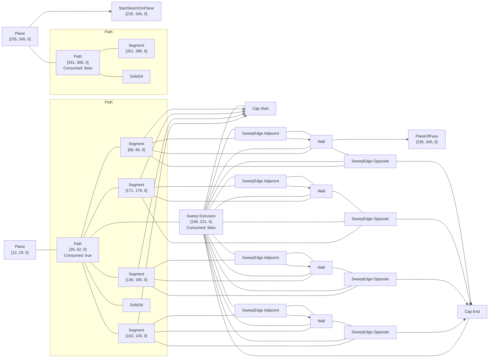

```mermaid
flowchart LR
  subgraph path4 [Path]
    4["Path<br>[35, 62, 0]<br>Consumed: true"]
      %% [ProgramBodyItem { index: 0 }, VariableDeclarationDeclaration, VariableDeclarationInit, PipeBodyItem { index: 1 }]
    12["Segment<br>[68, 96, 0]"]
      %% [ProgramBodyItem { index: 0 }, VariableDeclarationDeclaration, VariableDeclarationInit, PipeBodyItem { index: 2 }]
    8["Segment<br>[102, 130, 0]"]
      %% [ProgramBodyItem { index: 0 }, VariableDeclarationDeclaration, VariableDeclarationInit, PipeBodyItem { index: 3 }]
    9["Segment<br>[136, 165, 0]"]
      %% [ProgramBodyItem { index: 0 }, VariableDeclarationDeclaration, VariableDeclarationInit, PipeBodyItem { index: 4 }]
    10["Segment<br>[171, 178, 0]"]
      %% [ProgramBodyItem { index: 0 }, VariableDeclarationDeclaration, VariableDeclarationInit, PipeBodyItem { index: 5 }]
    14[Solid2d]
  end
  subgraph path3 [Path]
    3["Path<br>[351, 388, 0]<br>Consumed: false"]
      %% [ProgramBodyItem { index: 2 }, VariableDeclarationDeclaration, VariableDeclarationInit, PipeBodyItem { index: 1 }]
    11["Segment<br>[351, 388, 0]"]
      %% [ProgramBodyItem { index: 2 }, VariableDeclarationDeclaration, VariableDeclarationInit, PipeBodyItem { index: 1 }]
    13[Solid2d]
  end
  5["Plane<br>[12, 29, 0]"]
    %% [ProgramBodyItem { index: 0 }, VariableDeclarationDeclaration, VariableDeclarationInit, PipeBodyItem { index: 0 }]
  16["Sweep Extrusion<br>[190, 221, 0]<br>Consumed: false"]
    %% [ProgramBodyItem { index: 1 }, VariableDeclarationDeclaration, VariableDeclarationInit]
  28[Wall]
    %% face_code_ref=Missing NodePath
  25[Wall]
    %% face_code_ref=Missing NodePath
  26[Wall]
    %% face_code_ref=Missing NodePath
  27[Wall]
    %% face_code_ref=Missing NodePath
  2["Cap Start"]
    %% face_code_ref=Missing NodePath
  1["Cap End"]
    %% face_code_ref=Missing NodePath
  24["SweepEdge Opposite"]
  20["SweepEdge Adjacent"]
  21["SweepEdge Opposite"]
  17["SweepEdge Adjacent"]
  22["SweepEdge Opposite"]
  18["SweepEdge Adjacent"]
  23["SweepEdge Opposite"]
  19["SweepEdge Adjacent"]
  7["PlaneOfFace<br>[235, 345, 0]"]
    %% [ProgramBodyItem { index: 2 }, VariableDeclarationDeclaration, VariableDeclarationInit, PipeBodyItem { index: 0 }]
  6["Plane<br>[235, 345, 0]"]
    %% [ProgramBodyItem { index: 2 }, VariableDeclarationDeclaration, VariableDeclarationInit, PipeBodyItem { index: 0 }]
  15["StartSketchOnPlane<br>[235, 345, 0]"]
    %% [ProgramBodyItem { index: 2 }, VariableDeclarationDeclaration, VariableDeclarationInit, PipeBodyItem { index: 0 }]
  16 --- 1
  21 <--x 1
  22 <--x 1
  23 <--x 1
  24 <--x 1
  8 <--x 2
  9 <--x 2
  10 <--x 2
  12 <--x 2
  16 --- 2
  6 --- 3
  3 --- 11
  3 --- 13
  5 --- 4
  4 --- 8
  4 --- 9
  4 --- 10
  4 --- 12
  4 --- 14
  4 ---- 16
  6 <--x 15
  28 x--> 7
  8 --- 17
  8 --- 21
  8 --- 25
  9 --- 18
  9 --- 22
  9 --- 26
  10 --- 19
  10 --- 23
  10 --- 27
  12 --- 20
  12 --- 24
  12 --- 28
  16 --- 17
  16 --- 18
  16 --- 19
  16 --- 20
  16 --- 21
  16 --- 22
  16 --- 23
  16 --- 24
  16 --- 25
  16 --- 26
  16 --- 27
  16 --- 28
  25 --- 17
  17 x--> 25
  26 --- 18
  18 x--> 26
  27 --- 19
  19 x--> 27
  28 --- 20
  20 x--> 28
  25 --- 21
  26 --- 22
  27 --- 23
  28 --- 24
```
