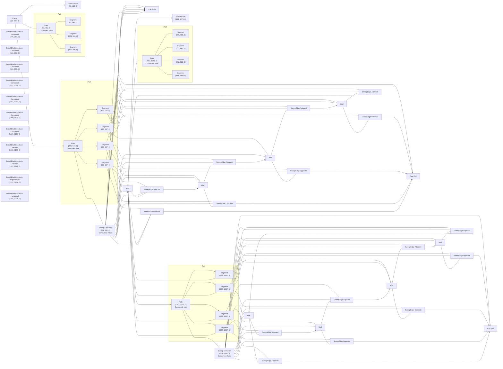

```mermaid
flowchart LR
  subgraph path2 [Path]
    2["Path<br>[53, 482, 0]<br>Consumed: false"]
      %% [ProgramBodyItem { index: 0 }, VariableDeclarationDeclaration, VariableDeclarationInit, SketchBlock]
    3["Segment<br>[81, 143, 0]"]
      %% [ProgramBodyItem { index: 0 }, VariableDeclarationDeclaration, VariableDeclarationInit, SketchBlock]
    4["Segment<br>[223, 320, 0]"]
      %% [ProgramBodyItem { index: 0 }, VariableDeclarationDeclaration, VariableDeclarationInit, SketchBlock]
    5["Segment<br>[407, 480, 0]"]
      %% [ProgramBodyItem { index: 0 }, VariableDeclarationDeclaration, VariableDeclarationInit, SketchBlock]
  end
  subgraph path6 [Path]
    6["Path<br>[495, 547, 0]<br>Consumed: true"]
      %% [ProgramBodyItem { index: 1 }, VariableDeclarationDeclaration, VariableDeclarationInit]
    7["Segment<br>[495, 547, 0]"]
      %% [ProgramBodyItem { index: 1 }, VariableDeclarationDeclaration, VariableDeclarationInit]
    8["Segment<br>[495, 547, 0]"]
      %% [ProgramBodyItem { index: 1 }, VariableDeclarationDeclaration, VariableDeclarationInit]
    9["Segment<br>[495, 547, 0]"]
      %% [ProgramBodyItem { index: 1 }, VariableDeclarationDeclaration, VariableDeclarationInit]
    10["Segment<br>[495, 547, 0]"]
      %% [ProgramBodyItem { index: 1 }, VariableDeclarationDeclaration, VariableDeclarationInit]
  end
  subgraph path26 [Path]
    26["Path<br>[663, 1273, 0]<br>Consumed: false"]
      %% [ProgramBodyItem { index: 4 }, VariableDeclarationDeclaration, VariableDeclarationInit, SketchBlock]
    27["Segment<br>[696, 766, 0]"]
      %% [ProgramBodyItem { index: 4 }, VariableDeclarationDeclaration, VariableDeclarationInit, SketchBlock]
    28["Segment<br>[777, 847, 0]"]
      %% [ProgramBodyItem { index: 4 }, VariableDeclarationDeclaration, VariableDeclarationInit, SketchBlock]
    29["Segment<br>[858, 928, 0]"]
      %% [ProgramBodyItem { index: 4 }, VariableDeclarationDeclaration, VariableDeclarationInit, SketchBlock]
    30["Segment<br>[939, 1009, 0]"]
      %% [ProgramBodyItem { index: 4 }, VariableDeclarationDeclaration, VariableDeclarationInit, SketchBlock]
  end
  subgraph path31 [Path]
    31["Path<br>[1287, 1337, 0]<br>Consumed: true"]
      %% [ProgramBodyItem { index: 5 }, VariableDeclarationDeclaration, VariableDeclarationInit]
    32["Segment<br>[1287, 1337, 0]"]
      %% [ProgramBodyItem { index: 5 }, VariableDeclarationDeclaration, VariableDeclarationInit]
    33["Segment<br>[1287, 1337, 0]"]
      %% [ProgramBodyItem { index: 5 }, VariableDeclarationDeclaration, VariableDeclarationInit]
    34["Segment<br>[1287, 1337, 0]"]
      %% [ProgramBodyItem { index: 5 }, VariableDeclarationDeclaration, VariableDeclarationInit]
    35["Segment<br>[1287, 1337, 0]"]
      %% [ProgramBodyItem { index: 5 }, VariableDeclarationDeclaration, VariableDeclarationInit]
  end
  1["Plane<br>[53, 482, 0]"]
    %% [ProgramBodyItem { index: 0 }, VariableDeclarationDeclaration, VariableDeclarationInit, SketchBlock]
  11["Sweep Extrusion<br>[561, 591, 0]<br>Consumed: false"]
    %% [ProgramBodyItem { index: 2 }, VariableDeclarationDeclaration, VariableDeclarationInit]
  12[Wall]
    %% face_code_ref=Missing NodePath
  13[Wall]
    %% face_code_ref=Missing NodePath
  14[Wall]
    %% face_code_ref=Missing NodePath
  15[Wall]
    %% face_code_ref=Missing NodePath
  16["Cap Start"]
    %% face_code_ref=Missing NodePath
  17["Cap End"]
    %% face_code_ref=Missing NodePath
  18["SweepEdge Opposite"]
  19["SweepEdge Adjacent"]
  20["SweepEdge Opposite"]
  21["SweepEdge Adjacent"]
  22["SweepEdge Opposite"]
  23["SweepEdge Adjacent"]
  24["SweepEdge Opposite"]
  25["SweepEdge Adjacent"]
  36["Sweep Extrusion<br>[1351, 1381, 0]<br>Consumed: false"]
    %% [ProgramBodyItem { index: 6 }, VariableDeclarationDeclaration, VariableDeclarationInit]
  37[Wall]
    %% face_code_ref=Missing NodePath
  38[Wall]
    %% face_code_ref=Missing NodePath
  39[Wall]
    %% face_code_ref=Missing NodePath
  40[Wall]
    %% face_code_ref=Missing NodePath
  41["Cap End"]
    %% face_code_ref=Missing NodePath
  42["SweepEdge Opposite"]
  43["SweepEdge Adjacent"]
  44["SweepEdge Opposite"]
  45["SweepEdge Adjacent"]
  46["SweepEdge Opposite"]
  47["SweepEdge Adjacent"]
  48["SweepEdge Opposite"]
  49["SweepEdge Adjacent"]
  50["SketchBlock<br>[53, 482, 0]"]
    %% [ProgramBodyItem { index: 0 }, VariableDeclarationDeclaration, VariableDeclarationInit, SketchBlock]
  51["SketchBlockConstraint Horizontal<br>[196, 213, 0]"]
    %% [ProgramBodyItem { index: 0 }, VariableDeclarationDeclaration, VariableDeclarationInit, SketchBlock]
  52["SketchBlockConstraint Coincident<br>[323, 358, 0]"]
    %% [ProgramBodyItem { index: 0 }, VariableDeclarationDeclaration, VariableDeclarationInit, SketchBlock]
  53["SketchBlockConstraint Coincident<br>[361, 396, 0]"]
    %% [ProgramBodyItem { index: 0 }, VariableDeclarationDeclaration, VariableDeclarationInit, SketchBlock]
  54["SketchBlock<br>[663, 1273, 0]"]
    %% [ProgramBodyItem { index: 4 }, VariableDeclarationDeclaration, VariableDeclarationInit, SketchBlock]
  55["SketchBlockConstraint Coincident<br>[1012, 1048, 0]"]
    %% [ProgramBodyItem { index: 4 }, VariableDeclarationDeclaration, VariableDeclarationInit, SketchBlock]
  56["SketchBlockConstraint Coincident<br>[1051, 1087, 0]"]
    %% [ProgramBodyItem { index: 4 }, VariableDeclarationDeclaration, VariableDeclarationInit, SketchBlock]
  57["SketchBlockConstraint Coincident<br>[1090, 1126, 0]"]
    %% [ProgramBodyItem { index: 4 }, VariableDeclarationDeclaration, VariableDeclarationInit, SketchBlock]
  58["SketchBlockConstraint Coincident<br>[1129, 1165, 0]"]
    %% [ProgramBodyItem { index: 4 }, VariableDeclarationDeclaration, VariableDeclarationInit, SketchBlock]
  59["SketchBlockConstraint Parallel<br>[1168, 1192, 0]"]
    %% [ProgramBodyItem { index: 4 }, VariableDeclarationDeclaration, VariableDeclarationInit, SketchBlock]
  60["SketchBlockConstraint Parallel<br>[1195, 1219, 0]"]
    %% [ProgramBodyItem { index: 4 }, VariableDeclarationDeclaration, VariableDeclarationInit, SketchBlock]
  61["SketchBlockConstraint Perpendicular<br>[1222, 1251, 0]"]
    %% [ProgramBodyItem { index: 4 }, VariableDeclarationDeclaration, VariableDeclarationInit, SketchBlock]
  62["SketchBlockConstraint Horizontal<br>[1254, 1271, 0]"]
    %% [ProgramBodyItem { index: 4 }, VariableDeclarationDeclaration, VariableDeclarationInit, SketchBlock]
  1 --- 2
  1 <--x 6
  1 <--x 50
  2 --- 3
  2 --- 4
  2 --- 5
  6 <--x 7
  6 <--x 8
  6 <--x 9
  6 <--x 10
  6 ---- 11
  7 --- 15
  7 x--> 16
  7 --- 24
  7 --- 25
  8 --- 14
  8 x--> 16
  8 --- 22
  8 --- 23
  9 --- 12
  9 x--> 16
  9 --- 18
  9 --- 19
  10 --- 13
  10 x--> 16
  10 --- 20
  10 --- 21
  11 --- 12
  11 --- 13
  11 --- 14
  11 --- 15
  11 --- 16
  11 --- 17
  11 --- 18
  11 --- 19
  11 --- 20
  11 --- 21
  11 --- 22
  11 --- 23
  11 --- 24
  11 --- 25
  12 --- 18
  12 --- 19
  21 <--x 12
  13 --- 20
  13 --- 21
  23 <--x 13
  14 --- 22
  14 --- 23
  25 <--x 14
  19 <--x 15
  15 --- 24
  15 --- 25
  15 --- 26
  15 <--x 31
  32 <--x 15
  33 <--x 15
  34 <--x 15
  35 <--x 15
  15 <--x 54
  18 <--x 17
  20 <--x 17
  22 <--x 17
  24 <--x 17
  26 --- 27
  26 --- 28
  26 --- 29
  26 --- 30
  31 <--x 32
  31 <--x 33
  31 <--x 34
  31 <--x 35
  31 ---- 36
  32 --- 40
  32 --- 48
  32 --- 49
  33 --- 39
  33 --- 46
  33 --- 47
  34 --- 37
  34 --- 42
  34 --- 43
  35 --- 38
  35 --- 44
  35 --- 45
  36 --- 37
  36 --- 38
  36 --- 39
  36 --- 40
  36 --- 41
  36 --- 42
  36 --- 43
  36 --- 44
  36 --- 45
  36 --- 46
  36 --- 47
  36 --- 48
  36 --- 49
  37 --- 42
  37 --- 43
  45 <--x 37
  38 --- 44
  38 --- 45
  47 <--x 38
  39 --- 46
  39 --- 47
  49 <--x 39
  43 <--x 40
  40 --- 48
  40 --- 49
  42 <--x 41
  44 <--x 41
  46 <--x 41
  48 <--x 41
```
