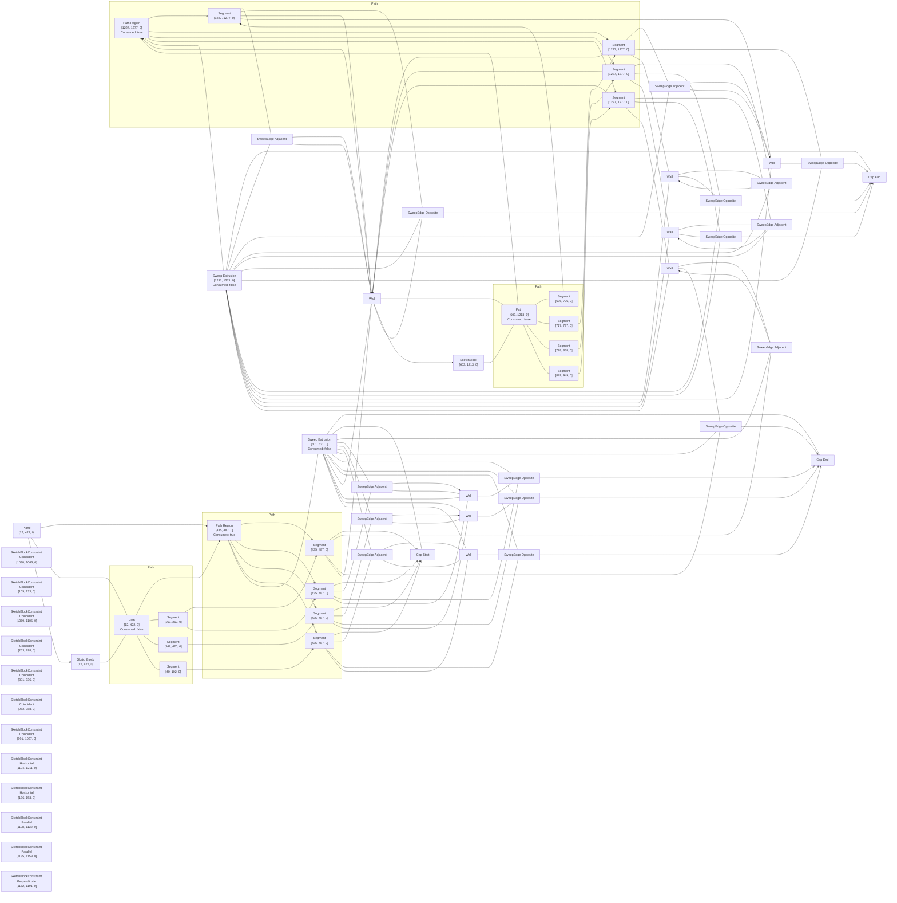

```mermaid
flowchart LR
  subgraph path6 [Path]
    6["Path<br>[12, 422, 0]<br>Consumed: false"]
      %% [ProgramBodyItem { index: 0 }, VariableDeclarationDeclaration, VariableDeclarationInit]
    15["Segment<br>[40, 102, 0]"]
      %% [ProgramBodyItem { index: 0 }, VariableDeclarationDeclaration, VariableDeclarationInit, SketchBlockBody, SketchBlockBodyItem { index: 0 }, VariableDeclarationDeclaration, VariableDeclarationInit]
    13["Segment<br>[163, 260, 0]"]
      %% [ProgramBodyItem { index: 0 }, VariableDeclarationDeclaration, VariableDeclarationInit, SketchBlockBody, SketchBlockBodyItem { index: 3 }, VariableDeclarationDeclaration, VariableDeclarationInit]
    14["Segment<br>[347, 420, 0]"]
      %% [ProgramBodyItem { index: 0 }, VariableDeclarationDeclaration, VariableDeclarationInit, SketchBlockBody, SketchBlockBodyItem { index: 6 }, VariableDeclarationDeclaration, VariableDeclarationInit]
  end
  subgraph path5 [Path]
    5["Path Region<br>[435, 487, 0]<br>Consumed: true"]
      %% [ProgramBodyItem { index: 1 }, VariableDeclarationDeclaration, VariableDeclarationInit]
    19["Segment<br>[435, 487, 0]"]
      %% [ProgramBodyItem { index: 1 }, VariableDeclarationDeclaration, VariableDeclarationInit]
    16["Segment<br>[435, 487, 0]"]
      %% [ProgramBodyItem { index: 1 }, VariableDeclarationDeclaration, VariableDeclarationInit]
    17["Segment<br>[435, 487, 0]"]
      %% [ProgramBodyItem { index: 1 }, VariableDeclarationDeclaration, VariableDeclarationInit]
    18["Segment<br>[435, 487, 0]"]
      %% [ProgramBodyItem { index: 1 }, VariableDeclarationDeclaration, VariableDeclarationInit]
  end
  subgraph path7 [Path]
    7["Path<br>[603, 1213, 0]<br>Consumed: false"]
      %% [ProgramBodyItem { index: 4 }, VariableDeclarationDeclaration, VariableDeclarationInit]
    20["Segment<br>[636, 706, 0]"]
      %% [ProgramBodyItem { index: 4 }, VariableDeclarationDeclaration, VariableDeclarationInit, SketchBlockBody, SketchBlockBodyItem { index: 0 }, VariableDeclarationDeclaration, VariableDeclarationInit]
    21["Segment<br>[717, 787, 0]"]
      %% [ProgramBodyItem { index: 4 }, VariableDeclarationDeclaration, VariableDeclarationInit, SketchBlockBody, SketchBlockBodyItem { index: 1 }, VariableDeclarationDeclaration, VariableDeclarationInit]
    22["Segment<br>[798, 868, 0]"]
      %% [ProgramBodyItem { index: 4 }, VariableDeclarationDeclaration, VariableDeclarationInit, SketchBlockBody, SketchBlockBodyItem { index: 2 }, VariableDeclarationDeclaration, VariableDeclarationInit]
    23["Segment<br>[879, 949, 0]"]
      %% [ProgramBodyItem { index: 4 }, VariableDeclarationDeclaration, VariableDeclarationInit, SketchBlockBody, SketchBlockBodyItem { index: 3 }, VariableDeclarationDeclaration, VariableDeclarationInit]
  end
  subgraph path4 [Path]
    4["Path Region<br>[1227, 1277, 0]<br>Consumed: true"]
      %% [ProgramBodyItem { index: 5 }, VariableDeclarationDeclaration, VariableDeclarationInit]
    9["Segment<br>[1227, 1277, 0]"]
      %% [ProgramBodyItem { index: 5 }, VariableDeclarationDeclaration, VariableDeclarationInit]
    10["Segment<br>[1227, 1277, 0]"]
      %% [ProgramBodyItem { index: 5 }, VariableDeclarationDeclaration, VariableDeclarationInit]
    11["Segment<br>[1227, 1277, 0]"]
      %% [ProgramBodyItem { index: 5 }, VariableDeclarationDeclaration, VariableDeclarationInit]
    12["Segment<br>[1227, 1277, 0]"]
      %% [ProgramBodyItem { index: 5 }, VariableDeclarationDeclaration, VariableDeclarationInit]
  end
  8["Plane<br>[12, 422, 0]"]
    %% [ProgramBodyItem { index: 0 }, VariableDeclarationDeclaration, VariableDeclarationInit]
  39["Sweep Extrusion<br>[501, 531, 0]<br>Consumed: false"]
    %% [ProgramBodyItem { index: 2 }, VariableDeclarationDeclaration, VariableDeclarationInit]
  61[Wall]
    %% face_code_ref=Missing NodePath
  62[Wall]
    %% face_code_ref=Missing NodePath
  63[Wall]
    %% face_code_ref=Missing NodePath
  56[Wall]
    %% face_code_ref=Missing NodePath
  3["Cap Start"]
    %% face_code_ref=Missing NodePath
  2["Cap End"]
    %% face_code_ref=Missing NodePath
  52["SweepEdge Opposite"]
  44["SweepEdge Adjacent"]
  53["SweepEdge Opposite"]
  45["SweepEdge Adjacent"]
  54["SweepEdge Opposite"]
  46["SweepEdge Adjacent"]
  55["SweepEdge Opposite"]
  47["SweepEdge Adjacent"]
  38["Sweep Extrusion<br>[1291, 1321, 0]<br>Consumed: false"]
    %% [ProgramBodyItem { index: 6 }, VariableDeclarationDeclaration, VariableDeclarationInit]
  57[Wall]
    %% face_code_ref=Missing NodePath
  58[Wall]
    %% face_code_ref=Missing NodePath
  59[Wall]
    %% face_code_ref=Missing NodePath
  60[Wall]
    %% face_code_ref=Missing NodePath
  1["Cap End"]
    %% face_code_ref=Missing NodePath
  48["SweepEdge Opposite"]
  40["SweepEdge Adjacent"]
  49["SweepEdge Opposite"]
  41["SweepEdge Adjacent"]
  50["SweepEdge Opposite"]
  42["SweepEdge Adjacent"]
  51["SweepEdge Opposite"]
  43["SweepEdge Adjacent"]
  24["SketchBlock<br>[12, 422, 0]"]
    %% [ProgramBodyItem { index: 0 }, VariableDeclarationDeclaration, VariableDeclarationInit]
  27["SketchBlockConstraint Coincident<br>[105, 133, 0]"]
    %% [ProgramBodyItem { index: 0 }, VariableDeclarationDeclaration, VariableDeclarationInit, SketchBlockBody, SketchBlockBodyItem { index: 1 }, ExpressionStatementExpr]
  34["SketchBlockConstraint Horizontal<br>[136, 153, 0]"]
    %% [ProgramBodyItem { index: 0 }, VariableDeclarationDeclaration, VariableDeclarationInit, SketchBlockBody, SketchBlockBodyItem { index: 2 }, ExpressionStatementExpr]
  29["SketchBlockConstraint Coincident<br>[263, 298, 0]"]
    %% [ProgramBodyItem { index: 0 }, VariableDeclarationDeclaration, VariableDeclarationInit, SketchBlockBody, SketchBlockBodyItem { index: 4 }, ExpressionStatementExpr]
  30["SketchBlockConstraint Coincident<br>[301, 336, 0]"]
    %% [ProgramBodyItem { index: 0 }, VariableDeclarationDeclaration, VariableDeclarationInit, SketchBlockBody, SketchBlockBodyItem { index: 5 }, ExpressionStatementExpr]
  25["SketchBlock<br>[603, 1213, 0]"]
    %% [ProgramBodyItem { index: 4 }, VariableDeclarationDeclaration, VariableDeclarationInit]
  31["SketchBlockConstraint Coincident<br>[952, 988, 0]"]
    %% [ProgramBodyItem { index: 4 }, VariableDeclarationDeclaration, VariableDeclarationInit, SketchBlockBody, SketchBlockBodyItem { index: 4 }, ExpressionStatementExpr]
  32["SketchBlockConstraint Coincident<br>[991, 1027, 0]"]
    %% [ProgramBodyItem { index: 4 }, VariableDeclarationDeclaration, VariableDeclarationInit, SketchBlockBody, SketchBlockBodyItem { index: 5 }, ExpressionStatementExpr]
  26["SketchBlockConstraint Coincident<br>[1030, 1066, 0]"]
    %% [ProgramBodyItem { index: 4 }, VariableDeclarationDeclaration, VariableDeclarationInit, SketchBlockBody, SketchBlockBodyItem { index: 6 }, ExpressionStatementExpr]
  28["SketchBlockConstraint Coincident<br>[1069, 1105, 0]"]
    %% [ProgramBodyItem { index: 4 }, VariableDeclarationDeclaration, VariableDeclarationInit, SketchBlockBody, SketchBlockBodyItem { index: 7 }, ExpressionStatementExpr]
  35["SketchBlockConstraint Parallel<br>[1108, 1132, 0]"]
    %% [ProgramBodyItem { index: 4 }, VariableDeclarationDeclaration, VariableDeclarationInit, SketchBlockBody, SketchBlockBodyItem { index: 8 }, ExpressionStatementExpr]
  36["SketchBlockConstraint Parallel<br>[1135, 1159, 0]"]
    %% [ProgramBodyItem { index: 4 }, VariableDeclarationDeclaration, VariableDeclarationInit, SketchBlockBody, SketchBlockBodyItem { index: 9 }, ExpressionStatementExpr]
  37["SketchBlockConstraint Perpendicular<br>[1162, 1191, 0]"]
    %% [ProgramBodyItem { index: 4 }, VariableDeclarationDeclaration, VariableDeclarationInit, SketchBlockBody, SketchBlockBodyItem { index: 10 }, ExpressionStatementExpr]
  33["SketchBlockConstraint Horizontal<br>[1194, 1211, 0]"]
    %% [ProgramBodyItem { index: 4 }, VariableDeclarationDeclaration, VariableDeclarationInit, SketchBlockBody, SketchBlockBodyItem { index: 11 }, ExpressionStatementExpr]
  38 --- 1
  48 <--x 1
  49 <--x 1
  50 <--x 1
  51 <--x 1
  39 --- 2
  52 <--x 2
  53 <--x 2
  54 <--x 2
  55 <--x 2
  16 <--x 3
  17 <--x 3
  18 <--x 3
  19 <--x 3
  39 --- 3
  7 x--> 4
  4 <--x 9
  4 <--x 10
  4 <--x 11
  4 <--x 12
  4 ---- 38
  56 x--> 4
  6 x--> 5
  8 x--> 5
  5 <--x 16
  5 <--x 17
  5 <--x 18
  5 <--x 19
  5 ---- 39
  8 --- 6
  6 --- 13
  6 --- 14
  6 --- 15
  24 --- 6
  7 --- 20
  7 --- 21
  7 --- 22
  7 --- 23
  25 --- 7
  56 --- 7
  8 <--x 24
  20 x--> 9
  9 --- 40
  9 --- 48
  9 x--> 56
  9 --- 57
  21 x--> 10
  10 --- 41
  10 --- 49
  10 x--> 56
  10 --- 58
  22 x--> 11
  11 --- 42
  11 --- 50
  11 x--> 56
  11 --- 59
  23 x--> 12
  12 --- 43
  12 --- 51
  12 x--> 56
  12 --- 60
  13 <--x 16
  13 <--x 17
  14 <--x 18
  15 <--x 19
  16 --- 44
  16 --- 52
  16 --- 56
  17 --- 45
  17 --- 53
  17 --- 61
  18 --- 46
  18 --- 54
  18 --- 62
  19 --- 47
  19 --- 55
  19 --- 63
  56 x--> 25
  38 --- 40
  38 --- 41
  38 --- 42
  38 --- 43
  38 --- 48
  38 --- 49
  38 --- 50
  38 --- 51
  38 --- 57
  38 --- 58
  38 --- 59
  38 --- 60
  39 --- 44
  39 --- 45
  39 --- 46
  39 --- 47
  39 --- 52
  39 --- 53
  39 --- 54
  39 --- 55
  39 --- 56
  39 --- 61
  39 --- 62
  39 --- 63
  56 --- 40
  40 x--> 56
  57 --- 41
  41 x--> 57
  58 --- 42
  42 x--> 58
  59 --- 43
  43 x--> 59
  60 --- 44
  44 x--> 60
  61 --- 45
  45 x--> 61
  62 --- 46
  46 x--> 62
  63 --- 47
  47 x--> 63
  56 --- 48
  57 --- 49
  58 --- 50
  59 --- 51
  60 --- 52
  61 --- 53
  62 --- 54
  63 --- 55
```
