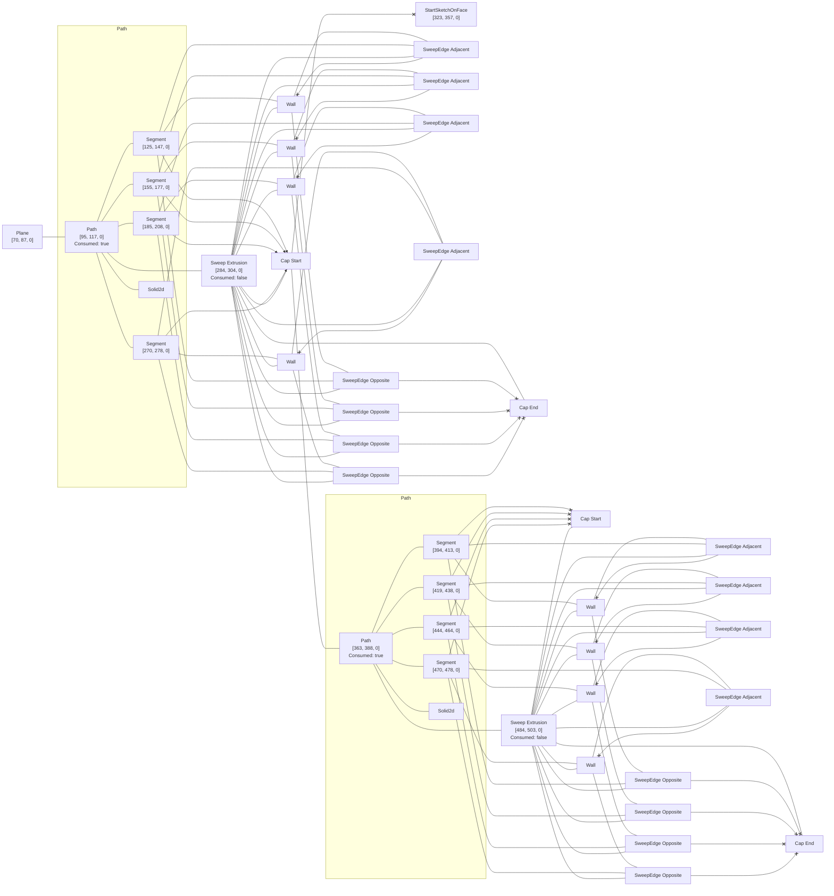

```mermaid
flowchart LR
  subgraph path13 [Path]
    13["Path<br>[95, 117, 0]<br>Consumed: true"]
      %% [ProgramBodyItem { index: 0 }, VariableDeclarationDeclaration, VariableDeclarationInit, FunctionExpressionBody, FunctionExpressionBodyItem { index: 0 }, VariableDeclarationDeclaration, VariableDeclarationInit, PipeBodyItem { index: 1 }]
    14["Segment<br>[125, 147, 0]"]
      %% [ProgramBodyItem { index: 0 }, VariableDeclarationDeclaration, VariableDeclarationInit, FunctionExpressionBody, FunctionExpressionBodyItem { index: 0 }, VariableDeclarationDeclaration, VariableDeclarationInit, PipeBodyItem { index: 2 }]
    15["Segment<br>[155, 177, 0]"]
      %% [ProgramBodyItem { index: 0 }, VariableDeclarationDeclaration, VariableDeclarationInit, FunctionExpressionBody, FunctionExpressionBodyItem { index: 0 }, VariableDeclarationDeclaration, VariableDeclarationInit, PipeBodyItem { index: 3 }]
    16["Segment<br>[185, 208, 0]"]
      %% [ProgramBodyItem { index: 0 }, VariableDeclarationDeclaration, VariableDeclarationInit, FunctionExpressionBody, FunctionExpressionBodyItem { index: 0 }, VariableDeclarationDeclaration, VariableDeclarationInit, PipeBodyItem { index: 4 }]
    17["Segment<br>[270, 278, 0]"]
      %% [ProgramBodyItem { index: 1 }, VariableDeclarationDeclaration, VariableDeclarationInit, PipeBodyItem { index: 1 }]
    28[Solid2d]
  end
  subgraph path21 [Path]
    21["Path<br>[363, 388, 0]<br>Consumed: true"]
      %% [ProgramBodyItem { index: 2 }, VariableDeclarationDeclaration, VariableDeclarationInit, PipeBodyItem { index: 1 }]
    22["Segment<br>[394, 413, 0]"]
      %% [ProgramBodyItem { index: 2 }, VariableDeclarationDeclaration, VariableDeclarationInit, PipeBodyItem { index: 2 }]
    23["Segment<br>[419, 438, 0]"]
      %% [ProgramBodyItem { index: 2 }, VariableDeclarationDeclaration, VariableDeclarationInit, PipeBodyItem { index: 3 }]
    24["Segment<br>[444, 464, 0]"]
      %% [ProgramBodyItem { index: 2 }, VariableDeclarationDeclaration, VariableDeclarationInit, PipeBodyItem { index: 4 }]
    25["Segment<br>[470, 478, 0]"]
      %% [ProgramBodyItem { index: 2 }, VariableDeclarationDeclaration, VariableDeclarationInit, PipeBodyItem { index: 5 }]
    27[Solid2d]
  end
  1["Cap End"]
    %% face_code_ref=Missing NodePath
  2["Cap End"]
    %% face_code_ref=Missing NodePath
  3["Cap Start"]
    %% face_code_ref=Missing NodePath
  4[Wall]
    %% face_code_ref=Missing NodePath
  5[Wall]
    %% face_code_ref=Missing NodePath
  6[Wall]
    %% face_code_ref=Missing NodePath
  7[Wall]
    %% face_code_ref=Missing NodePath
  8[Wall]
    %% face_code_ref=Missing NodePath
  9[Wall]
    %% face_code_ref=Missing NodePath
  10[Wall]
    %% face_code_ref=Missing NodePath
  11[Wall]
    %% face_code_ref=Missing NodePath
  12["Plane<br>[70, 87, 0]"]
    %% [ProgramBodyItem { index: 0 }, VariableDeclarationDeclaration, VariableDeclarationInit, FunctionExpressionBody, FunctionExpressionBodyItem { index: 0 }, VariableDeclarationDeclaration, VariableDeclarationInit, PipeBodyItem { index: 0 }]
  18["Sweep Extrusion<br>[284, 304, 0]<br>Consumed: false"]
    %% [ProgramBodyItem { index: 1 }, VariableDeclarationDeclaration, VariableDeclarationInit, PipeBodyItem { index: 2 }, LabeledExpressionExpr]
  19["Cap Start"]
    %% face_code_ref=[ProgramBodyItem { index: 2 }, VariableDeclarationDeclaration, VariableDeclarationInit, PipeBodyItem { index: 0 }]
  20["StartSketchOnFace<br>[323, 357, 0]"]
    %% [ProgramBodyItem { index: 2 }, VariableDeclarationDeclaration, VariableDeclarationInit, PipeBodyItem { index: 0 }]
  26["Sweep Extrusion<br>[484, 503, 0]<br>Consumed: false"]
    %% [ProgramBodyItem { index: 2 }, VariableDeclarationDeclaration, VariableDeclarationInit, PipeBodyItem { index: 6 }]
  29["SweepEdge Adjacent"]
  30["SweepEdge Adjacent"]
  31["SweepEdge Adjacent"]
  32["SweepEdge Adjacent"]
  33["SweepEdge Adjacent"]
  34["SweepEdge Adjacent"]
  35["SweepEdge Adjacent"]
  36["SweepEdge Adjacent"]
  37["SweepEdge Opposite"]
  38["SweepEdge Opposite"]
  39["SweepEdge Opposite"]
  40["SweepEdge Opposite"]
  41["SweepEdge Opposite"]
  42["SweepEdge Opposite"]
  43["SweepEdge Opposite"]
  44["SweepEdge Opposite"]
  18 --- 1
  37 <--x 1
  38 <--x 1
  39 <--x 1
  40 <--x 1
  26 --- 2
  41 <--x 2
  42 <--x 2
  43 <--x 2
  44 <--x 2
  22 <--x 3
  23 <--x 3
  24 <--x 3
  25 <--x 3
  26 --- 3
  14 --- 4
  18 --- 4
  4 --- 29
  29 <--x 4
  4 --- 37
  15 --- 5
  18 --- 5
  5 --- 30
  30 <--x 5
  5 --- 38
  16 --- 6
  18 --- 6
  6 --- 31
  31 <--x 6
  6 --- 39
  17 --- 7
  18 --- 7
  7 --- 32
  32 <--x 7
  7 --- 40
  22 --- 8
  26 --- 8
  8 --- 33
  33 <--x 8
  8 --- 41
  23 --- 9
  26 --- 9
  9 --- 34
  34 <--x 9
  9 --- 42
  24 --- 10
  26 --- 10
  10 --- 35
  35 <--x 10
  10 --- 43
  25 --- 11
  26 --- 11
  11 --- 36
  36 <--x 11
  11 --- 44
  12 --- 13
  13 --- 14
  13 --- 15
  13 --- 16
  13 --- 17
  13 ---- 18
  13 --- 28
  14 x--> 19
  14 --- 29
  14 --- 37
  15 x--> 19
  15 --- 30
  15 --- 38
  16 x--> 19
  16 --- 31
  16 --- 39
  17 x--> 19
  17 --- 32
  17 --- 40
  18 --- 19
  18 --- 29
  18 --- 30
  18 --- 31
  18 --- 32
  18 --- 37
  18 --- 38
  18 --- 39
  18 --- 40
  19 <--x 20
  19 --- 21
  21 --- 22
  21 --- 23
  21 --- 24
  21 --- 25
  21 ---- 26
  21 --- 27
  22 --- 33
  22 --- 41
  23 --- 34
  23 --- 42
  24 --- 35
  24 --- 43
  25 --- 36
  25 --- 44
  26 --- 33
  26 --- 34
  26 --- 35
  26 --- 36
  26 --- 41
  26 --- 42
  26 --- 43
  26 --- 44
```
