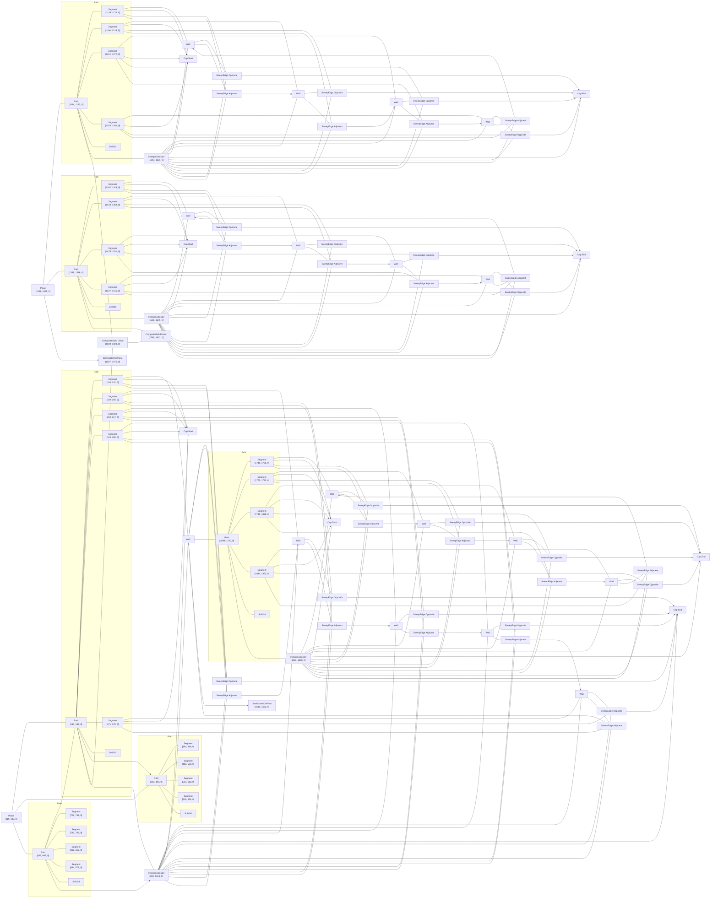

```mermaid
flowchart LR
  subgraph path2 [Path]
    2["Path<br>[150, 187, 0]"]
      %% [ProgramBodyItem { index: 4 }, VariableDeclarationDeclaration, VariableDeclarationInit, PipeBodyItem { index: 0 }]
    3["Segment<br>[193, 232, 0]"]
      %% [ProgramBodyItem { index: 4 }, VariableDeclarationDeclaration, VariableDeclarationInit, PipeBodyItem { index: 1 }]
    4["Segment<br>[238, 256, 0]"]
      %% [ProgramBodyItem { index: 4 }, VariableDeclarationDeclaration, VariableDeclarationInit, PipeBodyItem { index: 2 }]
    5["Segment<br>[262, 317, 0]"]
      %% [ProgramBodyItem { index: 4 }, VariableDeclarationDeclaration, VariableDeclarationInit, PipeBodyItem { index: 3 }]
    6["Segment<br>[323, 365, 0]"]
      %% [ProgramBodyItem { index: 4 }, VariableDeclarationDeclaration, VariableDeclarationInit, PipeBodyItem { index: 4 }]
    7["Segment<br>[371, 378, 0]"]
      %% [ProgramBodyItem { index: 4 }, VariableDeclarationDeclaration, VariableDeclarationInit, PipeBodyItem { index: 5 }]
    8[Solid2d]
  end
  subgraph path9 [Path]
    9["Path<br>[393, 448, 0]"]
      %% [ProgramBodyItem { index: 5 }, VariableDeclarationDeclaration, VariableDeclarationInit, PipeBodyItem { index: 0 }]
    10["Segment<br>[454, 486, 0]"]
      %% [ProgramBodyItem { index: 5 }, VariableDeclarationDeclaration, VariableDeclarationInit, PipeBodyItem { index: 1 }]
    11["Segment<br>[492, 538, 0]"]
      %% [ProgramBodyItem { index: 5 }, VariableDeclarationDeclaration, VariableDeclarationInit, PipeBodyItem { index: 2 }]
    12["Segment<br>[554, 610, 0]"]
      %% [ProgramBodyItem { index: 5 }, VariableDeclarationDeclaration, VariableDeclarationInit, PipeBodyItem { index: 3 }]
    13["Segment<br>[616, 624, 0]"]
      %% [ProgramBodyItem { index: 5 }, VariableDeclarationDeclaration, VariableDeclarationInit, PipeBodyItem { index: 4 }]
    14[Solid2d]
  end
  subgraph path15 [Path]
    15["Path<br>[639, 695, 0]"]
      %% [ProgramBodyItem { index: 6 }, VariableDeclarationDeclaration, VariableDeclarationInit, PipeBodyItem { index: 0 }]
    16["Segment<br>[701, 734, 0]"]
      %% [ProgramBodyItem { index: 6 }, VariableDeclarationDeclaration, VariableDeclarationInit, PipeBodyItem { index: 1 }]
    17["Segment<br>[740, 786, 0]"]
      %% [ProgramBodyItem { index: 6 }, VariableDeclarationDeclaration, VariableDeclarationInit, PipeBodyItem { index: 2 }]
    18["Segment<br>[802, 858, 0]"]
      %% [ProgramBodyItem { index: 6 }, VariableDeclarationDeclaration, VariableDeclarationInit, PipeBodyItem { index: 3 }]
    19["Segment<br>[864, 872, 0]"]
      %% [ProgramBodyItem { index: 6 }, VariableDeclarationDeclaration, VariableDeclarationInit, PipeBodyItem { index: 4 }]
    20[Solid2d]
  end
  subgraph path40 [Path]
    40["Path<br>[1084, 1133, 0]"]
      %% [ProgramBodyItem { index: 11 }, VariableDeclarationDeclaration, VariableDeclarationInit, PipeBodyItem { index: 0 }]
    41["Segment<br>[1139, 1174, 0]"]
      %% [ProgramBodyItem { index: 11 }, VariableDeclarationDeclaration, VariableDeclarationInit, PipeBodyItem { index: 1 }]
    42["Segment<br>[1180, 1215, 0]"]
      %% [ProgramBodyItem { index: 11 }, VariableDeclarationDeclaration, VariableDeclarationInit, PipeBodyItem { index: 2 }]
    43["Segment<br>[1221, 1277, 0]"]
      %% [ProgramBodyItem { index: 11 }, VariableDeclarationDeclaration, VariableDeclarationInit, PipeBodyItem { index: 3 }]
    44["Segment<br>[1283, 1291, 0]"]
      %% [ProgramBodyItem { index: 11 }, VariableDeclarationDeclaration, VariableDeclarationInit, PipeBodyItem { index: 4 }]
    45[Solid2d]
  end
  subgraph path61 [Path]
    61["Path<br>[1336, 1386, 0]"]
      %% [ProgramBodyItem { index: 12 }, VariableDeclarationDeclaration, VariableDeclarationInit, PipeBodyItem { index: 0 }]
    62["Segment<br>[1392, 1428, 0]"]
      %% [ProgramBodyItem { index: 12 }, VariableDeclarationDeclaration, VariableDeclarationInit, PipeBodyItem { index: 1 }]
    63["Segment<br>[1434, 1469, 0]"]
      %% [ProgramBodyItem { index: 12 }, VariableDeclarationDeclaration, VariableDeclarationInit, PipeBodyItem { index: 2 }]
    64["Segment<br>[1475, 1531, 0]"]
      %% [ProgramBodyItem { index: 12 }, VariableDeclarationDeclaration, VariableDeclarationInit, PipeBodyItem { index: 3 }]
    65["Segment<br>[1537, 1545, 0]"]
      %% [ProgramBodyItem { index: 12 }, VariableDeclarationDeclaration, VariableDeclarationInit, PipeBodyItem { index: 4 }]
    66[Solid2d]
  end
  subgraph path84 [Path]
    84["Path<br>[1699, 1740, 0]"]
      %% [ProgramBodyItem { index: 15 }, VariableDeclarationDeclaration, VariableDeclarationInit, PipeBodyItem { index: 0 }]
    85["Segment<br>[1746, 1766, 0]"]
      %% [ProgramBodyItem { index: 15 }, VariableDeclarationDeclaration, VariableDeclarationInit, PipeBodyItem { index: 1 }]
    86["Segment<br>[1772, 1792, 0]"]
      %% [ProgramBodyItem { index: 15 }, VariableDeclarationDeclaration, VariableDeclarationInit, PipeBodyItem { index: 2 }]
    87["Segment<br>[1798, 1838, 0]"]
      %% [ProgramBodyItem { index: 15 }, VariableDeclarationDeclaration, VariableDeclarationInit, PipeBodyItem { index: 3 }]
    88["Segment<br>[1844, 1852, 0]"]
      %% [ProgramBodyItem { index: 15 }, VariableDeclarationDeclaration, VariableDeclarationInit, PipeBodyItem { index: 4 }]
    89[Solid2d]
  end
  1["Plane<br>[119, 136, 0]"]
    %% [ProgramBodyItem { index: 3 }, VariableDeclarationDeclaration, VariableDeclarationInit]
  21["Sweep Extrusion<br>[982, 1013, 0]"]
    %% [ProgramBodyItem { index: 9 }, VariableDeclarationDeclaration, VariableDeclarationInit]
  22[Wall]
    %% face_code_ref=Missing NodePath
  23[Wall]
    %% face_code_ref=Missing NodePath
  24[Wall]
    %% face_code_ref=Missing NodePath
  25[Wall]
    %% face_code_ref=Missing NodePath
  26[Wall]
    %% face_code_ref=[ProgramBodyItem { index: 14 }, VariableDeclarationDeclaration, VariableDeclarationInit]
  27["Cap Start"]
    %% face_code_ref=Missing NodePath
  28["Cap End"]
    %% face_code_ref=Missing NodePath
  29["SweepEdge Opposite"]
  30["SweepEdge Adjacent"]
  31["SweepEdge Opposite"]
  32["SweepEdge Adjacent"]
  33["SweepEdge Opposite"]
  34["SweepEdge Adjacent"]
  35["SweepEdge Opposite"]
  36["SweepEdge Adjacent"]
  37["SweepEdge Opposite"]
  38["SweepEdge Adjacent"]
  39["Plane<br>[1041, 1069, 0]"]
    %% [ProgramBodyItem { index: 10 }, VariableDeclarationDeclaration, VariableDeclarationInit, CallKwUnlabeledArg]
  46["Sweep Extrusion<br>[1297, 1321, 0]"]
    %% [ProgramBodyItem { index: 11 }, VariableDeclarationDeclaration, VariableDeclarationInit, PipeBodyItem { index: 5 }]
  47[Wall]
    %% face_code_ref=Missing NodePath
  48[Wall]
    %% face_code_ref=Missing NodePath
  49[Wall]
    %% face_code_ref=Missing NodePath
  50[Wall]
    %% face_code_ref=Missing NodePath
  51["Cap Start"]
    %% face_code_ref=Missing NodePath
  52["Cap End"]
    %% face_code_ref=Missing NodePath
  53["SweepEdge Opposite"]
  54["SweepEdge Adjacent"]
  55["SweepEdge Opposite"]
  56["SweepEdge Adjacent"]
  57["SweepEdge Opposite"]
  58["SweepEdge Adjacent"]
  59["SweepEdge Opposite"]
  60["SweepEdge Adjacent"]
  67["Sweep Extrusion<br>[1551, 1575, 0]"]
    %% [ProgramBodyItem { index: 12 }, VariableDeclarationDeclaration, VariableDeclarationInit, PipeBodyItem { index: 5 }]
  68[Wall]
    %% face_code_ref=Missing NodePath
  69[Wall]
    %% face_code_ref=Missing NodePath
  70[Wall]
    %% face_code_ref=Missing NodePath
  71[Wall]
    %% face_code_ref=Missing NodePath
  72["Cap Start"]
    %% face_code_ref=Missing NodePath
  73["Cap End"]
    %% face_code_ref=Missing NodePath
  74["SweepEdge Opposite"]
  75["SweepEdge Adjacent"]
  76["SweepEdge Opposite"]
  77["SweepEdge Adjacent"]
  78["SweepEdge Opposite"]
  79["SweepEdge Adjacent"]
  80["SweepEdge Opposite"]
  81["SweepEdge Adjacent"]
  82["CompositeSolid Union<br>[1589, 1609, 0]"]
    %% [ProgramBodyItem { index: 13 }, VariableDeclarationDeclaration, VariableDeclarationInit, BinaryLeft]
  83["CompositeSolid Union<br>[1589, 1622, 0]"]
    %% [ProgramBodyItem { index: 13 }, VariableDeclarationDeclaration, VariableDeclarationInit]
  90["Sweep Extrusion<br>[1863, 1898, 0]"]
    %% [ProgramBodyItem { index: 16 }, VariableDeclarationDeclaration, VariableDeclarationInit, PipeBodyItem { index: 0 }]
  91[Wall]
    %% face_code_ref=Missing NodePath
  92[Wall]
    %% face_code_ref=Missing NodePath
  93[Wall]
    %% face_code_ref=Missing NodePath
  94[Wall]
    %% face_code_ref=Missing NodePath
  95["Cap Start"]
    %% face_code_ref=Missing NodePath
  96["Cap End"]
    %% face_code_ref=Missing NodePath
  97["SweepEdge Opposite"]
  98["SweepEdge Adjacent"]
  99["SweepEdge Opposite"]
  100["SweepEdge Adjacent"]
  101["SweepEdge Opposite"]
  102["SweepEdge Adjacent"]
  103["SweepEdge Opposite"]
  104["SweepEdge Adjacent"]
  105["StartSketchOnPlane<br>[1027, 1070, 0]"]
    %% [ProgramBodyItem { index: 10 }, VariableDeclarationDeclaration, VariableDeclarationInit]
  106["StartSketchOnFace<br>[1639, 1682, 0]"]
    %% [ProgramBodyItem { index: 14 }, VariableDeclarationDeclaration, VariableDeclarationInit]
  1 --- 2
  1 --- 9
  1 --- 15
  2 --- 3
  2 --- 4
  2 --- 5
  2 --- 6
  2 --- 7
  2 --- 8
  2 <--x 9
  15 --- 2
  2 ---- 21
  2 --- 82
  3 --- 26
  3 x--> 27
  3 --- 37
  3 --- 38
  4 --- 25
  4 x--> 27
  4 --- 35
  4 --- 36
  5 --- 24
  5 x--> 27
  5 --- 33
  5 --- 34
  6 --- 23
  6 x--> 27
  6 --- 31
  6 --- 32
  7 --- 22
  7 x--> 27
  7 --- 29
  7 --- 30
  9 --- 10
  9 --- 11
  9 --- 12
  9 --- 13
  9 --- 14
  15 --- 16
  15 --- 17
  15 --- 18
  15 --- 19
  15 --- 20
  15 x---> 21
  21 --- 22
  21 --- 23
  21 --- 24
  21 --- 25
  21 --- 26
  21 --- 27
  21 --- 28
  21 --- 29
  21 --- 30
  21 --- 31
  21 --- 32
  21 --- 33
  21 --- 34
  21 --- 35
  21 --- 36
  21 --- 37
  21 --- 38
  22 --- 29
  22 --- 30
  32 <--x 22
  23 --- 31
  23 --- 32
  34 <--x 23
  24 --- 33
  24 --- 34
  36 <--x 24
  25 --- 35
  25 --- 36
  38 <--x 25
  30 <--x 26
  26 --- 37
  26 --- 38
  26 --- 84
  26 <--x 106
  29 <--x 28
  31 <--x 28
  33 <--x 28
  35 <--x 28
  37 <--x 28
  39 --- 40
  39 --- 61
  39 <--x 105
  40 --- 41
  40 --- 42
  40 --- 43
  40 --- 44
  40 --- 45
  40 ---- 46
  40 --- 82
  41 --- 50
  41 x--> 51
  41 --- 59
  41 --- 60
  42 --- 49
  42 x--> 51
  42 --- 57
  42 --- 58
  43 --- 48
  43 x--> 51
  43 --- 55
  43 --- 56
  44 --- 47
  44 x--> 51
  44 --- 53
  44 --- 54
  46 --- 47
  46 --- 48
  46 --- 49
  46 --- 50
  46 --- 51
  46 --- 52
  46 --- 53
  46 --- 54
  46 --- 55
  46 --- 56
  46 --- 57
  46 --- 58
  46 --- 59
  46 --- 60
  47 --- 53
  47 --- 54
  56 <--x 47
  48 --- 55
  48 --- 56
  58 <--x 48
  49 --- 57
  49 --- 58
  60 <--x 49
  54 <--x 50
  50 --- 59
  50 --- 60
  53 <--x 52
  55 <--x 52
  57 <--x 52
  59 <--x 52
  61 --- 62
  61 --- 63
  61 --- 64
  61 --- 65
  61 --- 66
  61 ---- 67
  61 --- 83
  62 --- 68
  62 x--> 72
  62 --- 74
  62 --- 75
  63 --- 69
  63 x--> 72
  63 --- 76
  63 --- 77
  64 --- 70
  64 x--> 72
  64 --- 78
  64 --- 79
  65 --- 71
  65 x--> 72
  65 --- 80
  65 --- 81
  67 --- 68
  67 --- 69
  67 --- 70
  67 --- 71
  67 --- 72
  67 --- 73
  67 --- 74
  67 --- 75
  67 --- 76
  67 --- 77
  67 --- 78
  67 --- 79
  67 --- 80
  67 --- 81
  68 --- 74
  68 --- 75
  81 <--x 68
  75 <--x 69
  69 --- 76
  69 --- 77
  77 <--x 70
  70 --- 78
  70 --- 79
  79 <--x 71
  71 --- 80
  71 --- 81
  74 <--x 73
  76 <--x 73
  78 <--x 73
  80 <--x 73
  82 --- 83
  84 --- 85
  84 --- 86
  84 --- 87
  84 --- 88
  84 --- 89
  84 ---- 90
  85 --- 91
  85 x--> 95
  85 --- 97
  85 --- 98
  86 --- 92
  86 x--> 95
  86 --- 99
  86 --- 100
  87 --- 93
  87 x--> 95
  87 --- 101
  87 --- 102
  88 --- 94
  88 x--> 95
  88 --- 103
  88 --- 104
  90 --- 91
  90 --- 92
  90 --- 93
  90 --- 94
  90 --- 95
  90 --- 96
  90 --- 97
  90 --- 98
  90 --- 99
  90 --- 100
  90 --- 101
  90 --- 102
  90 --- 103
  90 --- 104
  91 --- 97
  91 --- 98
  104 <--x 91
  98 <--x 92
  92 --- 99
  92 --- 100
  100 <--x 93
  93 --- 101
  93 --- 102
  102 <--x 94
  94 --- 103
  94 --- 104
  97 <--x 96
  99 <--x 96
  101 <--x 96
  103 <--x 96
```
