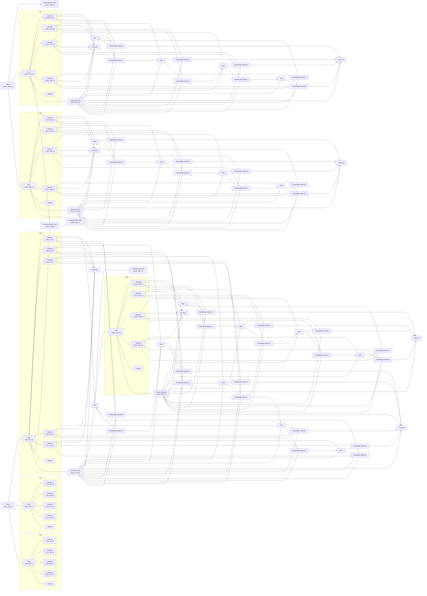

```mermaid
flowchart LR
  subgraph path5 [Path]
    5["Path<br>[150, 187, 0]"]
      %% [ProgramBodyItem { index: 4 }, VariableDeclarationDeclaration, VariableDeclarationInit, PipeBodyItem { index: 0 }]
    11["Segment<br>[193, 232, 0]"]
      %% [ProgramBodyItem { index: 4 }, VariableDeclarationDeclaration, VariableDeclarationInit, PipeBodyItem { index: 1 }]
    12["Segment<br>[238, 256, 0]"]
      %% [ProgramBodyItem { index: 4 }, VariableDeclarationDeclaration, VariableDeclarationInit, PipeBodyItem { index: 2 }]
    13["Segment<br>[262, 317, 0]"]
      %% [ProgramBodyItem { index: 4 }, VariableDeclarationDeclaration, VariableDeclarationInit, PipeBodyItem { index: 3 }]
    14["Segment<br>[323, 365, 0]"]
      %% [ProgramBodyItem { index: 4 }, VariableDeclarationDeclaration, VariableDeclarationInit, PipeBodyItem { index: 4 }]
    15["Segment<br>[371, 378, 0]"]
      %% [ProgramBodyItem { index: 4 }, VariableDeclarationDeclaration, VariableDeclarationInit, PipeBodyItem { index: 5 }]
    39[Solid2d]
  end
  subgraph path6 [Path]
    6["Path<br>[393, 448, 0]"]
      %% [ProgramBodyItem { index: 5 }, VariableDeclarationDeclaration, VariableDeclarationInit, PipeBodyItem { index: 0 }]
    16["Segment<br>[454, 486, 0]"]
      %% [ProgramBodyItem { index: 5 }, VariableDeclarationDeclaration, VariableDeclarationInit, PipeBodyItem { index: 1 }]
    17["Segment<br>[492, 538, 0]"]
      %% [ProgramBodyItem { index: 5 }, VariableDeclarationDeclaration, VariableDeclarationInit, PipeBodyItem { index: 2 }]
    18["Segment<br>[554, 610, 0]"]
      %% [ProgramBodyItem { index: 5 }, VariableDeclarationDeclaration, VariableDeclarationInit, PipeBodyItem { index: 3 }]
    19["Segment<br>[616, 624, 0]"]
      %% [ProgramBodyItem { index: 5 }, VariableDeclarationDeclaration, VariableDeclarationInit, PipeBodyItem { index: 4 }]
    41[Solid2d]
  end
  subgraph path7 [Path]
    7["Path<br>[639, 695, 0]"]
      %% [ProgramBodyItem { index: 6 }, VariableDeclarationDeclaration, VariableDeclarationInit, PipeBodyItem { index: 0 }]
    20["Segment<br>[701, 734, 0]"]
      %% [ProgramBodyItem { index: 6 }, VariableDeclarationDeclaration, VariableDeclarationInit, PipeBodyItem { index: 1 }]
    21["Segment<br>[740, 786, 0]"]
      %% [ProgramBodyItem { index: 6 }, VariableDeclarationDeclaration, VariableDeclarationInit, PipeBodyItem { index: 2 }]
    22["Segment<br>[802, 858, 0]"]
      %% [ProgramBodyItem { index: 6 }, VariableDeclarationDeclaration, VariableDeclarationInit, PipeBodyItem { index: 3 }]
    23["Segment<br>[864, 872, 0]"]
      %% [ProgramBodyItem { index: 6 }, VariableDeclarationDeclaration, VariableDeclarationInit, PipeBodyItem { index: 4 }]
    36[Solid2d]
  end
  subgraph path8 [Path]
    8["Path<br>[1084, 1133, 0]"]
      %% [ProgramBodyItem { index: 11 }, VariableDeclarationDeclaration, VariableDeclarationInit, PipeBodyItem { index: 0 }]
    24["Segment<br>[1139, 1174, 0]"]
      %% [ProgramBodyItem { index: 11 }, VariableDeclarationDeclaration, VariableDeclarationInit, PipeBodyItem { index: 1 }]
    25["Segment<br>[1180, 1215, 0]"]
      %% [ProgramBodyItem { index: 11 }, VariableDeclarationDeclaration, VariableDeclarationInit, PipeBodyItem { index: 2 }]
    26["Segment<br>[1221, 1277, 0]"]
      %% [ProgramBodyItem { index: 11 }, VariableDeclarationDeclaration, VariableDeclarationInit, PipeBodyItem { index: 3 }]
    27["Segment<br>[1283, 1291, 0]"]
      %% [ProgramBodyItem { index: 11 }, VariableDeclarationDeclaration, VariableDeclarationInit, PipeBodyItem { index: 4 }]
    40[Solid2d]
  end
  subgraph path9 [Path]
    9["Path<br>[1336, 1386, 0]"]
      %% [ProgramBodyItem { index: 12 }, VariableDeclarationDeclaration, VariableDeclarationInit, PipeBodyItem { index: 0 }]
    28["Segment<br>[1392, 1428, 0]"]
      %% [ProgramBodyItem { index: 12 }, VariableDeclarationDeclaration, VariableDeclarationInit, PipeBodyItem { index: 1 }]
    29["Segment<br>[1434, 1469, 0]"]
      %% [ProgramBodyItem { index: 12 }, VariableDeclarationDeclaration, VariableDeclarationInit, PipeBodyItem { index: 2 }]
    30["Segment<br>[1475, 1531, 0]"]
      %% [ProgramBodyItem { index: 12 }, VariableDeclarationDeclaration, VariableDeclarationInit, PipeBodyItem { index: 3 }]
    31["Segment<br>[1537, 1545, 0]"]
      %% [ProgramBodyItem { index: 12 }, VariableDeclarationDeclaration, VariableDeclarationInit, PipeBodyItem { index: 4 }]
    37[Solid2d]
  end
  subgraph path10 [Path]
    10["Path<br>[1699, 1740, 0]"]
      %% [ProgramBodyItem { index: 15 }, VariableDeclarationDeclaration, VariableDeclarationInit, PipeBodyItem { index: 0 }]
    32["Segment<br>[1746, 1766, 0]"]
      %% [ProgramBodyItem { index: 15 }, VariableDeclarationDeclaration, VariableDeclarationInit, PipeBodyItem { index: 1 }]
    33["Segment<br>[1772, 1792, 0]"]
      %% [ProgramBodyItem { index: 15 }, VariableDeclarationDeclaration, VariableDeclarationInit, PipeBodyItem { index: 2 }]
    34["Segment<br>[1798, 1838, 0]"]
      %% [ProgramBodyItem { index: 15 }, VariableDeclarationDeclaration, VariableDeclarationInit, PipeBodyItem { index: 3 }]
    35["Segment<br>[1844, 1852, 0]"]
      %% [ProgramBodyItem { index: 15 }, VariableDeclarationDeclaration, VariableDeclarationInit, PipeBodyItem { index: 4 }]
    38[Solid2d]
  end
  1["Plane<br>[119, 136, 0]"]
    %% [ProgramBodyItem { index: 3 }, VariableDeclarationDeclaration, VariableDeclarationInit]
  2["Plane<br>[1041, 1069, 0]"]
    %% [ProgramBodyItem { index: 10 }, VariableDeclarationDeclaration, VariableDeclarationInit, CallKwUnlabeledArg]
  3["StartSketchOnPlane<br>[1027, 1070, 0]"]
    %% [ProgramBodyItem { index: 10 }, VariableDeclarationDeclaration, VariableDeclarationInit]
  4["StartSketchOnFace<br>[1639, 1682, 0]"]
    %% [ProgramBodyItem { index: 14 }, VariableDeclarationDeclaration, VariableDeclarationInit]
  42["Sweep Extrusion<br>[982, 1013, 0]"]
    %% [ProgramBodyItem { index: 9 }, VariableDeclarationDeclaration, VariableDeclarationInit]
  43["Sweep Extrusion<br>[1297, 1321, 0]"]
    %% [ProgramBodyItem { index: 11 }, VariableDeclarationDeclaration, VariableDeclarationInit, PipeBodyItem { index: 5 }]
  44["Sweep Extrusion<br>[1551, 1575, 0]"]
    %% [ProgramBodyItem { index: 12 }, VariableDeclarationDeclaration, VariableDeclarationInit, PipeBodyItem { index: 5 }]
  45["Sweep Extrusion<br>[1863, 1898, 0]"]
    %% [ProgramBodyItem { index: 16 }, VariableDeclarationDeclaration, VariableDeclarationInit, PipeBodyItem { index: 0 }]
  46["CompositeSolid Union<br>[1589, 1609, 0]"]
    %% [ProgramBodyItem { index: 13 }, VariableDeclarationDeclaration, VariableDeclarationInit, BinaryLeft]
  47["CompositeSolid Union<br>[1589, 1622, 0]"]
    %% [ProgramBodyItem { index: 13 }, VariableDeclarationDeclaration, VariableDeclarationInit]
  48[Wall]
  49[Wall]
  50[Wall]
  51[Wall]
  52[Wall]
  53[Wall]
  54[Wall]
  55[Wall]
  56[Wall]
  57[Wall]
  58[Wall]
  59[Wall]
  60[Wall]
  61[Wall]
  62[Wall]
  63[Wall]
  64[Wall]
  65["Cap Start"]
  66["Cap Start"]
  67["Cap Start"]
  68["Cap Start"]
  69["Cap End"]
  70["Cap End"]
  71["Cap End"]
  72["Cap End"]
  73["SweepEdge Opposite"]
  74["SweepEdge Opposite"]
  75["SweepEdge Opposite"]
  76["SweepEdge Opposite"]
  77["SweepEdge Opposite"]
  78["SweepEdge Opposite"]
  79["SweepEdge Opposite"]
  80["SweepEdge Opposite"]
  81["SweepEdge Opposite"]
  82["SweepEdge Opposite"]
  83["SweepEdge Opposite"]
  84["SweepEdge Opposite"]
  85["SweepEdge Opposite"]
  86["SweepEdge Opposite"]
  87["SweepEdge Opposite"]
  88["SweepEdge Opposite"]
  89["SweepEdge Opposite"]
  90["SweepEdge Adjacent"]
  91["SweepEdge Adjacent"]
  92["SweepEdge Adjacent"]
  93["SweepEdge Adjacent"]
  94["SweepEdge Adjacent"]
  95["SweepEdge Adjacent"]
  96["SweepEdge Adjacent"]
  97["SweepEdge Adjacent"]
  98["SweepEdge Adjacent"]
  99["SweepEdge Adjacent"]
  100["SweepEdge Adjacent"]
  101["SweepEdge Adjacent"]
  102["SweepEdge Adjacent"]
  103["SweepEdge Adjacent"]
  104["SweepEdge Adjacent"]
  105["SweepEdge Adjacent"]
  106["SweepEdge Adjacent"]
  1 --- 5
  1 --- 6
  1 --- 7
  2 <--x 3
  2 --- 8
  2 --- 9
  56 x--> 4
  5 --- 11
  5 --- 12
  5 --- 13
  5 --- 14
  5 --- 15
  5 --- 39
  5 ---- 42
  5 --- 46
  6 --- 16
  6 --- 17
  6 --- 18
  6 --- 19
  6 --- 41
  7 --- 20
  7 --- 21
  7 --- 22
  7 --- 23
  7 --- 36
  8 --- 24
  8 --- 25
  8 --- 26
  8 --- 27
  8 --- 40
  8 ---- 43
  8 --- 46
  9 --- 28
  9 --- 29
  9 --- 30
  9 --- 31
  9 --- 37
  9 ---- 44
  9 --- 47
  10 --- 32
  10 --- 33
  10 --- 34
  10 --- 35
  10 --- 38
  10 ---- 45
  56 --- 10
  11 --- 56
  11 x--> 67
  11 --- 81
  11 --- 98
  12 --- 54
  12 x--> 67
  12 --- 80
  12 --- 97
  13 --- 53
  13 x--> 67
  13 --- 79
  13 --- 96
  14 --- 55
  14 x--> 67
  14 --- 78
  14 --- 95
  15 --- 52
  15 x--> 67
  15 --- 77
  15 --- 94
  24 --- 58
  24 x--> 65
  24 --- 85
  24 --- 102
  25 --- 60
  25 x--> 65
  25 --- 84
  25 --- 101
  26 --- 57
  26 x--> 65
  26 --- 83
  26 --- 100
  27 --- 59
  27 x--> 65
  27 --- 82
  27 --- 99
  28 --- 62
  28 x--> 68
  28 --- 86
  28 --- 103
  29 --- 63
  29 x--> 68
  29 --- 87
  29 --- 104
  30 --- 61
  30 x--> 68
  30 --- 88
  30 --- 105
  31 --- 64
  31 x--> 68
  31 --- 89
  31 --- 106
  32 --- 50
  32 x--> 66
  32 --- 73
  32 --- 90
  33 --- 51
  33 x--> 66
  33 --- 74
  33 --- 91
  34 --- 48
  34 x--> 66
  34 --- 75
  34 --- 92
  35 --- 49
  35 x--> 66
  35 --- 76
  35 --- 93
  42 --- 52
  42 --- 53
  42 --- 54
  42 --- 55
  42 --- 56
  42 --- 67
  42 --- 71
  42 --- 77
  42 --- 78
  42 --- 79
  42 --- 80
  42 --- 81
  42 --- 94
  42 --- 95
  42 --- 96
  42 --- 97
  42 --- 98
  43 --- 57
  43 --- 58
  43 --- 59
  43 --- 60
  43 --- 65
  43 --- 69
  43 --- 82
  43 --- 83
  43 --- 84
  43 --- 85
  43 --- 99
  43 --- 100
  43 --- 101
  43 --- 102
  44 --- 61
  44 --- 62
  44 --- 63
  44 --- 64
  44 --- 68
  44 --- 72
  44 --- 86
  44 --- 87
  44 --- 88
  44 --- 89
  44 --- 103
  44 --- 104
  44 --- 105
  44 --- 106
  45 --- 48
  45 --- 49
  45 --- 50
  45 --- 51
  45 --- 66
  45 --- 70
  45 --- 73
  45 --- 74
  45 --- 75
  45 --- 76
  45 --- 90
  45 --- 91
  45 --- 92
  45 --- 93
  46 --- 47
  48 --- 75
  91 <--x 48
  48 --- 92
  49 --- 76
  92 <--x 49
  49 --- 93
  50 --- 73
  50 --- 90
  93 <--x 50
  51 --- 74
  90 <--x 51
  51 --- 91
  52 --- 77
  52 --- 94
  95 <--x 52
  53 --- 79
  53 --- 96
  97 <--x 53
  54 --- 80
  54 --- 97
  98 <--x 54
  55 --- 78
  55 --- 95
  96 <--x 55
  56 --- 81
  94 <--x 56
  56 --- 98
  57 --- 83
  57 --- 100
  101 <--x 57
  58 --- 85
  99 <--x 58
  58 --- 102
  59 --- 82
  59 --- 99
  100 <--x 59
  60 --- 84
  60 --- 101
  102 <--x 60
  61 --- 88
  104 <--x 61
  61 --- 105
  62 --- 86
  62 --- 103
  106 <--x 62
  63 --- 87
  103 <--x 63
  63 --- 104
  64 --- 89
  105 <--x 64
  64 --- 106
  82 <--x 69
  83 <--x 69
  84 <--x 69
  85 <--x 69
  73 <--x 70
  74 <--x 70
  75 <--x 70
  76 <--x 70
  77 <--x 71
  78 <--x 71
  79 <--x 71
  80 <--x 71
  81 <--x 71
  86 <--x 72
  87 <--x 72
  88 <--x 72
  89 <--x 72
```
