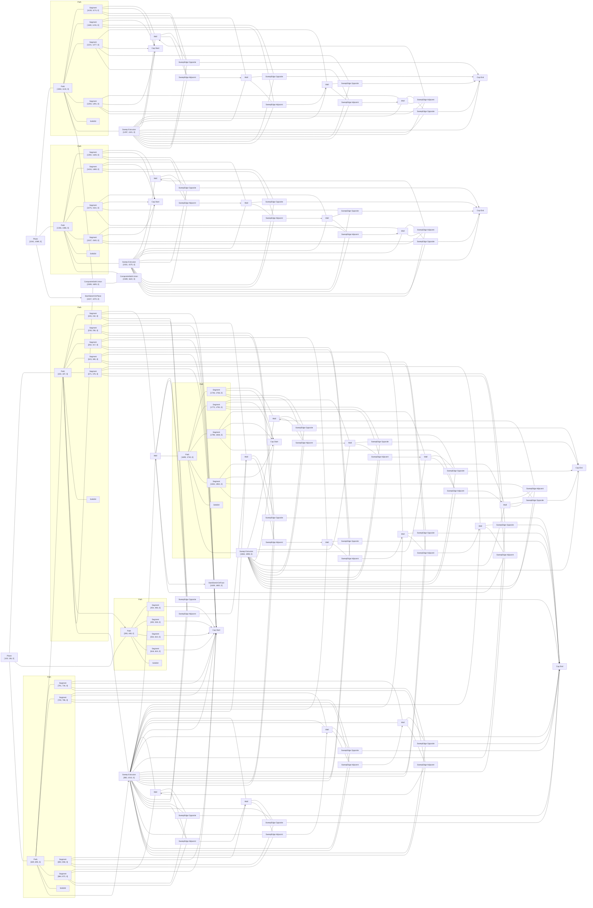

```mermaid
flowchart LR
  subgraph path2 [Path]
    2["Path<br>[150, 187, 0]"]
      %% [ProgramBodyItem { index: 4 }, VariableDeclarationDeclaration, VariableDeclarationInit, PipeBodyItem { index: 0 }]
    3["Segment<br>[193, 232, 0]"]
      %% [ProgramBodyItem { index: 4 }, VariableDeclarationDeclaration, VariableDeclarationInit, PipeBodyItem { index: 1 }]
    4["Segment<br>[238, 256, 0]"]
      %% [ProgramBodyItem { index: 4 }, VariableDeclarationDeclaration, VariableDeclarationInit, PipeBodyItem { index: 2 }]
    5["Segment<br>[262, 317, 0]"]
      %% [ProgramBodyItem { index: 4 }, VariableDeclarationDeclaration, VariableDeclarationInit, PipeBodyItem { index: 3 }]
    6["Segment<br>[323, 365, 0]"]
      %% [ProgramBodyItem { index: 4 }, VariableDeclarationDeclaration, VariableDeclarationInit, PipeBodyItem { index: 4 }]
    7["Segment<br>[371, 378, 0]"]
      %% [ProgramBodyItem { index: 4 }, VariableDeclarationDeclaration, VariableDeclarationInit, PipeBodyItem { index: 5 }]
    8[Solid2d]
  end
  subgraph path9 [Path]
    9["Path<br>[393, 448, 0]"]
      %% [ProgramBodyItem { index: 5 }, VariableDeclarationDeclaration, VariableDeclarationInit, PipeBodyItem { index: 0 }]
    10["Segment<br>[454, 486, 0]"]
      %% [ProgramBodyItem { index: 5 }, VariableDeclarationDeclaration, VariableDeclarationInit, PipeBodyItem { index: 1 }]
    11["Segment<br>[492, 538, 0]"]
      %% [ProgramBodyItem { index: 5 }, VariableDeclarationDeclaration, VariableDeclarationInit, PipeBodyItem { index: 2 }]
    12["Segment<br>[554, 610, 0]"]
      %% [ProgramBodyItem { index: 5 }, VariableDeclarationDeclaration, VariableDeclarationInit, PipeBodyItem { index: 3 }]
    13["Segment<br>[616, 624, 0]"]
      %% [ProgramBodyItem { index: 5 }, VariableDeclarationDeclaration, VariableDeclarationInit, PipeBodyItem { index: 4 }]
    14[Solid2d]
  end
  subgraph path15 [Path]
    15["Path<br>[639, 695, 0]"]
      %% [ProgramBodyItem { index: 6 }, VariableDeclarationDeclaration, VariableDeclarationInit, PipeBodyItem { index: 0 }]
    16["Segment<br>[701, 734, 0]"]
      %% [ProgramBodyItem { index: 6 }, VariableDeclarationDeclaration, VariableDeclarationInit, PipeBodyItem { index: 1 }]
    17["Segment<br>[740, 786, 0]"]
      %% [ProgramBodyItem { index: 6 }, VariableDeclarationDeclaration, VariableDeclarationInit, PipeBodyItem { index: 2 }]
    18["Segment<br>[802, 858, 0]"]
      %% [ProgramBodyItem { index: 6 }, VariableDeclarationDeclaration, VariableDeclarationInit, PipeBodyItem { index: 3 }]
    19["Segment<br>[864, 872, 0]"]
      %% [ProgramBodyItem { index: 6 }, VariableDeclarationDeclaration, VariableDeclarationInit, PipeBodyItem { index: 4 }]
    20[Solid2d]
  end
  subgraph path52 [Path]
    52["Path<br>[1084, 1133, 0]"]
      %% [ProgramBodyItem { index: 11 }, VariableDeclarationDeclaration, VariableDeclarationInit, PipeBodyItem { index: 0 }]
    53["Segment<br>[1139, 1174, 0]"]
      %% [ProgramBodyItem { index: 11 }, VariableDeclarationDeclaration, VariableDeclarationInit, PipeBodyItem { index: 1 }]
    54["Segment<br>[1180, 1215, 0]"]
      %% [ProgramBodyItem { index: 11 }, VariableDeclarationDeclaration, VariableDeclarationInit, PipeBodyItem { index: 2 }]
    55["Segment<br>[1221, 1277, 0]"]
      %% [ProgramBodyItem { index: 11 }, VariableDeclarationDeclaration, VariableDeclarationInit, PipeBodyItem { index: 3 }]
    56["Segment<br>[1283, 1291, 0]"]
      %% [ProgramBodyItem { index: 11 }, VariableDeclarationDeclaration, VariableDeclarationInit, PipeBodyItem { index: 4 }]
    57[Solid2d]
  end
  subgraph path73 [Path]
    73["Path<br>[1336, 1386, 0]"]
      %% [ProgramBodyItem { index: 12 }, VariableDeclarationDeclaration, VariableDeclarationInit, PipeBodyItem { index: 0 }]
    74["Segment<br>[1392, 1428, 0]"]
      %% [ProgramBodyItem { index: 12 }, VariableDeclarationDeclaration, VariableDeclarationInit, PipeBodyItem { index: 1 }]
    75["Segment<br>[1434, 1469, 0]"]
      %% [ProgramBodyItem { index: 12 }, VariableDeclarationDeclaration, VariableDeclarationInit, PipeBodyItem { index: 2 }]
    76["Segment<br>[1475, 1531, 0]"]
      %% [ProgramBodyItem { index: 12 }, VariableDeclarationDeclaration, VariableDeclarationInit, PipeBodyItem { index: 3 }]
    77["Segment<br>[1537, 1545, 0]"]
      %% [ProgramBodyItem { index: 12 }, VariableDeclarationDeclaration, VariableDeclarationInit, PipeBodyItem { index: 4 }]
    78[Solid2d]
  end
  subgraph path96 [Path]
    96["Path<br>[1699, 1740, 0]"]
      %% [ProgramBodyItem { index: 15 }, VariableDeclarationDeclaration, VariableDeclarationInit, PipeBodyItem { index: 0 }]
    97["Segment<br>[1746, 1766, 0]"]
      %% [ProgramBodyItem { index: 15 }, VariableDeclarationDeclaration, VariableDeclarationInit, PipeBodyItem { index: 1 }]
    98["Segment<br>[1772, 1792, 0]"]
      %% [ProgramBodyItem { index: 15 }, VariableDeclarationDeclaration, VariableDeclarationInit, PipeBodyItem { index: 2 }]
    99["Segment<br>[1798, 1838, 0]"]
      %% [ProgramBodyItem { index: 15 }, VariableDeclarationDeclaration, VariableDeclarationInit, PipeBodyItem { index: 3 }]
    100["Segment<br>[1844, 1852, 0]"]
      %% [ProgramBodyItem { index: 15 }, VariableDeclarationDeclaration, VariableDeclarationInit, PipeBodyItem { index: 4 }]
    101[Solid2d]
  end
  1["Plane<br>[119, 136, 0]"]
    %% [ProgramBodyItem { index: 3 }, VariableDeclarationDeclaration, VariableDeclarationInit]
  21["Sweep Extrusion<br>[982, 1013, 0]"]
    %% [ProgramBodyItem { index: 9 }, VariableDeclarationDeclaration, VariableDeclarationInit]
  22[Wall]
    %% face_code_ref=Missing NodePath
  23[Wall]
    %% face_code_ref=Missing NodePath
  24[Wall]
    %% face_code_ref=Missing NodePath
  25[Wall]
    %% face_code_ref=Missing NodePath
  26[Wall]
    %% face_code_ref=[ProgramBodyItem { index: 14 }, VariableDeclarationDeclaration, VariableDeclarationInit]
  27[Wall]
    %% face_code_ref=Missing NodePath
  28[Wall]
    %% face_code_ref=Missing NodePath
  29[Wall]
    %% face_code_ref=Missing NodePath
  30[Wall]
    %% face_code_ref=Missing NodePath
  31["Cap Start"]
    %% face_code_ref=Missing NodePath
  32["Cap End"]
    %% face_code_ref=Missing NodePath
  33["SweepEdge Opposite"]
  34["SweepEdge Adjacent"]
  35["SweepEdge Opposite"]
  36["SweepEdge Adjacent"]
  37["SweepEdge Opposite"]
  38["SweepEdge Adjacent"]
  39["SweepEdge Opposite"]
  40["SweepEdge Adjacent"]
  41["SweepEdge Opposite"]
  42["SweepEdge Adjacent"]
  43["SweepEdge Opposite"]
  44["SweepEdge Adjacent"]
  45["SweepEdge Opposite"]
  46["SweepEdge Adjacent"]
  47["SweepEdge Opposite"]
  48["SweepEdge Adjacent"]
  49["SweepEdge Opposite"]
  50["SweepEdge Adjacent"]
  51["Plane<br>[1041, 1069, 0]"]
    %% [ProgramBodyItem { index: 10 }, VariableDeclarationDeclaration, VariableDeclarationInit, CallKwUnlabeledArg]
  58["Sweep Extrusion<br>[1297, 1321, 0]"]
    %% [ProgramBodyItem { index: 11 }, VariableDeclarationDeclaration, VariableDeclarationInit, PipeBodyItem { index: 5 }]
  59[Wall]
    %% face_code_ref=Missing NodePath
  60[Wall]
    %% face_code_ref=Missing NodePath
  61[Wall]
    %% face_code_ref=Missing NodePath
  62[Wall]
    %% face_code_ref=Missing NodePath
  63["Cap Start"]
    %% face_code_ref=Missing NodePath
  64["Cap End"]
    %% face_code_ref=Missing NodePath
  65["SweepEdge Opposite"]
  66["SweepEdge Adjacent"]
  67["SweepEdge Opposite"]
  68["SweepEdge Adjacent"]
  69["SweepEdge Opposite"]
  70["SweepEdge Adjacent"]
  71["SweepEdge Opposite"]
  72["SweepEdge Adjacent"]
  79["Sweep Extrusion<br>[1551, 1575, 0]"]
    %% [ProgramBodyItem { index: 12 }, VariableDeclarationDeclaration, VariableDeclarationInit, PipeBodyItem { index: 5 }]
  80[Wall]
    %% face_code_ref=Missing NodePath
  81[Wall]
    %% face_code_ref=Missing NodePath
  82[Wall]
    %% face_code_ref=Missing NodePath
  83[Wall]
    %% face_code_ref=Missing NodePath
  84["Cap Start"]
    %% face_code_ref=Missing NodePath
  85["Cap End"]
    %% face_code_ref=Missing NodePath
  86["SweepEdge Opposite"]
  87["SweepEdge Adjacent"]
  88["SweepEdge Opposite"]
  89["SweepEdge Adjacent"]
  90["SweepEdge Opposite"]
  91["SweepEdge Adjacent"]
  92["SweepEdge Opposite"]
  93["SweepEdge Adjacent"]
  94["CompositeSolid Union<br>[1589, 1609, 0]"]
    %% [ProgramBodyItem { index: 13 }, VariableDeclarationDeclaration, VariableDeclarationInit, BinaryLeft]
  95["CompositeSolid Union<br>[1589, 1622, 0]"]
    %% [ProgramBodyItem { index: 13 }, VariableDeclarationDeclaration, VariableDeclarationInit]
  102["Sweep Extrusion<br>[1863, 1898, 0]"]
    %% [ProgramBodyItem { index: 16 }, VariableDeclarationDeclaration, VariableDeclarationInit, PipeBodyItem { index: 0 }]
  103[Wall]
    %% face_code_ref=Missing NodePath
  104[Wall]
    %% face_code_ref=Missing NodePath
  105[Wall]
    %% face_code_ref=Missing NodePath
  106[Wall]
    %% face_code_ref=Missing NodePath
  107["Cap Start"]
    %% face_code_ref=Missing NodePath
  108["Cap End"]
    %% face_code_ref=Missing NodePath
  109["SweepEdge Opposite"]
  110["SweepEdge Adjacent"]
  111["SweepEdge Opposite"]
  112["SweepEdge Adjacent"]
  113["SweepEdge Opposite"]
  114["SweepEdge Adjacent"]
  115["SweepEdge Opposite"]
  116["SweepEdge Adjacent"]
  117["StartSketchOnPlane<br>[1027, 1070, 0]"]
    %% [ProgramBodyItem { index: 10 }, VariableDeclarationDeclaration, VariableDeclarationInit]
  118["StartSketchOnFace<br>[1639, 1682, 0]"]
    %% [ProgramBodyItem { index: 14 }, VariableDeclarationDeclaration, VariableDeclarationInit]
  1 --- 2
  1 --- 9
  1 --- 15
  2 --- 3
  2 --- 4
  2 --- 5
  2 --- 6
  2 --- 7
  2 --- 8
  2 <--x 9
  15 --- 2
  2 ---- 21
  2 --- 94
  3 --- 26
  3 x--> 31
  3 --- 41
  3 --- 42
  4 --- 25
  4 x--> 31
  4 --- 39
  4 --- 40
  5 --- 24
  5 x--> 31
  5 --- 37
  5 --- 38
  6 --- 23
  6 x--> 31
  6 --- 35
  6 --- 36
  7 --- 22
  7 x--> 31
  7 --- 33
  7 --- 34
  9 --- 10
  9 --- 11
  9 --- 12
  9 --- 13
  9 --- 14
  10 x--> 31
  11 x--> 31
  12 x--> 31
  13 x--> 31
  15 --- 16
  15 --- 17
  15 --- 18
  15 --- 19
  15 --- 20
  15 x---> 21
  16 --- 30
  16 x--> 31
  16 --- 49
  16 --- 50
  17 --- 29
  17 x--> 31
  17 --- 47
  17 --- 48
  18 --- 28
  18 x--> 31
  18 --- 45
  18 --- 46
  19 --- 27
  19 x--> 31
  19 --- 43
  19 --- 44
  21 --- 22
  21 --- 23
  21 --- 24
  21 --- 25
  21 --- 26
  21 --- 27
  21 --- 28
  21 --- 29
  21 --- 30
  21 --- 31
  21 --- 32
  21 --- 33
  21 --- 34
  21 --- 35
  21 --- 36
  21 --- 37
  21 --- 38
  21 --- 39
  21 --- 40
  21 --- 41
  21 --- 42
  21 --- 43
  21 --- 44
  21 --- 45
  21 --- 46
  21 --- 47
  21 --- 48
  21 --- 49
  21 --- 50
  22 --- 33
  22 --- 34
  36 <--x 22
  23 --- 35
  23 --- 36
  38 <--x 23
  24 --- 37
  24 --- 38
  40 <--x 24
  25 --- 39
  25 --- 40
  42 <--x 25
  34 <--x 26
  26 --- 41
  26 --- 42
  26 --- 96
  26 <--x 118
  27 --- 43
  27 --- 44
  50 <--x 27
  44 <--x 28
  28 --- 45
  28 --- 46
  46 <--x 29
  29 --- 47
  29 --- 48
  48 <--x 30
  30 --- 49
  30 --- 50
  33 <--x 32
  35 <--x 32
  37 <--x 32
  39 <--x 32
  41 <--x 32
  43 <--x 32
  45 <--x 32
  47 <--x 32
  49 <--x 32
  51 --- 52
  51 --- 73
  51 <--x 117
  52 --- 53
  52 --- 54
  52 --- 55
  52 --- 56
  52 --- 57
  52 ---- 58
  52 --- 94
  53 --- 62
  53 x--> 63
  53 --- 71
  53 --- 72
  54 --- 61
  54 x--> 63
  54 --- 69
  54 --- 70
  55 --- 60
  55 x--> 63
  55 --- 67
  55 --- 68
  56 --- 59
  56 x--> 63
  56 --- 65
  56 --- 66
  58 --- 59
  58 --- 60
  58 --- 61
  58 --- 62
  58 --- 63
  58 --- 64
  58 --- 65
  58 --- 66
  58 --- 67
  58 --- 68
  58 --- 69
  58 --- 70
  58 --- 71
  58 --- 72
  59 --- 65
  59 --- 66
  68 <--x 59
  60 --- 67
  60 --- 68
  70 <--x 60
  61 --- 69
  61 --- 70
  72 <--x 61
  66 <--x 62
  62 --- 71
  62 --- 72
  65 <--x 64
  67 <--x 64
  69 <--x 64
  71 <--x 64
  73 --- 74
  73 --- 75
  73 --- 76
  73 --- 77
  73 --- 78
  73 ---- 79
  73 --- 95
  74 --- 80
  74 x--> 84
  74 --- 86
  74 --- 87
  75 --- 81
  75 x--> 84
  75 --- 88
  75 --- 89
  76 --- 82
  76 x--> 84
  76 --- 90
  76 --- 91
  77 --- 83
  77 x--> 84
  77 --- 92
  77 --- 93
  79 --- 80
  79 --- 81
  79 --- 82
  79 --- 83
  79 --- 84
  79 --- 85
  79 --- 86
  79 --- 87
  79 --- 88
  79 --- 89
  79 --- 90
  79 --- 91
  79 --- 92
  79 --- 93
  80 --- 86
  80 --- 87
  93 <--x 80
  87 <--x 81
  81 --- 88
  81 --- 89
  89 <--x 82
  82 --- 90
  82 --- 91
  91 <--x 83
  83 --- 92
  83 --- 93
  86 <--x 85
  88 <--x 85
  90 <--x 85
  92 <--x 85
  94 --- 95
  96 --- 97
  96 --- 98
  96 --- 99
  96 --- 100
  96 --- 101
  96 ---- 102
  97 --- 103
  97 x--> 107
  97 --- 109
  97 --- 110
  98 --- 104
  98 x--> 107
  98 --- 111
  98 --- 112
  99 --- 105
  99 x--> 107
  99 --- 113
  99 --- 114
  100 --- 106
  100 x--> 107
  100 --- 115
  100 --- 116
  102 --- 103
  102 --- 104
  102 --- 105
  102 --- 106
  102 --- 107
  102 --- 108
  102 --- 109
  102 --- 110
  102 --- 111
  102 --- 112
  102 --- 113
  102 --- 114
  102 --- 115
  102 --- 116
  103 --- 109
  103 --- 110
  116 <--x 103
  110 <--x 104
  104 --- 111
  104 --- 112
  112 <--x 105
  105 --- 113
  105 --- 114
  114 <--x 106
  106 --- 115
  106 --- 116
  109 <--x 108
  111 <--x 108
  113 <--x 108
  115 <--x 108
```
