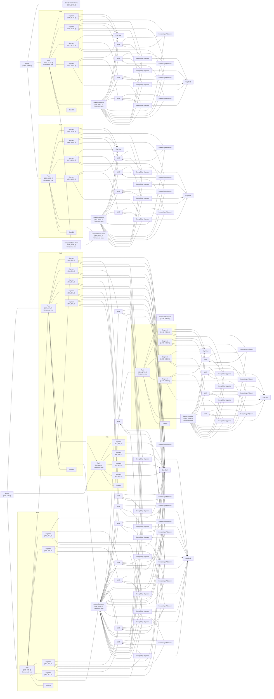

```mermaid
flowchart LR
  subgraph path30 [Path]
    30["Path<br>[150, 187, 0]<br>Consumed: true"]
      %% [ProgramBodyItem { index: 4 }, VariableDeclarationDeclaration, VariableDeclarationInit, PipeBodyItem { index: 0 }]
    31["Segment<br>[193, 232, 0]"]
      %% [ProgramBodyItem { index: 4 }, VariableDeclarationDeclaration, VariableDeclarationInit, PipeBodyItem { index: 1 }]
    32["Segment<br>[238, 256, 0]"]
      %% [ProgramBodyItem { index: 4 }, VariableDeclarationDeclaration, VariableDeclarationInit, PipeBodyItem { index: 2 }]
    33["Segment<br>[262, 317, 0]"]
      %% [ProgramBodyItem { index: 4 }, VariableDeclarationDeclaration, VariableDeclarationInit, PipeBodyItem { index: 3 }]
    34["Segment<br>[323, 365, 0]"]
      %% [ProgramBodyItem { index: 4 }, VariableDeclarationDeclaration, VariableDeclarationInit, PipeBodyItem { index: 4 }]
    35["Segment<br>[371, 378, 0]"]
      %% [ProgramBodyItem { index: 4 }, VariableDeclarationDeclaration, VariableDeclarationInit, PipeBodyItem { index: 5 }]
    73[Solid2d]
  end
  subgraph path36 [Path]
    36["Path<br>[393, 448, 0]<br>Consumed: true"]
      %% [ProgramBodyItem { index: 5 }, VariableDeclarationDeclaration, VariableDeclarationInit, PipeBodyItem { index: 0 }]
    37["Segment<br>[454, 486, 0]"]
      %% [ProgramBodyItem { index: 5 }, VariableDeclarationDeclaration, VariableDeclarationInit, PipeBodyItem { index: 1 }]
    38["Segment<br>[492, 538, 0]"]
      %% [ProgramBodyItem { index: 5 }, VariableDeclarationDeclaration, VariableDeclarationInit, PipeBodyItem { index: 2 }]
    39["Segment<br>[554, 610, 0]"]
      %% [ProgramBodyItem { index: 5 }, VariableDeclarationDeclaration, VariableDeclarationInit, PipeBodyItem { index: 3 }]
    40["Segment<br>[616, 624, 0]"]
      %% [ProgramBodyItem { index: 5 }, VariableDeclarationDeclaration, VariableDeclarationInit, PipeBodyItem { index: 4 }]
    75[Solid2d]
  end
  subgraph path41 [Path]
    41["Path<br>[639, 695, 0]<br>Consumed: true"]
      %% [ProgramBodyItem { index: 6 }, VariableDeclarationDeclaration, VariableDeclarationInit, PipeBodyItem { index: 0 }]
    42["Segment<br>[701, 734, 0]"]
      %% [ProgramBodyItem { index: 6 }, VariableDeclarationDeclaration, VariableDeclarationInit, PipeBodyItem { index: 1 }]
    43["Segment<br>[740, 786, 0]"]
      %% [ProgramBodyItem { index: 6 }, VariableDeclarationDeclaration, VariableDeclarationInit, PipeBodyItem { index: 2 }]
    44["Segment<br>[802, 858, 0]"]
      %% [ProgramBodyItem { index: 6 }, VariableDeclarationDeclaration, VariableDeclarationInit, PipeBodyItem { index: 3 }]
    45["Segment<br>[864, 872, 0]"]
      %% [ProgramBodyItem { index: 6 }, VariableDeclarationDeclaration, VariableDeclarationInit, PipeBodyItem { index: 4 }]
    76[Solid2d]
  end
  subgraph path49 [Path]
    49["Path<br>[1084, 1133, 0]<br>Consumed: true"]
      %% [ProgramBodyItem { index: 11 }, VariableDeclarationDeclaration, VariableDeclarationInit, PipeBodyItem { index: 0 }]
    50["Segment<br>[1139, 1174, 0]"]
      %% [ProgramBodyItem { index: 11 }, VariableDeclarationDeclaration, VariableDeclarationInit, PipeBodyItem { index: 1 }]
    51["Segment<br>[1180, 1215, 0]"]
      %% [ProgramBodyItem { index: 11 }, VariableDeclarationDeclaration, VariableDeclarationInit, PipeBodyItem { index: 2 }]
    52["Segment<br>[1221, 1277, 0]"]
      %% [ProgramBodyItem { index: 11 }, VariableDeclarationDeclaration, VariableDeclarationInit, PipeBodyItem { index: 3 }]
    53["Segment<br>[1283, 1291, 0]"]
      %% [ProgramBodyItem { index: 11 }, VariableDeclarationDeclaration, VariableDeclarationInit, PipeBodyItem { index: 4 }]
    71[Solid2d]
  end
  subgraph path55 [Path]
    55["Path<br>[1336, 1386, 0]<br>Consumed: true"]
      %% [ProgramBodyItem { index: 12 }, VariableDeclarationDeclaration, VariableDeclarationInit, PipeBodyItem { index: 0 }]
    56["Segment<br>[1392, 1428, 0]"]
      %% [ProgramBodyItem { index: 12 }, VariableDeclarationDeclaration, VariableDeclarationInit, PipeBodyItem { index: 1 }]
    57["Segment<br>[1434, 1469, 0]"]
      %% [ProgramBodyItem { index: 12 }, VariableDeclarationDeclaration, VariableDeclarationInit, PipeBodyItem { index: 2 }]
    58["Segment<br>[1475, 1531, 0]"]
      %% [ProgramBodyItem { index: 12 }, VariableDeclarationDeclaration, VariableDeclarationInit, PipeBodyItem { index: 3 }]
    59["Segment<br>[1537, 1545, 0]"]
      %% [ProgramBodyItem { index: 12 }, VariableDeclarationDeclaration, VariableDeclarationInit, PipeBodyItem { index: 4 }]
    72[Solid2d]
  end
  subgraph path65 [Path]
    65["Path<br>[1699, 1740, 0]<br>Consumed: true"]
      %% [ProgramBodyItem { index: 15 }, VariableDeclarationDeclaration, VariableDeclarationInit, PipeBodyItem { index: 0 }]
    66["Segment<br>[1746, 1766, 0]"]
      %% [ProgramBodyItem { index: 15 }, VariableDeclarationDeclaration, VariableDeclarationInit, PipeBodyItem { index: 1 }]
    67["Segment<br>[1772, 1792, 0]"]
      %% [ProgramBodyItem { index: 15 }, VariableDeclarationDeclaration, VariableDeclarationInit, PipeBodyItem { index: 2 }]
    68["Segment<br>[1798, 1838, 0]"]
      %% [ProgramBodyItem { index: 15 }, VariableDeclarationDeclaration, VariableDeclarationInit, PipeBodyItem { index: 3 }]
    69["Segment<br>[1844, 1852, 0]"]
      %% [ProgramBodyItem { index: 15 }, VariableDeclarationDeclaration, VariableDeclarationInit, PipeBodyItem { index: 4 }]
    74[Solid2d]
  end
  1["Cap End"]
    %% face_code_ref=Missing NodePath
  2["Cap End"]
    %% face_code_ref=Missing NodePath
  3["Cap End"]
    %% face_code_ref=Missing NodePath
  4["Cap End"]
    %% face_code_ref=Missing NodePath
  5["Cap Start"]
    %% face_code_ref=Missing NodePath
  6["Cap Start"]
    %% face_code_ref=Missing NodePath
  7["Cap Start"]
    %% face_code_ref=Missing NodePath
  8["Cap Start"]
    %% face_code_ref=Missing NodePath
  9[Wall]
    %% face_code_ref=Missing NodePath
  10[Wall]
    %% face_code_ref=Missing NodePath
  11[Wall]
    %% face_code_ref=Missing NodePath
  12[Wall]
    %% face_code_ref=Missing NodePath
  13[Wall]
    %% face_code_ref=Missing NodePath
  14[Wall]
    %% face_code_ref=Missing NodePath
  15[Wall]
    %% face_code_ref=Missing NodePath
  16[Wall]
    %% face_code_ref=Missing NodePath
  17[Wall]
    %% face_code_ref=Missing NodePath
  18[Wall]
    %% face_code_ref=Missing NodePath
  19[Wall]
    %% face_code_ref=Missing NodePath
  20[Wall]
    %% face_code_ref=Missing NodePath
  21[Wall]
    %% face_code_ref=Missing NodePath
  22[Wall]
    %% face_code_ref=Missing NodePath
  23[Wall]
    %% face_code_ref=Missing NodePath
  24[Wall]
    %% face_code_ref=Missing NodePath
  25[Wall]
    %% face_code_ref=Missing NodePath
  26[Wall]
    %% face_code_ref=Missing NodePath
  27[Wall]
    %% face_code_ref=Missing NodePath
  28[Wall]
    %% face_code_ref=Missing NodePath
  29["Plane<br>[119, 136, 0]"]
    %% [ProgramBodyItem { index: 3 }, VariableDeclarationDeclaration, VariableDeclarationInit]
  46["Sweep Extrusion<br>[982, 1013, 0]<br>Consumed: true"]
    %% [ProgramBodyItem { index: 9 }, VariableDeclarationDeclaration, VariableDeclarationInit]
  47["StartSketchOnPlane<br>[1027, 1070, 0]"]
    %% [ProgramBodyItem { index: 10 }, VariableDeclarationDeclaration, VariableDeclarationInit]
  48["Plane<br>[1041, 1069, 0]"]
    %% [ProgramBodyItem { index: 10 }, VariableDeclarationDeclaration, VariableDeclarationInit, CallKwUnlabeledArg]
  54["Sweep Extrusion<br>[1297, 1321, 0]<br>Consumed: true"]
    %% [ProgramBodyItem { index: 11 }, VariableDeclarationDeclaration, VariableDeclarationInit, PipeBodyItem { index: 5 }]
  60["Sweep Extrusion<br>[1551, 1575, 0]<br>Consumed: true"]
    %% [ProgramBodyItem { index: 12 }, VariableDeclarationDeclaration, VariableDeclarationInit, PipeBodyItem { index: 5 }]
  61["CompositeSolid Union<br>[1589, 1609, 0]<br>Consumed: true"]
    %% [ProgramBodyItem { index: 13 }, VariableDeclarationDeclaration, VariableDeclarationInit, BinaryLeft]
  62["CompositeSolid Union<br>[1589, 1622, 0]<br>Consumed: false"]
    %% [ProgramBodyItem { index: 13 }, VariableDeclarationDeclaration, VariableDeclarationInit]
  63["StartSketchOnFace<br>[1639, 1682, 0]"]
    %% [ProgramBodyItem { index: 14 }, VariableDeclarationDeclaration, VariableDeclarationInit]
  64[Wall]
    %% face_code_ref=[ProgramBodyItem { index: 14 }, VariableDeclarationDeclaration, VariableDeclarationInit]
  70["Sweep Extrusion<br>[1863, 1898, 0]<br>Consumed: false"]
    %% [ProgramBodyItem { index: 16 }, VariableDeclarationDeclaration, VariableDeclarationInit, PipeBodyItem { index: 0 }]
  77["SweepEdge Adjacent"]
  78["SweepEdge Adjacent"]
  79["SweepEdge Adjacent"]
  80["SweepEdge Adjacent"]
  81["SweepEdge Adjacent"]
  82["SweepEdge Adjacent"]
  83["SweepEdge Adjacent"]
  84["SweepEdge Adjacent"]
  85["SweepEdge Adjacent"]
  86["SweepEdge Adjacent"]
  87["SweepEdge Adjacent"]
  88["SweepEdge Adjacent"]
  89["SweepEdge Adjacent"]
  90["SweepEdge Adjacent"]
  91["SweepEdge Adjacent"]
  92["SweepEdge Adjacent"]
  93["SweepEdge Adjacent"]
  94["SweepEdge Adjacent"]
  95["SweepEdge Adjacent"]
  96["SweepEdge Adjacent"]
  97["SweepEdge Adjacent"]
  98["SweepEdge Opposite"]
  99["SweepEdge Opposite"]
  100["SweepEdge Opposite"]
  101["SweepEdge Opposite"]
  102["SweepEdge Opposite"]
  103["SweepEdge Opposite"]
  104["SweepEdge Opposite"]
  105["SweepEdge Opposite"]
  106["SweepEdge Opposite"]
  107["SweepEdge Opposite"]
  108["SweepEdge Opposite"]
  109["SweepEdge Opposite"]
  110["SweepEdge Opposite"]
  111["SweepEdge Opposite"]
  112["SweepEdge Opposite"]
  113["SweepEdge Opposite"]
  114["SweepEdge Opposite"]
  115["SweepEdge Opposite"]
  116["SweepEdge Opposite"]
  117["SweepEdge Opposite"]
  118["SweepEdge Opposite"]
  54 --- 1
  98 <--x 1
  99 <--x 1
  100 <--x 1
  101 <--x 1
  60 --- 2
  102 <--x 2
  103 <--x 2
  104 <--x 2
  105 <--x 2
  70 --- 3
  106 <--x 3
  107 <--x 3
  108 <--x 3
  109 <--x 3
  46 --- 4
  110 <--x 4
  111 <--x 4
  112 <--x 4
  113 <--x 4
  114 <--x 4
  115 <--x 4
  116 <--x 4
  117 <--x 4
  118 <--x 4
  50 <--x 5
  51 <--x 5
  52 <--x 5
  53 <--x 5
  54 --- 5
  56 <--x 6
  57 <--x 6
  58 <--x 6
  59 <--x 6
  60 --- 6
  66 <--x 7
  67 <--x 7
  68 <--x 7
  69 <--x 7
  70 --- 7
  31 <--x 8
  32 <--x 8
  33 <--x 8
  34 <--x 8
  35 <--x 8
  37 <--x 8
  38 <--x 8
  39 <--x 8
  40 <--x 8
  42 <--x 8
  43 <--x 8
  44 <--x 8
  45 <--x 8
  46 --- 8
  50 --- 9
  54 --- 9
  9 --- 77
  77 <--x 9
  9 --- 98
  51 --- 10
  54 --- 10
  10 --- 78
  78 <--x 10
  10 --- 99
  52 --- 11
  54 --- 11
  11 --- 79
  79 <--x 11
  11 --- 100
  53 --- 12
  54 --- 12
  12 --- 80
  80 <--x 12
  12 --- 101
  56 --- 13
  60 --- 13
  13 --- 81
  81 <--x 13
  13 --- 102
  57 --- 14
  60 --- 14
  14 --- 82
  82 <--x 14
  14 --- 103
  58 --- 15
  60 --- 15
  15 --- 83
  83 <--x 15
  15 --- 104
  59 --- 16
  60 --- 16
  16 --- 84
  84 <--x 16
  16 --- 105
  66 --- 17
  70 --- 17
  17 --- 85
  85 <--x 17
  17 --- 106
  67 --- 18
  70 --- 18
  18 --- 86
  86 <--x 18
  18 --- 107
  68 --- 19
  70 --- 19
  19 --- 87
  87 <--x 19
  19 --- 108
  69 --- 20
  70 --- 20
  20 --- 88
  88 <--x 20
  20 --- 109
  32 --- 21
  46 --- 21
  21 --- 89
  89 <--x 21
  21 --- 110
  33 --- 22
  46 --- 22
  22 --- 90
  90 <--x 22
  22 --- 111
  34 --- 23
  46 --- 23
  23 --- 91
  91 <--x 23
  23 --- 112
  35 --- 24
  46 --- 24
  24 --- 92
  92 <--x 24
  24 --- 113
  42 --- 25
  46 --- 25
  25 --- 93
  93 <--x 25
  25 --- 114
  43 --- 26
  46 --- 26
  26 --- 94
  94 <--x 26
  26 --- 115
  44 --- 27
  46 --- 27
  27 --- 95
  95 <--x 27
  27 --- 116
  45 --- 28
  46 --- 28
  28 --- 96
  96 <--x 28
  28 --- 117
  29 --- 30
  29 --- 36
  29 --- 41
  30 --- 31
  30 --- 32
  30 --- 33
  30 --- 34
  30 --- 35
  30 <--x 36
  41 --- 30
  30 ---- 46
  30 --- 61
  30 --- 73
  31 --- 64
  31 --- 89
  31 --- 110
  32 --- 90
  32 --- 111
  33 --- 91
  33 --- 112
  34 --- 92
  34 --- 113
  35 --- 93
  35 --- 114
  36 --- 37
  36 --- 38
  36 --- 39
  36 --- 40
  36 --- 75
  41 --- 42
  41 --- 43
  41 --- 44
  41 --- 45
  41 x---> 46
  41 --- 76
  42 --- 94
  42 --- 115
  43 --- 95
  43 --- 116
  44 --- 96
  44 --- 117
  45 --- 97
  45 --- 118
  46 --- 64
  46 --- 89
  46 --- 90
  46 --- 91
  46 --- 92
  46 --- 93
  46 --- 94
  46 --- 95
  46 --- 96
  46 --- 97
  46 --- 110
  46 --- 111
  46 --- 112
  46 --- 113
  46 --- 114
  46 --- 115
  46 --- 116
  46 --- 117
  46 --- 118
  48 x--> 47
  48 --- 49
  48 --- 55
  49 --- 50
  49 --- 51
  49 --- 52
  49 --- 53
  49 ---- 54
  49 --- 61
  49 --- 71
  50 --- 77
  50 --- 98
  51 --- 78
  51 --- 99
  52 --- 79
  52 --- 100
  53 --- 80
  53 --- 101
  54 --- 77
  54 --- 78
  54 --- 79
  54 --- 80
  54 --- 98
  54 --- 99
  54 --- 100
  54 --- 101
  55 --- 56
  55 --- 57
  55 --- 58
  55 --- 59
  55 ---- 60
  55 --- 62
  55 --- 72
  56 --- 81
  56 --- 102
  57 --- 82
  57 --- 103
  58 --- 83
  58 --- 104
  59 --- 84
  59 --- 105
  60 --- 81
  60 --- 82
  60 --- 83
  60 --- 84
  60 --- 102
  60 --- 103
  60 --- 104
  60 --- 105
  61 --- 62
  64 x--> 63
  64 --- 65
  64 --- 97
  97 <--x 64
  64 --- 118
  65 --- 66
  65 --- 67
  65 --- 68
  65 --- 69
  65 ---- 70
  65 --- 74
  66 --- 85
  66 --- 106
  67 --- 86
  67 --- 107
  68 --- 87
  68 --- 108
  69 --- 88
  69 --- 109
  70 --- 85
  70 --- 86
  70 --- 87
  70 --- 88
  70 --- 106
  70 --- 107
  70 --- 108
  70 --- 109
```
