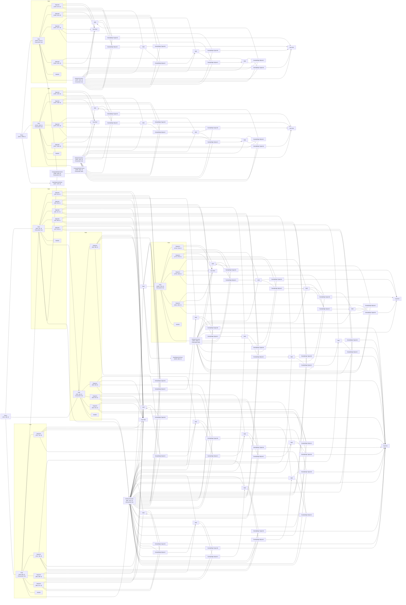

```mermaid
flowchart LR
  subgraph path2 [Path]
    2["Path<br>[150, 187, 0]<br>Consumed: true"]
      %% [ProgramBodyItem { index: 4 }, VariableDeclarationDeclaration, VariableDeclarationInit, PipeBodyItem { index: 0 }]
    3["Segment<br>[193, 232, 0]"]
      %% [ProgramBodyItem { index: 4 }, VariableDeclarationDeclaration, VariableDeclarationInit, PipeBodyItem { index: 1 }]
    4["Segment<br>[238, 256, 0]"]
      %% [ProgramBodyItem { index: 4 }, VariableDeclarationDeclaration, VariableDeclarationInit, PipeBodyItem { index: 2 }]
    5["Segment<br>[262, 317, 0]"]
      %% [ProgramBodyItem { index: 4 }, VariableDeclarationDeclaration, VariableDeclarationInit, PipeBodyItem { index: 3 }]
    6["Segment<br>[323, 365, 0]"]
      %% [ProgramBodyItem { index: 4 }, VariableDeclarationDeclaration, VariableDeclarationInit, PipeBodyItem { index: 4 }]
    7["Segment<br>[371, 378, 0]"]
      %% [ProgramBodyItem { index: 4 }, VariableDeclarationDeclaration, VariableDeclarationInit, PipeBodyItem { index: 5 }]
    8[Solid2d]
  end
  subgraph path9 [Path]
    9["Path<br>[393, 448, 0]<br>Consumed: true"]
      %% [ProgramBodyItem { index: 5 }, VariableDeclarationDeclaration, VariableDeclarationInit, PipeBodyItem { index: 0 }]
    10["Segment<br>[454, 486, 0]"]
      %% [ProgramBodyItem { index: 5 }, VariableDeclarationDeclaration, VariableDeclarationInit, PipeBodyItem { index: 1 }]
    11["Segment<br>[492, 538, 0]"]
      %% [ProgramBodyItem { index: 5 }, VariableDeclarationDeclaration, VariableDeclarationInit, PipeBodyItem { index: 2 }]
    12["Segment<br>[554, 610, 0]"]
      %% [ProgramBodyItem { index: 5 }, VariableDeclarationDeclaration, VariableDeclarationInit, PipeBodyItem { index: 3 }]
    13["Segment<br>[616, 624, 0]"]
      %% [ProgramBodyItem { index: 5 }, VariableDeclarationDeclaration, VariableDeclarationInit, PipeBodyItem { index: 4 }]
    14[Solid2d]
  end
  subgraph path15 [Path]
    15["Path<br>[639, 695, 0]<br>Consumed: true"]
      %% [ProgramBodyItem { index: 6 }, VariableDeclarationDeclaration, VariableDeclarationInit, PipeBodyItem { index: 0 }]
    16["Segment<br>[701, 734, 0]"]
      %% [ProgramBodyItem { index: 6 }, VariableDeclarationDeclaration, VariableDeclarationInit, PipeBodyItem { index: 1 }]
    17["Segment<br>[740, 786, 0]"]
      %% [ProgramBodyItem { index: 6 }, VariableDeclarationDeclaration, VariableDeclarationInit, PipeBodyItem { index: 2 }]
    18["Segment<br>[802, 858, 0]"]
      %% [ProgramBodyItem { index: 6 }, VariableDeclarationDeclaration, VariableDeclarationInit, PipeBodyItem { index: 3 }]
    19["Segment<br>[864, 872, 0]"]
      %% [ProgramBodyItem { index: 6 }, VariableDeclarationDeclaration, VariableDeclarationInit, PipeBodyItem { index: 4 }]
    20[Solid2d]
  end
  subgraph path64 [Path]
    64["Path<br>[1084, 1133, 0]<br>Consumed: true"]
      %% [ProgramBodyItem { index: 11 }, VariableDeclarationDeclaration, VariableDeclarationInit, PipeBodyItem { index: 0 }]
    65["Segment<br>[1139, 1174, 0]"]
      %% [ProgramBodyItem { index: 11 }, VariableDeclarationDeclaration, VariableDeclarationInit, PipeBodyItem { index: 1 }]
    66["Segment<br>[1180, 1215, 0]"]
      %% [ProgramBodyItem { index: 11 }, VariableDeclarationDeclaration, VariableDeclarationInit, PipeBodyItem { index: 2 }]
    67["Segment<br>[1221, 1277, 0]"]
      %% [ProgramBodyItem { index: 11 }, VariableDeclarationDeclaration, VariableDeclarationInit, PipeBodyItem { index: 3 }]
    68["Segment<br>[1283, 1291, 0]"]
      %% [ProgramBodyItem { index: 11 }, VariableDeclarationDeclaration, VariableDeclarationInit, PipeBodyItem { index: 4 }]
    69[Solid2d]
  end
  subgraph path85 [Path]
    85["Path<br>[1336, 1386, 0]<br>Consumed: true"]
      %% [ProgramBodyItem { index: 12 }, VariableDeclarationDeclaration, VariableDeclarationInit, PipeBodyItem { index: 0 }]
    86["Segment<br>[1392, 1428, 0]"]
      %% [ProgramBodyItem { index: 12 }, VariableDeclarationDeclaration, VariableDeclarationInit, PipeBodyItem { index: 1 }]
    87["Segment<br>[1434, 1469, 0]"]
      %% [ProgramBodyItem { index: 12 }, VariableDeclarationDeclaration, VariableDeclarationInit, PipeBodyItem { index: 2 }]
    88["Segment<br>[1475, 1531, 0]"]
      %% [ProgramBodyItem { index: 12 }, VariableDeclarationDeclaration, VariableDeclarationInit, PipeBodyItem { index: 3 }]
    89["Segment<br>[1537, 1545, 0]"]
      %% [ProgramBodyItem { index: 12 }, VariableDeclarationDeclaration, VariableDeclarationInit, PipeBodyItem { index: 4 }]
    90[Solid2d]
  end
  subgraph path108 [Path]
    108["Path<br>[1699, 1740, 0]<br>Consumed: true"]
      %% [ProgramBodyItem { index: 15 }, VariableDeclarationDeclaration, VariableDeclarationInit, PipeBodyItem { index: 0 }]
    109["Segment<br>[1746, 1766, 0]"]
      %% [ProgramBodyItem { index: 15 }, VariableDeclarationDeclaration, VariableDeclarationInit, PipeBodyItem { index: 1 }]
    110["Segment<br>[1772, 1792, 0]"]
      %% [ProgramBodyItem { index: 15 }, VariableDeclarationDeclaration, VariableDeclarationInit, PipeBodyItem { index: 2 }]
    111["Segment<br>[1798, 1838, 0]"]
      %% [ProgramBodyItem { index: 15 }, VariableDeclarationDeclaration, VariableDeclarationInit, PipeBodyItem { index: 3 }]
    112["Segment<br>[1844, 1852, 0]"]
      %% [ProgramBodyItem { index: 15 }, VariableDeclarationDeclaration, VariableDeclarationInit, PipeBodyItem { index: 4 }]
    113[Solid2d]
  end
  1["Plane<br>[119, 136, 0]"]
    %% [ProgramBodyItem { index: 3 }, VariableDeclarationDeclaration, VariableDeclarationInit]
  21["Sweep Extrusion<br>[982, 1013, 0]<br>Consumed: true"]
    %% [ProgramBodyItem { index: 9 }, VariableDeclarationDeclaration, VariableDeclarationInit]
  22[Wall]
    %% face_code_ref=Missing NodePath
  23[Wall]
    %% face_code_ref=Missing NodePath
  24[Wall]
    %% face_code_ref=Missing NodePath
  25[Wall]
    %% face_code_ref=Missing NodePath
  26[Wall]
    %% face_code_ref=[ProgramBodyItem { index: 14 }, VariableDeclarationDeclaration, VariableDeclarationInit]
  27[Wall]
    %% face_code_ref=Missing NodePath
  28[Wall]
    %% face_code_ref=Missing NodePath
  29[Wall]
    %% face_code_ref=Missing NodePath
  30[Wall]
    %% face_code_ref=Missing NodePath
  31[Wall]
    %% face_code_ref=Missing NodePath
  32[Wall]
    %% face_code_ref=Missing NodePath
  33[Wall]
    %% face_code_ref=Missing NodePath
  34[Wall]
    %% face_code_ref=Missing NodePath
  35["Cap Start"]
    %% face_code_ref=Missing NodePath
  36["Cap End"]
    %% face_code_ref=Missing NodePath
  37["SweepEdge Opposite"]
  38["SweepEdge Adjacent"]
  39["SweepEdge Opposite"]
  40["SweepEdge Adjacent"]
  41["SweepEdge Opposite"]
  42["SweepEdge Adjacent"]
  43["SweepEdge Opposite"]
  44["SweepEdge Adjacent"]
  45["SweepEdge Opposite"]
  46["SweepEdge Adjacent"]
  47["SweepEdge Opposite"]
  48["SweepEdge Adjacent"]
  49["SweepEdge Opposite"]
  50["SweepEdge Adjacent"]
  51["SweepEdge Opposite"]
  52["SweepEdge Adjacent"]
  53["SweepEdge Opposite"]
  54["SweepEdge Adjacent"]
  55["SweepEdge Opposite"]
  56["SweepEdge Adjacent"]
  57["SweepEdge Opposite"]
  58["SweepEdge Adjacent"]
  59["SweepEdge Opposite"]
  60["SweepEdge Adjacent"]
  61["SweepEdge Opposite"]
  62["SweepEdge Adjacent"]
  63["Plane<br>[1041, 1069, 0]"]
    %% [ProgramBodyItem { index: 10 }, VariableDeclarationDeclaration, VariableDeclarationInit, CallKwUnlabeledArg]
  70["Sweep Extrusion<br>[1297, 1321, 0]<br>Consumed: true"]
    %% [ProgramBodyItem { index: 11 }, VariableDeclarationDeclaration, VariableDeclarationInit, PipeBodyItem { index: 5 }]
  71[Wall]
    %% face_code_ref=Missing NodePath
  72[Wall]
    %% face_code_ref=Missing NodePath
  73[Wall]
    %% face_code_ref=Missing NodePath
  74[Wall]
    %% face_code_ref=Missing NodePath
  75["Cap Start"]
    %% face_code_ref=Missing NodePath
  76["Cap End"]
    %% face_code_ref=Missing NodePath
  77["SweepEdge Opposite"]
  78["SweepEdge Adjacent"]
  79["SweepEdge Opposite"]
  80["SweepEdge Adjacent"]
  81["SweepEdge Opposite"]
  82["SweepEdge Adjacent"]
  83["SweepEdge Opposite"]
  84["SweepEdge Adjacent"]
  91["Sweep Extrusion<br>[1551, 1575, 0]<br>Consumed: true"]
    %% [ProgramBodyItem { index: 12 }, VariableDeclarationDeclaration, VariableDeclarationInit, PipeBodyItem { index: 5 }]
  92[Wall]
    %% face_code_ref=Missing NodePath
  93[Wall]
    %% face_code_ref=Missing NodePath
  94[Wall]
    %% face_code_ref=Missing NodePath
  95[Wall]
    %% face_code_ref=Missing NodePath
  96["Cap Start"]
    %% face_code_ref=Missing NodePath
  97["Cap End"]
    %% face_code_ref=Missing NodePath
  98["SweepEdge Opposite"]
  99["SweepEdge Adjacent"]
  100["SweepEdge Opposite"]
  101["SweepEdge Adjacent"]
  102["SweepEdge Opposite"]
  103["SweepEdge Adjacent"]
  104["SweepEdge Opposite"]
  105["SweepEdge Adjacent"]
  106["CompositeSolid Union<br>[1589, 1609, 0]<br>Consumed: true"]
    %% [ProgramBodyItem { index: 13 }, VariableDeclarationDeclaration, VariableDeclarationInit, BinaryLeft]
  107["CompositeSolid Union<br>[1589, 1622, 0]<br>Consumed: false"]
    %% [ProgramBodyItem { index: 13 }, VariableDeclarationDeclaration, VariableDeclarationInit]
  114["Sweep Extrusion<br>[1863, 1898, 0]<br>Consumed: false"]
    %% [ProgramBodyItem { index: 16 }, VariableDeclarationDeclaration, VariableDeclarationInit, PipeBodyItem { index: 0 }]
  115[Wall]
    %% face_code_ref=Missing NodePath
  116[Wall]
    %% face_code_ref=Missing NodePath
  117[Wall]
    %% face_code_ref=Missing NodePath
  118[Wall]
    %% face_code_ref=Missing NodePath
  119["Cap Start"]
    %% face_code_ref=Missing NodePath
  120["Cap End"]
    %% face_code_ref=Missing NodePath
  121["SweepEdge Opposite"]
  122["SweepEdge Adjacent"]
  123["SweepEdge Opposite"]
  124["SweepEdge Adjacent"]
  125["SweepEdge Opposite"]
  126["SweepEdge Adjacent"]
  127["SweepEdge Opposite"]
  128["SweepEdge Adjacent"]
  129["StartSketchOnPlane<br>[1027, 1070, 0]"]
    %% [ProgramBodyItem { index: 10 }, VariableDeclarationDeclaration, VariableDeclarationInit]
  130["StartSketchOnFace<br>[1639, 1682, 0]"]
    %% [ProgramBodyItem { index: 14 }, VariableDeclarationDeclaration, VariableDeclarationInit]
  1 --- 2
  1 --- 9
  1 --- 15
  2 --- 3
  2 --- 4
  2 --- 5
  2 --- 6
  2 --- 7
  2 --- 8
  2 <--x 9
  15 --- 2
  2 ---- 21
  2 --- 106
  3 --- 26
  3 x--> 35
  3 --- 45
  3 --- 46
  4 --- 25
  4 x--> 35
  4 --- 43
  4 --- 44
  5 --- 24
  5 x--> 35
  5 --- 41
  5 --- 42
  6 --- 23
  6 x--> 35
  6 --- 39
  6 --- 40
  7 --- 22
  7 x--> 35
  7 --- 37
  7 --- 38
  9 --- 10
  9 --- 11
  9 --- 12
  9 --- 13
  9 --- 14
  9 x---> 21
  10 --- 27
  10 x--> 35
  10 --- 47
  10 --- 48
  11 --- 28
  11 x--> 35
  11 --- 49
  11 --- 50
  12 --- 29
  12 x--> 35
  12 --- 51
  12 --- 52
  13 --- 30
  13 x--> 35
  13 --- 53
  13 --- 54
  15 --- 16
  15 --- 17
  15 --- 18
  15 --- 19
  15 --- 20
  15 x---> 21
  16 --- 34
  16 x--> 35
  16 --- 61
  16 --- 62
  17 --- 33
  17 x--> 35
  17 --- 59
  17 --- 60
  18 --- 32
  18 x--> 35
  18 --- 57
  18 --- 58
  19 --- 31
  19 x--> 35
  19 --- 55
  19 --- 56
  21 --- 22
  21 --- 23
  21 --- 24
  21 --- 25
  21 --- 26
  21 --- 27
  21 --- 28
  21 --- 29
  21 --- 30
  21 --- 31
  21 --- 32
  21 --- 33
  21 --- 34
  21 --- 35
  21 --- 36
  21 --- 37
  21 --- 38
  21 --- 39
  21 --- 40
  21 --- 41
  21 --- 42
  21 --- 43
  21 --- 44
  21 --- 45
  21 --- 46
  21 --- 47
  21 --- 48
  21 --- 49
  21 --- 50
  21 --- 51
  21 --- 52
  21 --- 53
  21 --- 54
  21 --- 55
  21 --- 56
  21 --- 57
  21 --- 58
  21 --- 59
  21 --- 60
  21 --- 61
  21 --- 62
  22 --- 37
  22 --- 38
  40 <--x 22
  23 --- 39
  23 --- 40
  42 <--x 23
  24 --- 41
  24 --- 42
  44 <--x 24
  25 --- 43
  25 --- 44
  46 <--x 25
  38 <--x 26
  26 --- 45
  26 --- 46
  26 --- 108
  26 <--x 130
  27 --- 47
  27 --- 48
  54 <--x 27
  48 <--x 28
  28 --- 49
  28 --- 50
  50 <--x 29
  29 --- 51
  29 --- 52
  52 <--x 30
  30 --- 53
  30 --- 54
  31 --- 55
  31 --- 56
  62 <--x 31
  56 <--x 32
  32 --- 57
  32 --- 58
  58 <--x 33
  33 --- 59
  33 --- 60
  60 <--x 34
  34 --- 61
  34 --- 62
  37 <--x 36
  39 <--x 36
  41 <--x 36
  43 <--x 36
  45 <--x 36
  47 <--x 36
  49 <--x 36
  51 <--x 36
  53 <--x 36
  55 <--x 36
  57 <--x 36
  59 <--x 36
  61 <--x 36
  63 --- 64
  63 --- 85
  63 <--x 129
  64 --- 65
  64 --- 66
  64 --- 67
  64 --- 68
  64 --- 69
  64 ---- 70
  64 --- 106
  65 --- 74
  65 x--> 75
  65 --- 83
  65 --- 84
  66 --- 73
  66 x--> 75
  66 --- 81
  66 --- 82
  67 --- 72
  67 x--> 75
  67 --- 79
  67 --- 80
  68 --- 71
  68 x--> 75
  68 --- 77
  68 --- 78
  70 --- 71
  70 --- 72
  70 --- 73
  70 --- 74
  70 --- 75
  70 --- 76
  70 --- 77
  70 --- 78
  70 --- 79
  70 --- 80
  70 --- 81
  70 --- 82
  70 --- 83
  70 --- 84
  71 --- 77
  71 --- 78
  80 <--x 71
  72 --- 79
  72 --- 80
  82 <--x 72
  73 --- 81
  73 --- 82
  84 <--x 73
  78 <--x 74
  74 --- 83
  74 --- 84
  77 <--x 76
  79 <--x 76
  81 <--x 76
  83 <--x 76
  85 --- 86
  85 --- 87
  85 --- 88
  85 --- 89
  85 --- 90
  85 ---- 91
  85 --- 107
  86 --- 92
  86 x--> 96
  86 --- 98
  86 --- 99
  87 --- 93
  87 x--> 96
  87 --- 100
  87 --- 101
  88 --- 94
  88 x--> 96
  88 --- 102
  88 --- 103
  89 --- 95
  89 x--> 96
  89 --- 104
  89 --- 105
  91 --- 92
  91 --- 93
  91 --- 94
  91 --- 95
  91 --- 96
  91 --- 97
  91 --- 98
  91 --- 99
  91 --- 100
  91 --- 101
  91 --- 102
  91 --- 103
  91 --- 104
  91 --- 105
  92 --- 98
  92 --- 99
  105 <--x 92
  99 <--x 93
  93 --- 100
  93 --- 101
  101 <--x 94
  94 --- 102
  94 --- 103
  103 <--x 95
  95 --- 104
  95 --- 105
  98 <--x 97
  100 <--x 97
  102 <--x 97
  104 <--x 97
  106 --- 107
  108 --- 109
  108 --- 110
  108 --- 111
  108 --- 112
  108 --- 113
  108 ---- 114
  109 --- 115
  109 x--> 119
  109 --- 121
  109 --- 122
  110 --- 116
  110 x--> 119
  110 --- 123
  110 --- 124
  111 --- 117
  111 x--> 119
  111 --- 125
  111 --- 126
  112 --- 118
  112 x--> 119
  112 --- 127
  112 --- 128
  114 --- 115
  114 --- 116
  114 --- 117
  114 --- 118
  114 --- 119
  114 --- 120
  114 --- 121
  114 --- 122
  114 --- 123
  114 --- 124
  114 --- 125
  114 --- 126
  114 --- 127
  114 --- 128
  115 --- 121
  115 --- 122
  128 <--x 115
  122 <--x 116
  116 --- 123
  116 --- 124
  124 <--x 117
  117 --- 125
  117 --- 126
  126 <--x 118
  118 --- 127
  118 --- 128
  121 <--x 120
  123 <--x 120
  125 <--x 120
  127 <--x 120
```
