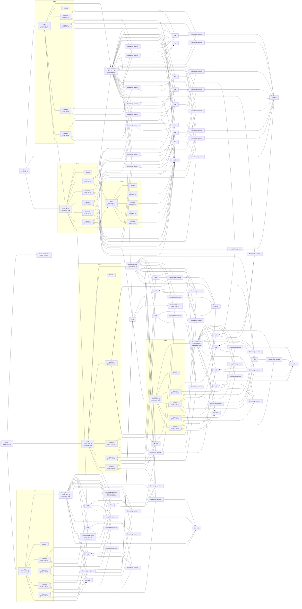

```mermaid
flowchart LR
  subgraph path11 [Path]
    11["Path<br>[1084, 1133, 0]<br>Consumed: true"]
      %% [ProgramBodyItem { index: 11 }, VariableDeclarationDeclaration, VariableDeclarationInit, PipeBodyItem { index: 0 }]
    19["Segment<br>[1139, 1174, 0]"]
      %% [ProgramBodyItem { index: 11 }, VariableDeclarationDeclaration, VariableDeclarationInit, PipeBodyItem { index: 1 }]
    20["Segment<br>[1180, 1215, 0]"]
      %% [ProgramBodyItem { index: 11 }, VariableDeclarationDeclaration, VariableDeclarationInit, PipeBodyItem { index: 2 }]
    21["Segment<br>[1221, 1277, 0]"]
      %% [ProgramBodyItem { index: 11 }, VariableDeclarationDeclaration, VariableDeclarationInit, PipeBodyItem { index: 3 }]
    22["Segment<br>[1283, 1291, 0]"]
      %% [ProgramBodyItem { index: 11 }, VariableDeclarationDeclaration, VariableDeclarationInit, PipeBodyItem { index: 4 }]
    44[Solid2d]
  end
  subgraph path12 [Path]
    12["Path<br>[1336, 1386, 0]<br>Consumed: true"]
      %% [ProgramBodyItem { index: 12 }, VariableDeclarationDeclaration, VariableDeclarationInit, PipeBodyItem { index: 0 }]
    23["Segment<br>[1392, 1428, 0]"]
      %% [ProgramBodyItem { index: 12 }, VariableDeclarationDeclaration, VariableDeclarationInit, PipeBodyItem { index: 1 }]
    24["Segment<br>[1434, 1469, 0]"]
      %% [ProgramBodyItem { index: 12 }, VariableDeclarationDeclaration, VariableDeclarationInit, PipeBodyItem { index: 2 }]
    25["Segment<br>[1475, 1531, 0]"]
      %% [ProgramBodyItem { index: 12 }, VariableDeclarationDeclaration, VariableDeclarationInit, PipeBodyItem { index: 3 }]
    26["Segment<br>[1537, 1545, 0]"]
      %% [ProgramBodyItem { index: 12 }, VariableDeclarationDeclaration, VariableDeclarationInit, PipeBodyItem { index: 4 }]
    45[Solid2d]
  end
  subgraph path13 [Path]
    13["Path<br>[150, 187, 0]<br>Consumed: true"]
      %% [ProgramBodyItem { index: 4 }, VariableDeclarationDeclaration, VariableDeclarationInit, PipeBodyItem { index: 0 }]
    31["Segment<br>[193, 232, 0]"]
      %% [ProgramBodyItem { index: 4 }, VariableDeclarationDeclaration, VariableDeclarationInit, PipeBodyItem { index: 1 }]
    32["Segment<br>[238, 256, 0]"]
      %% [ProgramBodyItem { index: 4 }, VariableDeclarationDeclaration, VariableDeclarationInit, PipeBodyItem { index: 2 }]
    33["Segment<br>[262, 317, 0]"]
      %% [ProgramBodyItem { index: 4 }, VariableDeclarationDeclaration, VariableDeclarationInit, PipeBodyItem { index: 3 }]
    34["Segment<br>[323, 365, 0]"]
      %% [ProgramBodyItem { index: 4 }, VariableDeclarationDeclaration, VariableDeclarationInit, PipeBodyItem { index: 4 }]
    35["Segment<br>[371, 378, 0]"]
      %% [ProgramBodyItem { index: 4 }, VariableDeclarationDeclaration, VariableDeclarationInit, PipeBodyItem { index: 5 }]
    46[Solid2d]
  end
  subgraph path14 [Path]
    14["Path<br>[1699, 1740, 0]<br>Consumed: true"]
      %% [ProgramBodyItem { index: 15 }, VariableDeclarationDeclaration, VariableDeclarationInit, PipeBodyItem { index: 0 }]
    27["Segment<br>[1746, 1766, 0]"]
      %% [ProgramBodyItem { index: 15 }, VariableDeclarationDeclaration, VariableDeclarationInit, PipeBodyItem { index: 1 }]
    28["Segment<br>[1772, 1792, 0]"]
      %% [ProgramBodyItem { index: 15 }, VariableDeclarationDeclaration, VariableDeclarationInit, PipeBodyItem { index: 2 }]
    29["Segment<br>[1798, 1838, 0]"]
      %% [ProgramBodyItem { index: 15 }, VariableDeclarationDeclaration, VariableDeclarationInit, PipeBodyItem { index: 3 }]
    30["Segment<br>[1844, 1852, 0]"]
      %% [ProgramBodyItem { index: 15 }, VariableDeclarationDeclaration, VariableDeclarationInit, PipeBodyItem { index: 4 }]
    47[Solid2d]
  end
  subgraph path15 [Path]
    15["Path<br>[393, 448, 0]<br>Consumed: true"]
      %% [ProgramBodyItem { index: 5 }, VariableDeclarationDeclaration, VariableDeclarationInit, PipeBodyItem { index: 0 }]
    36["Segment<br>[454, 486, 0]"]
      %% [ProgramBodyItem { index: 5 }, VariableDeclarationDeclaration, VariableDeclarationInit, PipeBodyItem { index: 1 }]
    37["Segment<br>[492, 538, 0]"]
      %% [ProgramBodyItem { index: 5 }, VariableDeclarationDeclaration, VariableDeclarationInit, PipeBodyItem { index: 2 }]
    38["Segment<br>[554, 610, 0]"]
      %% [ProgramBodyItem { index: 5 }, VariableDeclarationDeclaration, VariableDeclarationInit, PipeBodyItem { index: 3 }]
    39["Segment<br>[616, 624, 0]"]
      %% [ProgramBodyItem { index: 5 }, VariableDeclarationDeclaration, VariableDeclarationInit, PipeBodyItem { index: 4 }]
    48[Solid2d]
  end
  subgraph path16 [Path]
    16["Path<br>[639, 695, 0]<br>Consumed: true"]
      %% [ProgramBodyItem { index: 6 }, VariableDeclarationDeclaration, VariableDeclarationInit, PipeBodyItem { index: 0 }]
    40["Segment<br>[701, 734, 0]"]
      %% [ProgramBodyItem { index: 6 }, VariableDeclarationDeclaration, VariableDeclarationInit, PipeBodyItem { index: 1 }]
    41["Segment<br>[740, 786, 0]"]
      %% [ProgramBodyItem { index: 6 }, VariableDeclarationDeclaration, VariableDeclarationInit, PipeBodyItem { index: 2 }]
    42["Segment<br>[802, 858, 0]"]
      %% [ProgramBodyItem { index: 6 }, VariableDeclarationDeclaration, VariableDeclarationInit, PipeBodyItem { index: 3 }]
    43["Segment<br>[864, 872, 0]"]
      %% [ProgramBodyItem { index: 6 }, VariableDeclarationDeclaration, VariableDeclarationInit, PipeBodyItem { index: 4 }]
    49[Solid2d]
  end
  1["Cap End"]
    %% face_code_ref=Missing NodePath
  2["Cap End"]
    %% face_code_ref=Missing NodePath
  3["Cap End"]
    %% face_code_ref=Missing NodePath
  4["Cap End"]
    %% face_code_ref=Missing NodePath
  5["Cap Start"]
    %% face_code_ref=Missing NodePath
  6["Cap Start"]
    %% face_code_ref=Missing NodePath
  7["Cap Start"]
    %% face_code_ref=Missing NodePath
  8["Cap Start"]
    %% face_code_ref=Missing NodePath
  9["CompositeSolid Union<br>[1589, 1609, 0]<br>Consumed: true"]
    %% [ProgramBodyItem { index: 13 }, VariableDeclarationDeclaration, VariableDeclarationInit, BinaryLeft]
  10["CompositeSolid Union<br>[1589, 1622, 0]<br>Consumed: false"]
    %% [ProgramBodyItem { index: 13 }, VariableDeclarationDeclaration, VariableDeclarationInit]
  17["Plane<br>[1041, 1069, 0]"]
    %% [ProgramBodyItem { index: 10 }, VariableDeclarationDeclaration, VariableDeclarationInit, CallKwUnlabeledArg]
  18["Plane<br>[119, 136, 0]"]
    %% [ProgramBodyItem { index: 3 }, VariableDeclarationDeclaration, VariableDeclarationInit]
  50["StartSketchOnFace<br>[1639, 1682, 0]"]
    %% [ProgramBodyItem { index: 14 }, VariableDeclarationDeclaration, VariableDeclarationInit]
  51["StartSketchOnPlane<br>[1027, 1070, 0]"]
    %% [ProgramBodyItem { index: 10 }, VariableDeclarationDeclaration, VariableDeclarationInit]
  52["Sweep Extrusion<br>[1297, 1321, 0]<br>Consumed: true"]
    %% [ProgramBodyItem { index: 11 }, VariableDeclarationDeclaration, VariableDeclarationInit, PipeBodyItem { index: 5 }]
  53["Sweep Extrusion<br>[1551, 1575, 0]<br>Consumed: true"]
    %% [ProgramBodyItem { index: 12 }, VariableDeclarationDeclaration, VariableDeclarationInit, PipeBodyItem { index: 5 }]
  54["Sweep Extrusion<br>[1863, 1898, 0]<br>Consumed: false"]
    %% [ProgramBodyItem { index: 16 }, VariableDeclarationDeclaration, VariableDeclarationInit, PipeBodyItem { index: 0 }]
  55["Sweep Extrusion<br>[982, 1013, 0]<br>Consumed: true"]
    %% [ProgramBodyItem { index: 9 }, VariableDeclarationDeclaration, VariableDeclarationInit]
  56["SweepEdge Adjacent"]
  57["SweepEdge Adjacent"]
  58["SweepEdge Adjacent"]
  59["SweepEdge Adjacent"]
  60["SweepEdge Adjacent"]
  61["SweepEdge Adjacent"]
  62["SweepEdge Adjacent"]
  63["SweepEdge Adjacent"]
  64["SweepEdge Adjacent"]
  65["SweepEdge Adjacent"]
  66["SweepEdge Adjacent"]
  67["SweepEdge Adjacent"]
  68["SweepEdge Adjacent"]
  69["SweepEdge Adjacent"]
  70["SweepEdge Adjacent"]
  71["SweepEdge Adjacent"]
  72["SweepEdge Adjacent"]
  73["SweepEdge Adjacent"]
  74["SweepEdge Adjacent"]
  75["SweepEdge Adjacent"]
  76["SweepEdge Adjacent"]
  77["SweepEdge Opposite"]
  78["SweepEdge Opposite"]
  79["SweepEdge Opposite"]
  80["SweepEdge Opposite"]
  81["SweepEdge Opposite"]
  82["SweepEdge Opposite"]
  83["SweepEdge Opposite"]
  84["SweepEdge Opposite"]
  85["SweepEdge Opposite"]
  86["SweepEdge Opposite"]
  87["SweepEdge Opposite"]
  88["SweepEdge Opposite"]
  89["SweepEdge Opposite"]
  90["SweepEdge Opposite"]
  91["SweepEdge Opposite"]
  92["SweepEdge Opposite"]
  93["SweepEdge Opposite"]
  94["SweepEdge Opposite"]
  95["SweepEdge Opposite"]
  96["SweepEdge Opposite"]
  97["SweepEdge Opposite"]
  98[Wall]
    %% face_code_ref=[ProgramBodyItem { index: 14 }, VariableDeclarationDeclaration, VariableDeclarationInit]
  99[Wall]
    %% face_code_ref=Missing NodePath
  100[Wall]
    %% face_code_ref=Missing NodePath
  101[Wall]
    %% face_code_ref=Missing NodePath
  102[Wall]
    %% face_code_ref=Missing NodePath
  103[Wall]
    %% face_code_ref=Missing NodePath
  104[Wall]
    %% face_code_ref=Missing NodePath
  105[Wall]
    %% face_code_ref=Missing NodePath
  106[Wall]
    %% face_code_ref=Missing NodePath
  107[Wall]
    %% face_code_ref=Missing NodePath
  108[Wall]
    %% face_code_ref=Missing NodePath
  109[Wall]
    %% face_code_ref=Missing NodePath
  110[Wall]
    %% face_code_ref=Missing NodePath
  111[Wall]
    %% face_code_ref=Missing NodePath
  112[Wall]
    %% face_code_ref=Missing NodePath
  113[Wall]
    %% face_code_ref=Missing NodePath
  114[Wall]
    %% face_code_ref=Missing NodePath
  115[Wall]
    %% face_code_ref=Missing NodePath
  116[Wall]
    %% face_code_ref=Missing NodePath
  117[Wall]
    %% face_code_ref=Missing NodePath
  118[Wall]
    %% face_code_ref=Missing NodePath
  52 --- 1
  77 <--x 1
  78 <--x 1
  79 <--x 1
  80 <--x 1
  53 --- 2
  81 <--x 2
  82 <--x 2
  83 <--x 2
  84 <--x 2
  54 --- 3
  85 <--x 3
  86 <--x 3
  87 <--x 3
  88 <--x 3
  55 --- 4
  89 <--x 4
  90 <--x 4
  91 <--x 4
  92 <--x 4
  93 <--x 4
  94 <--x 4
  95 <--x 4
  96 <--x 4
  97 <--x 4
  19 <--x 5
  20 <--x 5
  21 <--x 5
  22 <--x 5
  52 --- 5
  23 <--x 6
  24 <--x 6
  25 <--x 6
  26 <--x 6
  53 --- 6
  27 <--x 7
  28 <--x 7
  29 <--x 7
  30 <--x 7
  54 --- 7
  31 <--x 8
  32 <--x 8
  33 <--x 8
  34 <--x 8
  35 <--x 8
  36 <--x 8
  37 <--x 8
  38 <--x 8
  39 <--x 8
  40 <--x 8
  41 <--x 8
  42 <--x 8
  43 <--x 8
  55 --- 8
  9 --- 10
  11 --- 9
  13 --- 9
  12 --- 10
  17 --- 11
  11 --- 19
  11 --- 20
  11 --- 21
  11 --- 22
  11 --- 44
  11 ---- 52
  17 --- 12
  12 --- 23
  12 --- 24
  12 --- 25
  12 --- 26
  12 --- 45
  12 ---- 53
  13 <--x 15
  16 --- 13
  18 --- 13
  13 --- 31
  13 --- 32
  13 --- 33
  13 --- 34
  13 --- 35
  13 --- 46
  13 ---- 55
  14 --- 27
  14 --- 28
  14 --- 29
  14 --- 30
  14 --- 47
  14 ---- 54
  98 --- 14
  18 --- 15
  15 --- 36
  15 --- 37
  15 --- 38
  15 --- 39
  15 --- 48
  18 --- 16
  16 --- 40
  16 --- 41
  16 --- 42
  16 --- 43
  16 --- 49
  16 x---> 55
  17 <--x 51
  19 --- 56
  19 --- 77
  19 --- 99
  20 --- 57
  20 --- 78
  20 --- 100
  21 --- 58
  21 --- 79
  21 --- 101
  22 --- 59
  22 --- 80
  22 --- 102
  23 --- 60
  23 --- 81
  23 --- 103
  24 --- 61
  24 --- 82
  24 --- 104
  25 --- 62
  25 --- 83
  25 --- 105
  26 --- 63
  26 --- 84
  26 --- 106
  27 --- 64
  27 --- 85
  27 --- 107
  28 --- 65
  28 --- 86
  28 --- 108
  29 --- 66
  29 --- 87
  29 --- 109
  30 --- 67
  30 --- 88
  30 --- 110
  31 --- 68
  31 --- 89
  31 --- 98
  32 --- 69
  32 --- 90
  32 --- 111
  33 --- 70
  33 --- 91
  33 --- 112
  34 --- 71
  34 --- 92
  34 --- 113
  35 --- 72
  35 --- 93
  35 --- 114
  40 --- 73
  40 --- 94
  40 --- 115
  41 --- 74
  41 --- 95
  41 --- 116
  42 --- 75
  42 --- 96
  42 --- 117
  43 --- 76
  43 --- 97
  43 --- 118
  98 x--> 50
  52 --- 56
  52 --- 57
  52 --- 58
  52 --- 59
  52 --- 77
  52 --- 78
  52 --- 79
  52 --- 80
  52 --- 99
  52 --- 100
  52 --- 101
  52 --- 102
  53 --- 60
  53 --- 61
  53 --- 62
  53 --- 63
  53 --- 81
  53 --- 82
  53 --- 83
  53 --- 84
  53 --- 103
  53 --- 104
  53 --- 105
  53 --- 106
  54 --- 64
  54 --- 65
  54 --- 66
  54 --- 67
  54 --- 85
  54 --- 86
  54 --- 87
  54 --- 88
  54 --- 107
  54 --- 108
  54 --- 109
  54 --- 110
  55 --- 68
  55 --- 69
  55 --- 70
  55 --- 71
  55 --- 72
  55 --- 73
  55 --- 74
  55 --- 75
  55 --- 76
  55 --- 89
  55 --- 90
  55 --- 91
  55 --- 92
  55 --- 93
  55 --- 94
  55 --- 95
  55 --- 96
  55 --- 97
  55 --- 98
  55 --- 111
  55 --- 112
  55 --- 113
  55 --- 114
  55 --- 115
  55 --- 116
  55 --- 117
  55 --- 118
  98 --- 56
  56 x--> 98
  99 --- 57
  57 x--> 99
  100 --- 58
  58 x--> 100
  59 x--> 101
  101 --- 59
  102 --- 60
  60 x--> 102
  103 --- 61
  61 x--> 103
  104 --- 62
  62 x--> 104
  63 x--> 105
  105 --- 63
  106 --- 64
  64 x--> 106
  107 --- 65
  65 x--> 107
  108 --- 66
  66 x--> 108
  67 x--> 109
  109 --- 67
  110 --- 68
  68 x--> 110
  111 --- 69
  69 x--> 111
  112 --- 70
  70 x--> 112
  113 --- 71
  71 x--> 113
  72 x--> 114
  114 --- 72
  115 --- 73
  73 x--> 115
  74 x--> 116
  116 --- 74
  75 x--> 117
  117 --- 75
  76 x--> 118
  118 --- 76
  98 --- 77
  99 --- 78
  100 --- 79
  101 --- 80
  102 --- 81
  103 --- 82
  104 --- 83
  105 --- 84
  106 --- 85
  107 --- 86
  108 --- 87
  109 --- 88
  110 --- 89
  111 --- 90
  112 --- 91
  113 --- 92
  114 --- 93
  115 --- 94
  116 --- 95
  117 --- 96
  118 --- 97
```
