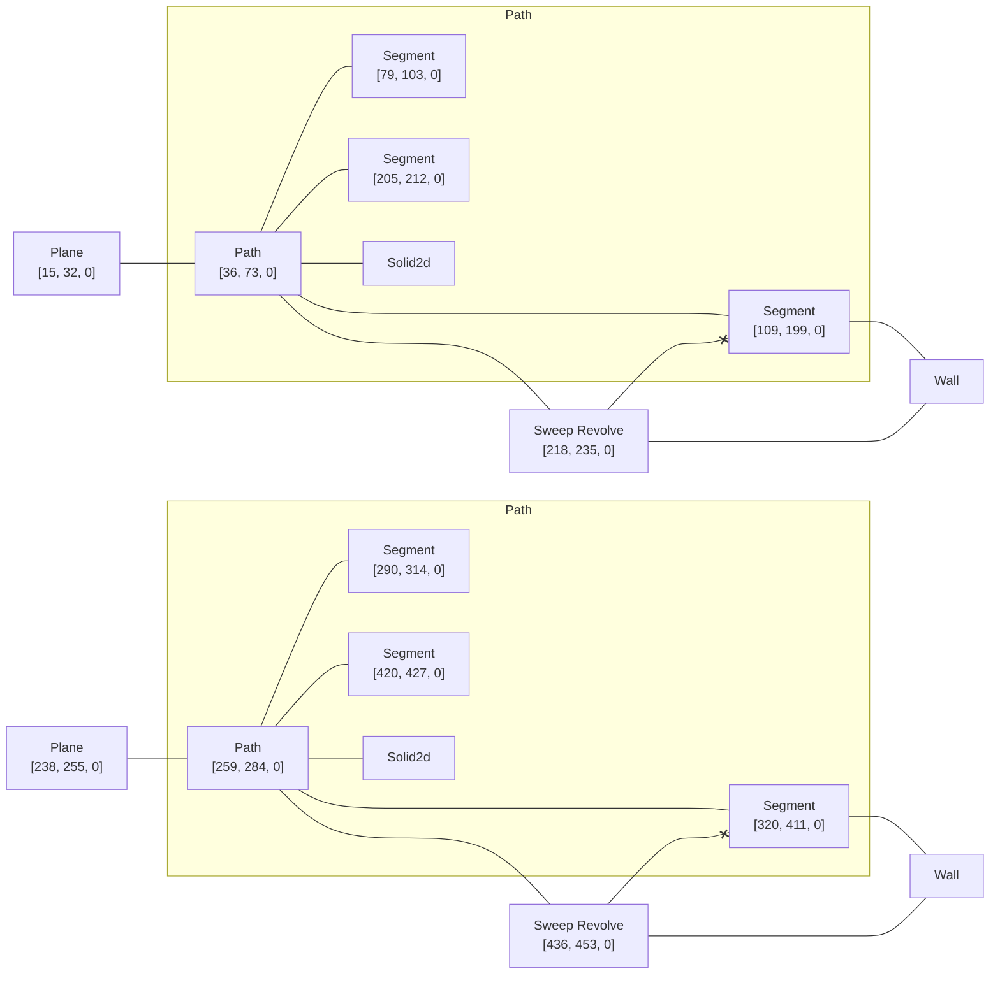

```mermaid
flowchart LR
  subgraph path3 [Path]
    3["Path<br>[36, 73, 0]"]
      %% [ProgramBodyItem { index: 1 }, ExpressionStatementExpr, PipeBodyItem { index: 1 }]
    5["Segment<br>[79, 103, 0]"]
      %% [ProgramBodyItem { index: 1 }, ExpressionStatementExpr, PipeBodyItem { index: 2 }]
    6["Segment<br>[109, 199, 0]"]
      %% [ProgramBodyItem { index: 1 }, ExpressionStatementExpr, PipeBodyItem { index: 3 }]
    7["Segment<br>[205, 212, 0]"]
      %% [ProgramBodyItem { index: 1 }, ExpressionStatementExpr, PipeBodyItem { index: 4 }]
    12[Solid2d]
  end
  subgraph path4 [Path]
    4["Path<br>[259, 284, 0]"]
      %% [ProgramBodyItem { index: 2 }, ExpressionStatementExpr, PipeBodyItem { index: 1 }]
    8["Segment<br>[290, 314, 0]"]
      %% [ProgramBodyItem { index: 2 }, ExpressionStatementExpr, PipeBodyItem { index: 2 }]
    9["Segment<br>[320, 411, 0]"]
      %% [ProgramBodyItem { index: 2 }, ExpressionStatementExpr, PipeBodyItem { index: 3 }]
    10["Segment<br>[420, 427, 0]"]
      %% [ProgramBodyItem { index: 2 }, ExpressionStatementExpr, PipeBodyItem { index: 4 }]
    11[Solid2d]
  end
  1["Plane<br>[15, 32, 0]"]
    %% [ProgramBodyItem { index: 1 }, ExpressionStatementExpr, PipeBodyItem { index: 0 }]
  2["Plane<br>[238, 255, 0]"]
    %% [ProgramBodyItem { index: 2 }, ExpressionStatementExpr, PipeBodyItem { index: 0 }]
  13["Sweep Revolve<br>[218, 235, 0]"]
    %% [ProgramBodyItem { index: 1 }, ExpressionStatementExpr, PipeBodyItem { index: 5 }]
  14["Sweep Revolve<br>[436, 453, 0]"]
    %% [ProgramBodyItem { index: 2 }, ExpressionStatementExpr, PipeBodyItem { index: 5 }]
  15[Wall]
    %% face_code_ref=Missing NodePath
  16[Wall]
    %% face_code_ref=Missing NodePath
  1 --- 3
  2 --- 4
  3 --- 5
  3 --- 6
  3 --- 7
  3 --- 12
  3 ---- 13
  4 --- 8
  4 --- 9
  4 --- 10
  4 --- 11
  4 ---- 14
  13 <--x 6
  6 --- 15
  14 <--x 9
  9 --- 16
  13 --- 15
  14 --- 16
```
