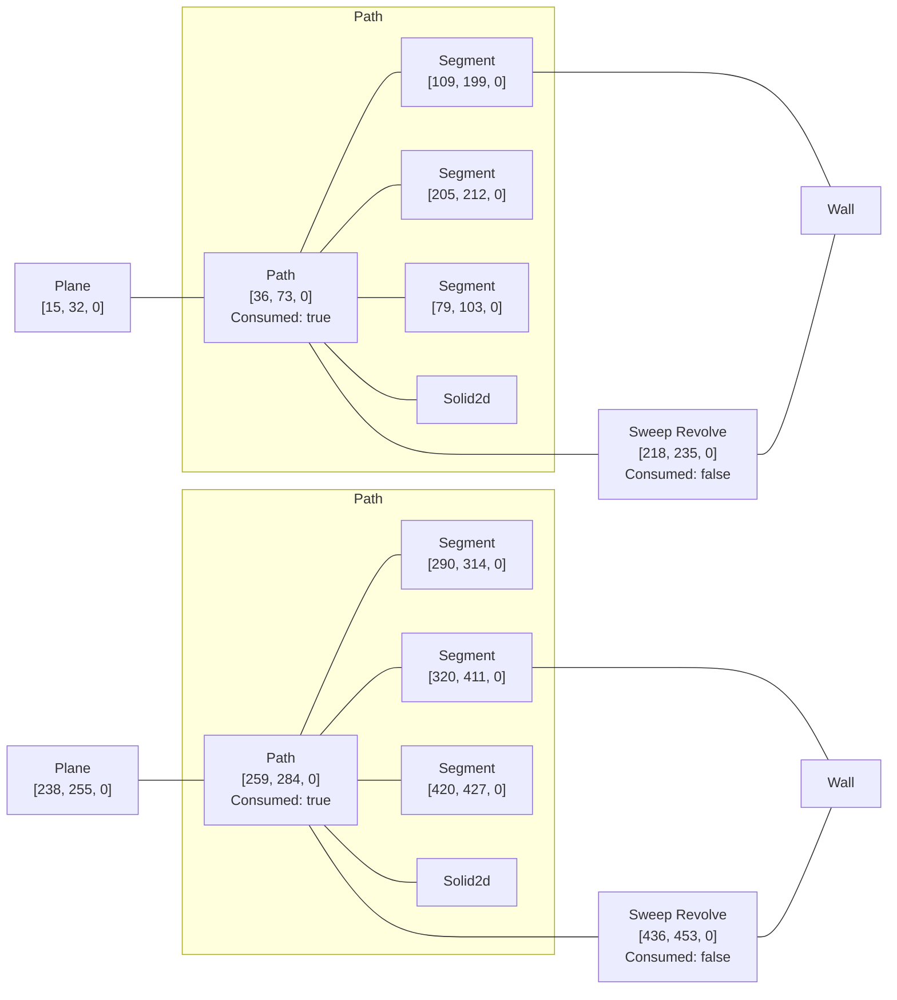

```mermaid
flowchart LR
  subgraph path1 [Path]
    1["Path<br>[259, 284, 0]<br>Consumed: true"]
      %% [ProgramBodyItem { index: 2 }, ExpressionStatementExpr, PipeBodyItem { index: 1 }]
    7["Segment<br>[290, 314, 0]"]
      %% [ProgramBodyItem { index: 2 }, ExpressionStatementExpr, PipeBodyItem { index: 2 }]
    8["Segment<br>[320, 411, 0]"]
      %% [ProgramBodyItem { index: 2 }, ExpressionStatementExpr, PipeBodyItem { index: 3 }]
    9["Segment<br>[420, 427, 0]"]
      %% [ProgramBodyItem { index: 2 }, ExpressionStatementExpr, PipeBodyItem { index: 4 }]
    11[Solid2d]
  end
  subgraph path2 [Path]
    2["Path<br>[36, 73, 0]<br>Consumed: true"]
      %% [ProgramBodyItem { index: 1 }, ExpressionStatementExpr, PipeBodyItem { index: 1 }]
    5["Segment<br>[109, 199, 0]"]
      %% [ProgramBodyItem { index: 1 }, ExpressionStatementExpr, PipeBodyItem { index: 3 }]
    6["Segment<br>[205, 212, 0]"]
      %% [ProgramBodyItem { index: 1 }, ExpressionStatementExpr, PipeBodyItem { index: 4 }]
    10["Segment<br>[79, 103, 0]"]
      %% [ProgramBodyItem { index: 1 }, ExpressionStatementExpr, PipeBodyItem { index: 2 }]
    12[Solid2d]
  end
  3["Plane<br>[15, 32, 0]"]
    %% [ProgramBodyItem { index: 1 }, ExpressionStatementExpr, PipeBodyItem { index: 0 }]
  4["Plane<br>[238, 255, 0]"]
    %% [ProgramBodyItem { index: 2 }, ExpressionStatementExpr, PipeBodyItem { index: 0 }]
  13["Sweep Revolve<br>[218, 235, 0]<br>Consumed: false"]
    %% [ProgramBodyItem { index: 1 }, ExpressionStatementExpr, PipeBodyItem { index: 5 }]
  14["Sweep Revolve<br>[436, 453, 0]<br>Consumed: false"]
    %% [ProgramBodyItem { index: 2 }, ExpressionStatementExpr, PipeBodyItem { index: 5 }]
  15[Wall]
    %% face_code_ref=Missing NodePath
  16[Wall]
    %% face_code_ref=Missing NodePath
  4 --- 1
  1 --- 7
  1 --- 8
  1 --- 9
  1 --- 11
  1 ---- 14
  3 --- 2
  2 --- 5
  2 --- 6
  2 --- 10
  2 --- 12
  2 ---- 13
  5 --- 15
  8 --- 16
  13 --- 15
  14 --- 16
```
