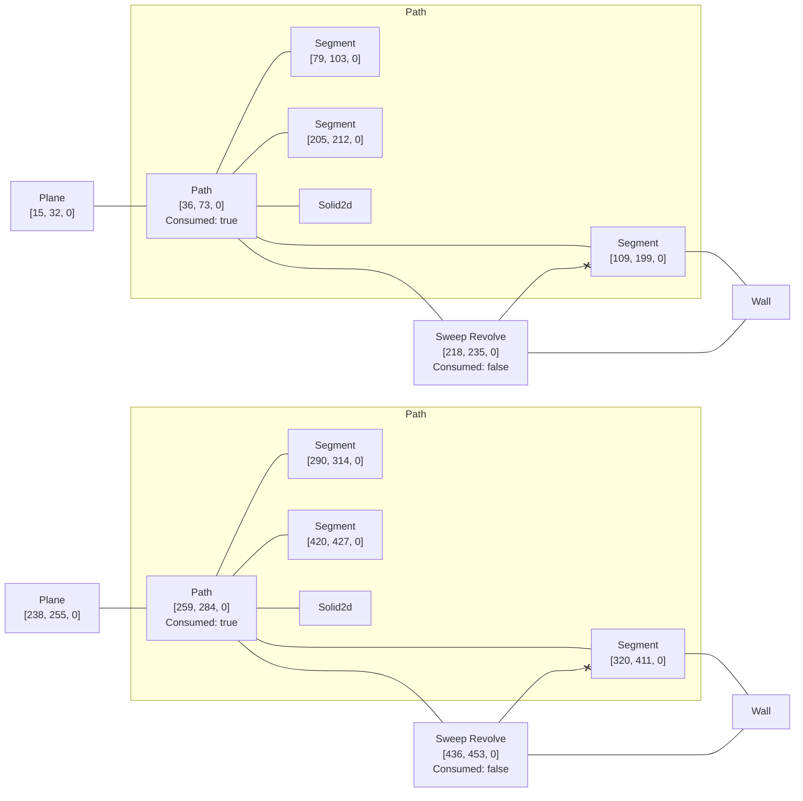

```mermaid
flowchart LR
  subgraph path4 [Path]
    4["Path<br>[36, 73, 0]<br>Consumed: true"]
      %% [ProgramBodyItem { index: 1 }, ExpressionStatementExpr, PipeBodyItem { index: 1 }]
    5["Segment<br>[79, 103, 0]"]
      %% [ProgramBodyItem { index: 1 }, ExpressionStatementExpr, PipeBodyItem { index: 2 }]
    6["Segment<br>[109, 199, 0]"]
      %% [ProgramBodyItem { index: 1 }, ExpressionStatementExpr, PipeBodyItem { index: 3 }]
    7["Segment<br>[205, 212, 0]"]
      %% [ProgramBodyItem { index: 1 }, ExpressionStatementExpr, PipeBodyItem { index: 4 }]
    16[Solid2d]
  end
  subgraph path10 [Path]
    10["Path<br>[259, 284, 0]<br>Consumed: true"]
      %% [ProgramBodyItem { index: 2 }, ExpressionStatementExpr, PipeBodyItem { index: 1 }]
    11["Segment<br>[290, 314, 0]"]
      %% [ProgramBodyItem { index: 2 }, ExpressionStatementExpr, PipeBodyItem { index: 2 }]
    12["Segment<br>[320, 411, 0]"]
      %% [ProgramBodyItem { index: 2 }, ExpressionStatementExpr, PipeBodyItem { index: 3 }]
    13["Segment<br>[420, 427, 0]"]
      %% [ProgramBodyItem { index: 2 }, ExpressionStatementExpr, PipeBodyItem { index: 4 }]
    15[Solid2d]
  end
  1[Wall]
    %% face_code_ref=Missing NodePath
  2[Wall]
    %% face_code_ref=Missing NodePath
  3["Plane<br>[15, 32, 0]"]
    %% [ProgramBodyItem { index: 1 }, ExpressionStatementExpr, PipeBodyItem { index: 0 }]
  8["Sweep Revolve<br>[218, 235, 0]<br>Consumed: false"]
    %% [ProgramBodyItem { index: 1 }, ExpressionStatementExpr, PipeBodyItem { index: 5 }]
  9["Plane<br>[238, 255, 0]"]
    %% [ProgramBodyItem { index: 2 }, ExpressionStatementExpr, PipeBodyItem { index: 0 }]
  14["Sweep Revolve<br>[436, 453, 0]<br>Consumed: false"]
    %% [ProgramBodyItem { index: 2 }, ExpressionStatementExpr, PipeBodyItem { index: 5 }]
  6 --- 1
  8 --- 1
  12 --- 2
  14 --- 2
  3 --- 4
  4 --- 5
  4 --- 6
  4 --- 7
  4 ---- 8
  4 --- 16
  8 <--x 6
  9 --- 10
  10 --- 11
  10 --- 12
  10 --- 13
  10 ---- 14
  10 --- 15
  14 <--x 12
```
