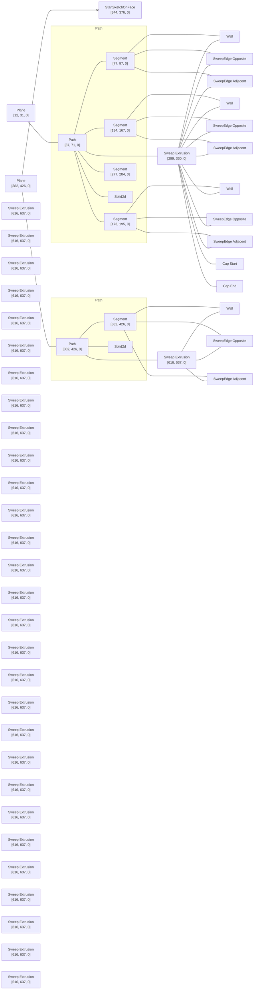

```mermaid
flowchart LR
  subgraph path2 [Path]
    2["Path<br>[37, 71, 0]"]
    3["Segment<br>[77, 97, 0]"]
    4["Segment<br>[134, 167, 0]"]
    5["Segment<br>[173, 195, 0]"]
    6["Segment<br>[277, 284, 0]"]
    7[Solid2d]
  end
  subgraph path21 [Path]
    21["Path<br>[382, 426, 0]"]
    22["Segment<br>[382, 426, 0]"]
    23[Solid2d]
  end
  1["Plane<br>[12, 31, 0]"]
  8["Sweep Extrusion<br>[299, 330, 0]"]
  9[Wall]
  10[Wall]
  11[Wall]
  12["Cap Start"]
  13["Cap End"]
  14["SweepEdge Opposite"]
  15["SweepEdge Adjacent"]
  16["SweepEdge Opposite"]
  17["SweepEdge Adjacent"]
  18["SweepEdge Opposite"]
  19["SweepEdge Adjacent"]
  20["Plane<br>[382, 426, 0]"]
  24["Sweep Extrusion<br>[616, 637, 0]"]
  25[Wall]
  26["SweepEdge Opposite"]
  27["SweepEdge Adjacent"]
  28["Sweep Extrusion<br>[616, 637, 0]"]
  29["Sweep Extrusion<br>[616, 637, 0]"]
  30["Sweep Extrusion<br>[616, 637, 0]"]
  31["Sweep Extrusion<br>[616, 637, 0]"]
  32["Sweep Extrusion<br>[616, 637, 0]"]
  33["Sweep Extrusion<br>[616, 637, 0]"]
  34["Sweep Extrusion<br>[616, 637, 0]"]
  35["Sweep Extrusion<br>[616, 637, 0]"]
  36["Sweep Extrusion<br>[616, 637, 0]"]
  37["Sweep Extrusion<br>[616, 637, 0]"]
  38["Sweep Extrusion<br>[616, 637, 0]"]
  39["Sweep Extrusion<br>[616, 637, 0]"]
  40["Sweep Extrusion<br>[616, 637, 0]"]
  41["Sweep Extrusion<br>[616, 637, 0]"]
  42["Sweep Extrusion<br>[616, 637, 0]"]
  43["Sweep Extrusion<br>[616, 637, 0]"]
  44["Sweep Extrusion<br>[616, 637, 0]"]
  45["Sweep Extrusion<br>[616, 637, 0]"]
  46["Sweep Extrusion<br>[616, 637, 0]"]
  47["Sweep Extrusion<br>[616, 637, 0]"]
  48["Sweep Extrusion<br>[616, 637, 0]"]
  49["Sweep Extrusion<br>[616, 637, 0]"]
  50["Sweep Extrusion<br>[616, 637, 0]"]
  51["Sweep Extrusion<br>[616, 637, 0]"]
  52["Sweep Extrusion<br>[616, 637, 0]"]
  53["Sweep Extrusion<br>[616, 637, 0]"]
  54["Sweep Extrusion<br>[616, 637, 0]"]
  55["Sweep Extrusion<br>[616, 637, 0]"]
  56["Sweep Extrusion<br>[616, 637, 0]"]
  57["StartSketchOnFace<br>[344, 376, 0]"]
  1 --- 2
  2 --- 3
  2 --- 4
  2 --- 5
  2 --- 6
  2 ---- 8
  2 --- 7
  3 --- 11
  3 --- 18
  3 --- 19
  4 --- 10
  4 --- 16
  4 --- 17
  5 --- 9
  5 --- 14
  5 --- 15
  8 --- 9
  8 --- 10
  8 --- 11
  8 --- 12
  8 --- 13
  8 --- 14
  8 --- 15
  8 --- 16
  8 --- 17
  8 --- 18
  8 --- 19
  20 --- 21
  21 --- 22
  21 ---- 24
  21 --- 23
  22 --- 25
  22 --- 26
  22 --- 27
  24 --- 25
  24 --- 26
  24 --- 27
  20 <--x 57
```
