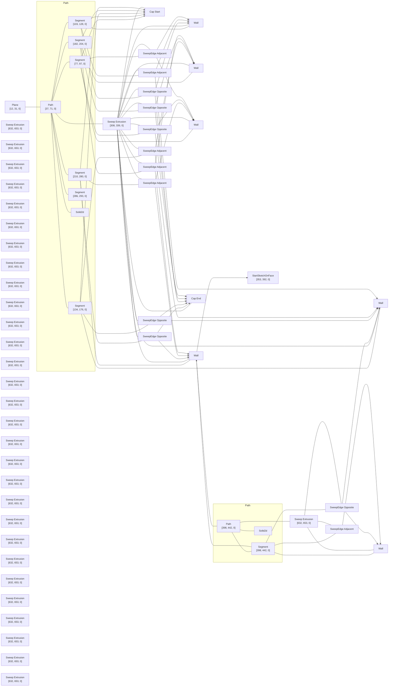

```mermaid
flowchart LR
  subgraph path3 [Path]
    3["Path<br>[37, 71, 0]"]
    5["Segment<br>[77, 97, 0]"]
    6["Segment<br>[103, 128, 0]"]
    7["Segment<br>[134, 176, 0]"]
    8["Segment<br>[182, 204, 0]"]
    9["Segment<br>[210, 280, 0]"]
    10["Segment<br>[286, 293, 0]"]
    12[Solid2d]
  end
  subgraph path4 [Path]
    4["Path<br>[398, 442, 0]"]
    11["Segment<br>[398, 442, 0]"]
    13[Solid2d]
  end
  1["Plane<br>[12, 31, 0]"]
  2["StartSketchOnFace<br>[353, 392, 0]"]
  14["Sweep Extrusion<br>[308, 339, 0]"]
  15["Sweep Extrusion<br>[632, 653, 0]"]
  16["Sweep Extrusion<br>[632, 653, 0]"]
  17["Sweep Extrusion<br>[632, 653, 0]"]
  18["Sweep Extrusion<br>[632, 653, 0]"]
  19["Sweep Extrusion<br>[632, 653, 0]"]
  20["Sweep Extrusion<br>[632, 653, 0]"]
  21["Sweep Extrusion<br>[632, 653, 0]"]
  22["Sweep Extrusion<br>[632, 653, 0]"]
  23["Sweep Extrusion<br>[632, 653, 0]"]
  24["Sweep Extrusion<br>[632, 653, 0]"]
  25["Sweep Extrusion<br>[632, 653, 0]"]
  26["Sweep Extrusion<br>[632, 653, 0]"]
  27["Sweep Extrusion<br>[632, 653, 0]"]
  28["Sweep Extrusion<br>[632, 653, 0]"]
  29["Sweep Extrusion<br>[632, 653, 0]"]
  30["Sweep Extrusion<br>[632, 653, 0]"]
  31["Sweep Extrusion<br>[632, 653, 0]"]
  32["Sweep Extrusion<br>[632, 653, 0]"]
  33["Sweep Extrusion<br>[632, 653, 0]"]
  34["Sweep Extrusion<br>[632, 653, 0]"]
  35["Sweep Extrusion<br>[632, 653, 0]"]
  36["Sweep Extrusion<br>[632, 653, 0]"]
  37["Sweep Extrusion<br>[632, 653, 0]"]
  38["Sweep Extrusion<br>[632, 653, 0]"]
  39["Sweep Extrusion<br>[632, 653, 0]"]
  40["Sweep Extrusion<br>[632, 653, 0]"]
  41["Sweep Extrusion<br>[632, 653, 0]"]
  42["Sweep Extrusion<br>[632, 653, 0]"]
  43["Sweep Extrusion<br>[632, 653, 0]"]
  44["Sweep Extrusion<br>[632, 653, 0]"]
  45[Wall]
  46[Wall]
  47[Wall]
  48[Wall]
  49[Wall]
  50[Wall]
  51["Cap Start"]
  52["Cap End"]
  53["SweepEdge Opposite"]
  54["SweepEdge Adjacent"]
  55["SweepEdge Opposite"]
  56["SweepEdge Adjacent"]
  57["SweepEdge Opposite"]
  58["SweepEdge Adjacent"]
  59["SweepEdge Opposite"]
  60["SweepEdge Adjacent"]
  61["SweepEdge Opposite"]
  62["SweepEdge Adjacent"]
  63["SweepEdge Opposite"]
  64["SweepEdge Adjacent"]
  1 --- 3
  50 x--> 2
  3 --- 5
  3 --- 6
  3 --- 7
  3 --- 8
  3 --- 9
  3 --- 10
  3 --- 12
  3 ---- 14
  4 --- 11
  4 --- 13
  4 ---- 25
  50 --- 4
  5 --- 49
  5 x--> 51
  5 --- 63
  5 --- 64
  6 --- 47
  6 x--> 51
  6 --- 59
  6 --- 60
  7 --- 46
  7 x--> 51
  7 --- 57
  7 --- 58
  8 --- 48
  8 x--> 51
  8 --- 61
  8 --- 62
  9 --- 50
  9 x--> 51
  9 --- 55
  9 --- 56
  11 --- 45
  11 x--> 50
  11 --- 53
  11 --- 54
  14 --- 46
  14 --- 47
  14 --- 48
  14 --- 49
  14 --- 50
  14 --- 51
  14 --- 52
  14 --- 55
  14 --- 56
  14 --- 57
  14 --- 58
  14 --- 59
  14 --- 60
  14 --- 61
  14 --- 62
  14 --- 63
  14 --- 64
  25 --- 45
  25 --- 53
  25 --- 54
  53 <--x 45
  54 <--x 45
  53 <--x 46
  57 <--x 46
  58 <--x 46
  60 <--x 46
  59 <--x 47
  60 <--x 47
  64 <--x 47
  58 <--x 48
  61 <--x 48
  62 <--x 48
  56 <--x 49
  63 <--x 49
  64 <--x 49
  55 <--x 50
  56 <--x 50
  62 <--x 50
  55 <--x 52
  57 <--x 52
  59 <--x 52
  61 <--x 52
  63 <--x 52
```
