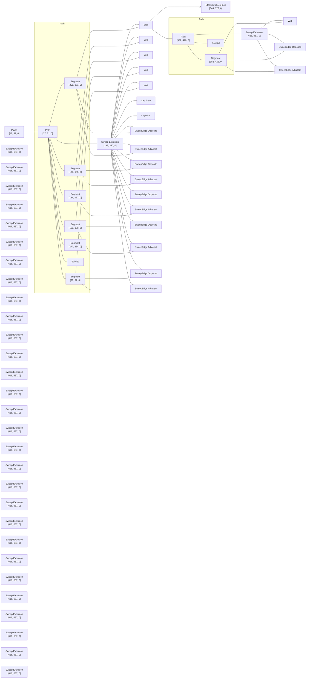

```mermaid
flowchart LR
  subgraph path2 [Path]
    2["Path<br>[37, 71, 0]"]
    3["Segment<br>[77, 97, 0]"]
    4["Segment<br>[103, 128, 0]"]
    5["Segment<br>[134, 167, 0]"]
    6["Segment<br>[173, 195, 0]"]
    7["Segment<br>[201, 271, 0]"]
    8["Segment<br>[277, 284, 0]"]
    9[Solid2d]
  end
  subgraph path28 [Path]
    28["Path<br>[382, 426, 0]"]
    29["Segment<br>[382, 426, 0]"]
    30[Solid2d]
  end
  1["Plane<br>[12, 31, 0]"]
  10["Sweep Extrusion<br>[299, 330, 0]"]
  11[Wall]
  12[Wall]
  13[Wall]
  14[Wall]
  15[Wall]
  16["Cap Start"]
  17["Cap End"]
  18["SweepEdge Opposite"]
  19["SweepEdge Adjacent"]
  20["SweepEdge Opposite"]
  21["SweepEdge Adjacent"]
  22["SweepEdge Opposite"]
  23["SweepEdge Adjacent"]
  24["SweepEdge Opposite"]
  25["SweepEdge Adjacent"]
  26["SweepEdge Opposite"]
  27["SweepEdge Adjacent"]
  31["Sweep Extrusion<br>[616, 637, 0]"]
  32[Wall]
  33["SweepEdge Opposite"]
  34["SweepEdge Adjacent"]
  35["Sweep Extrusion<br>[616, 637, 0]"]
  36["Sweep Extrusion<br>[616, 637, 0]"]
  37["Sweep Extrusion<br>[616, 637, 0]"]
  38["Sweep Extrusion<br>[616, 637, 0]"]
  39["Sweep Extrusion<br>[616, 637, 0]"]
  40["Sweep Extrusion<br>[616, 637, 0]"]
  41["Sweep Extrusion<br>[616, 637, 0]"]
  42["Sweep Extrusion<br>[616, 637, 0]"]
  43["Sweep Extrusion<br>[616, 637, 0]"]
  44["Sweep Extrusion<br>[616, 637, 0]"]
  45["Sweep Extrusion<br>[616, 637, 0]"]
  46["Sweep Extrusion<br>[616, 637, 0]"]
  47["Sweep Extrusion<br>[616, 637, 0]"]
  48["Sweep Extrusion<br>[616, 637, 0]"]
  49["Sweep Extrusion<br>[616, 637, 0]"]
  50["Sweep Extrusion<br>[616, 637, 0]"]
  51["Sweep Extrusion<br>[616, 637, 0]"]
  52["Sweep Extrusion<br>[616, 637, 0]"]
  53["Sweep Extrusion<br>[616, 637, 0]"]
  54["Sweep Extrusion<br>[616, 637, 0]"]
  55["Sweep Extrusion<br>[616, 637, 0]"]
  56["Sweep Extrusion<br>[616, 637, 0]"]
  57["Sweep Extrusion<br>[616, 637, 0]"]
  58["Sweep Extrusion<br>[616, 637, 0]"]
  59["Sweep Extrusion<br>[616, 637, 0]"]
  60["Sweep Extrusion<br>[616, 637, 0]"]
  61["Sweep Extrusion<br>[616, 637, 0]"]
  62["Sweep Extrusion<br>[616, 637, 0]"]
  63["Sweep Extrusion<br>[616, 637, 0]"]
  64["StartSketchOnFace<br>[344, 376, 0]"]
  1 --- 2
  2 --- 3
  2 --- 4
  2 --- 5
  2 --- 6
  2 --- 7
  2 --- 8
  2 ---- 10
  2 --- 9
  3 --- 15
  3 --- 26
  3 --- 27
  4 --- 14
  4 --- 24
  4 --- 25
  5 --- 13
  5 --- 22
  5 --- 23
  6 --- 12
  6 --- 20
  6 --- 21
  7 --- 11
  7 --- 18
  7 --- 19
  10 --- 11
  10 --- 12
  10 --- 13
  10 --- 14
  10 --- 15
  10 --- 16
  10 --- 17
  10 --- 18
  10 --- 19
  10 --- 20
  10 --- 21
  10 --- 22
  10 --- 23
  10 --- 24
  10 --- 25
  10 --- 26
  10 --- 27
  11 --- 28
  28 --- 29
  28 ---- 31
  28 --- 30
  29 --- 32
  29 --- 33
  29 --- 34
  31 --- 32
  31 --- 33
  31 --- 34
  11 <--x 64
```
