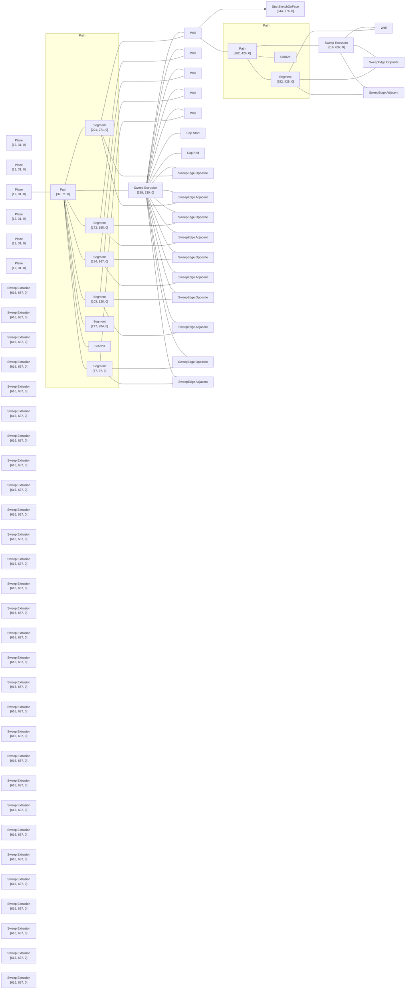

```mermaid
flowchart LR
  subgraph path7 [Path]
    7["Path<br>[37, 71, 0]"]
    8["Segment<br>[77, 97, 0]"]
    9["Segment<br>[103, 128, 0]"]
    10["Segment<br>[134, 167, 0]"]
    11["Segment<br>[173, 195, 0]"]
    12["Segment<br>[201, 271, 0]"]
    13["Segment<br>[277, 284, 0]"]
    14[Solid2d]
  end
  subgraph path33 [Path]
    33["Path<br>[382, 426, 0]"]
    34["Segment<br>[382, 426, 0]"]
    35[Solid2d]
  end
  1["Plane<br>[12, 31, 0]"]
  2["Plane<br>[12, 31, 0]"]
  3["Plane<br>[12, 31, 0]"]
  4["Plane<br>[12, 31, 0]"]
  5["Plane<br>[12, 31, 0]"]
  6["Plane<br>[12, 31, 0]"]
  15["Sweep Extrusion<br>[299, 330, 0]"]
  16[Wall]
  17[Wall]
  18[Wall]
  19[Wall]
  20[Wall]
  21["Cap Start"]
  22["Cap End"]
  23["SweepEdge Opposite"]
  24["SweepEdge Adjacent"]
  25["SweepEdge Opposite"]
  26["SweepEdge Adjacent"]
  27["SweepEdge Opposite"]
  28["SweepEdge Adjacent"]
  29["SweepEdge Opposite"]
  30["SweepEdge Adjacent"]
  31["SweepEdge Opposite"]
  32["SweepEdge Adjacent"]
  36["Sweep Extrusion<br>[616, 637, 0]"]
  37[Wall]
  38["SweepEdge Opposite"]
  39["SweepEdge Adjacent"]
  40["Sweep Extrusion<br>[616, 637, 0]"]
  41["Sweep Extrusion<br>[616, 637, 0]"]
  42["Sweep Extrusion<br>[616, 637, 0]"]
  43["Sweep Extrusion<br>[616, 637, 0]"]
  44["Sweep Extrusion<br>[616, 637, 0]"]
  45["Sweep Extrusion<br>[616, 637, 0]"]
  46["Sweep Extrusion<br>[616, 637, 0]"]
  47["Sweep Extrusion<br>[616, 637, 0]"]
  48["Sweep Extrusion<br>[616, 637, 0]"]
  49["Sweep Extrusion<br>[616, 637, 0]"]
  50["Sweep Extrusion<br>[616, 637, 0]"]
  51["Sweep Extrusion<br>[616, 637, 0]"]
  52["Sweep Extrusion<br>[616, 637, 0]"]
  53["Sweep Extrusion<br>[616, 637, 0]"]
  54["Sweep Extrusion<br>[616, 637, 0]"]
  55["Sweep Extrusion<br>[616, 637, 0]"]
  56["Sweep Extrusion<br>[616, 637, 0]"]
  57["Sweep Extrusion<br>[616, 637, 0]"]
  58["Sweep Extrusion<br>[616, 637, 0]"]
  59["Sweep Extrusion<br>[616, 637, 0]"]
  60["Sweep Extrusion<br>[616, 637, 0]"]
  61["Sweep Extrusion<br>[616, 637, 0]"]
  62["Sweep Extrusion<br>[616, 637, 0]"]
  63["Sweep Extrusion<br>[616, 637, 0]"]
  64["Sweep Extrusion<br>[616, 637, 0]"]
  65["Sweep Extrusion<br>[616, 637, 0]"]
  66["Sweep Extrusion<br>[616, 637, 0]"]
  67["Sweep Extrusion<br>[616, 637, 0]"]
  68["Sweep Extrusion<br>[616, 637, 0]"]
  69["StartSketchOnFace<br>[344, 376, 0]"]
  3 --- 7
  7 --- 8
  7 --- 9
  7 --- 10
  7 --- 11
  7 --- 12
  7 --- 13
  7 ---- 15
  7 --- 14
  8 --- 20
  8 --- 31
  8 --- 32
  9 --- 19
  9 --- 29
  9 --- 30
  10 --- 18
  10 --- 27
  10 --- 28
  11 --- 17
  11 --- 25
  11 --- 26
  12 --- 16
  12 --- 23
  12 --- 24
  15 --- 16
  15 --- 17
  15 --- 18
  15 --- 19
  15 --- 20
  15 --- 21
  15 --- 22
  15 --- 23
  15 --- 24
  15 --- 25
  15 --- 26
  15 --- 27
  15 --- 28
  15 --- 29
  15 --- 30
  15 --- 31
  15 --- 32
  16 --- 33
  33 --- 34
  33 ---- 36
  33 --- 35
  34 --- 37
  34 --- 38
  34 --- 39
  36 --- 37
  36 --- 38
  36 --- 39
  16 <--x 69
```
