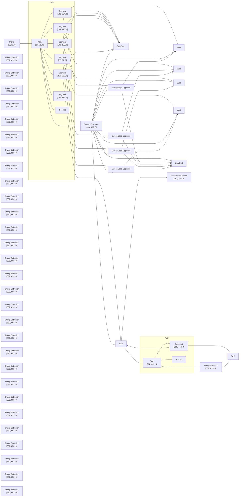

```mermaid
flowchart LR
  subgraph path2 [Path]
    2["Path<br>[37, 71, 0]"]
    3["Segment<br>[77, 97, 0]"]
    4["Segment<br>[103, 128, 0]"]
    5["Segment<br>[134, 176, 0]"]
    6["Segment<br>[182, 204, 0]"]
    7["Segment<br>[210, 280, 0]"]
    8["Segment<br>[286, 293, 0]"]
    9[Solid2d]
  end
  subgraph path22 [Path]
    22["Path<br>[398, 442, 0]"]
    23["Segment<br>[398, 442, 0]"]
    24[Solid2d]
  end
  1["Plane<br>[12, 31, 0]"]
  10["Sweep Extrusion<br>[308, 339, 0]"]
  11[Wall]
  12[Wall]
  13[Wall]
  14[Wall]
  15[Wall]
  16["Cap Start"]
  17["Cap End"]
  18["SweepEdge Opposite"]
  19["SweepEdge Opposite"]
  20["SweepEdge Opposite"]
  21["SweepEdge Opposite"]
  25["Sweep Extrusion<br>[632, 653, 0]"]
  26[Wall]
  27["Sweep Extrusion<br>[632, 653, 0]"]
  28["Sweep Extrusion<br>[632, 653, 0]"]
  29["Sweep Extrusion<br>[632, 653, 0]"]
  30["Sweep Extrusion<br>[632, 653, 0]"]
  31["Sweep Extrusion<br>[632, 653, 0]"]
  32["Sweep Extrusion<br>[632, 653, 0]"]
  33["Sweep Extrusion<br>[632, 653, 0]"]
  34["Sweep Extrusion<br>[632, 653, 0]"]
  35["Sweep Extrusion<br>[632, 653, 0]"]
  36["Sweep Extrusion<br>[632, 653, 0]"]
  37["Sweep Extrusion<br>[632, 653, 0]"]
  38["Sweep Extrusion<br>[632, 653, 0]"]
  39["Sweep Extrusion<br>[632, 653, 0]"]
  40["Sweep Extrusion<br>[632, 653, 0]"]
  41["Sweep Extrusion<br>[632, 653, 0]"]
  42["Sweep Extrusion<br>[632, 653, 0]"]
  43["Sweep Extrusion<br>[632, 653, 0]"]
  44["Sweep Extrusion<br>[632, 653, 0]"]
  45["Sweep Extrusion<br>[632, 653, 0]"]
  46["Sweep Extrusion<br>[632, 653, 0]"]
  47["Sweep Extrusion<br>[632, 653, 0]"]
  48["Sweep Extrusion<br>[632, 653, 0]"]
  49["Sweep Extrusion<br>[632, 653, 0]"]
  50["Sweep Extrusion<br>[632, 653, 0]"]
  51["Sweep Extrusion<br>[632, 653, 0]"]
  52["Sweep Extrusion<br>[632, 653, 0]"]
  53["Sweep Extrusion<br>[632, 653, 0]"]
  54["Sweep Extrusion<br>[632, 653, 0]"]
  55["Sweep Extrusion<br>[632, 653, 0]"]
  56["StartSketchOnFace<br>[353, 392, 0]"]
  1 --- 2
  2 --- 3
  2 --- 4
  2 --- 5
  2 --- 6
  2 --- 7
  2 --- 8
  2 ---- 10
  2 --- 9
  3 --- 15
  3 --- 21
  3 x--> 16
  4 --- 14
  4 --- 20
  4 x--> 16
  5 --- 13
  5 --- 19
  5 x--> 16
  6 --- 12
  6 --- 18
  6 x--> 16
  7 --- 11
  7 x--> 16
  10 --- 11
  10 --- 12
  10 --- 13
  10 --- 14
  10 --- 15
  10 --- 16
  10 --- 17
  10 --- 18
  10 --- 19
  10 --- 20
  10 --- 21
  11 --- 22
  18 <--x 12
  18 <--x 17
  19 <--x 13
  19 <--x 17
  20 <--x 14
  20 <--x 17
  21 <--x 15
  21 <--x 17
  22 --- 23
  22 ---- 25
  22 --- 24
  23 --- 26
  23 <--x 11
  25 --- 26
  11 <--x 56
```
