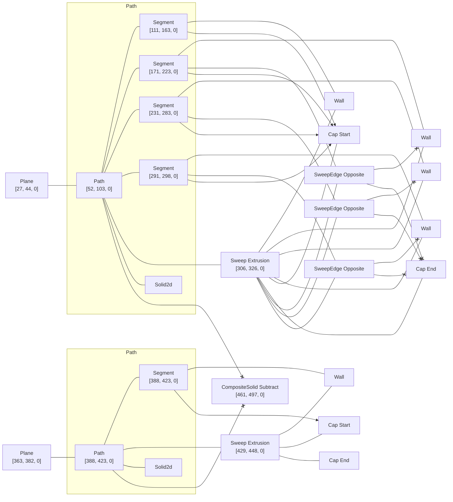

```mermaid
flowchart LR
  subgraph path2 [Path]
    2["Path<br>[52, 103, 0]"]
    3["Segment<br>[111, 163, 0]"]
    4["Segment<br>[171, 223, 0]"]
    5["Segment<br>[231, 283, 0]"]
    6["Segment<br>[291, 298, 0]"]
    7[Solid2d]
  end
  subgraph path19 [Path]
    19["Path<br>[388, 423, 0]"]
    20["Segment<br>[388, 423, 0]"]
    21[Solid2d]
  end
  1["Plane<br>[27, 44, 0]"]
  8["Sweep Extrusion<br>[306, 326, 0]"]
  9[Wall]
  10[Wall]
  11[Wall]
  12[Wall]
  13["Cap Start"]
  14["Cap End"]
  15["SweepEdge Opposite"]
  16["SweepEdge Opposite"]
  17["SweepEdge Opposite"]
  18["Plane<br>[363, 382, 0]"]
  22["Sweep Extrusion<br>[429, 448, 0]"]
  23[Wall]
  24["Cap Start"]
  25["Cap End"]
  26["CompositeSolid Subtract<br>[461, 497, 0]"]
  1 --- 2
  2 --- 3
  2 --- 4
  2 --- 5
  2 --- 6
  2 ---- 8
  2 --- 7
  3 --- 9
  3 x--> 13
  4 --- 10
  4 --- 15
  4 x--> 13
  5 --- 11
  5 --- 16
  5 x--> 13
  6 --- 12
  6 --- 17
  6 x--> 13
  8 --- 9
  8 --- 10
  8 --- 11
  8 --- 12
  8 --- 13
  8 --- 14
  8 --- 15
  8 --- 16
  8 --- 17
  15 <--x 10
  15 <--x 14
  16 <--x 11
  16 <--x 14
  17 <--x 12
  17 <--x 14
  18 --- 19
  19 --- 20
  19 ---- 22
  19 --- 21
  20 --- 23
  20 x--> 24
  22 --- 23
  22 --- 24
  22 --- 25
  2 <--x 26
  19 <--x 26
```
