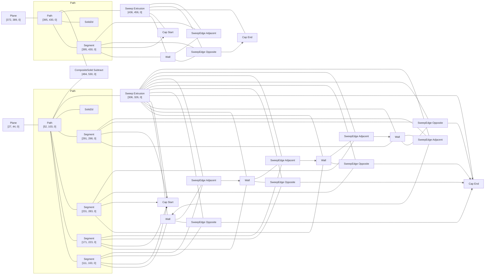

```mermaid
flowchart LR
  subgraph path3 [Path]
    3["Path<br>[52, 103, 0]"]
      %% [ProgramBodyItem { index: 0 }, VariableDeclarationDeclaration, VariableDeclarationInit, FunctionExpressionBody, FunctionExpressionBodyItem { index: 0 }, ReturnStatementArg, PipeBodyItem { index: 1 }]
    5["Segment<br>[111, 163, 0]"]
      %% [ProgramBodyItem { index: 0 }, VariableDeclarationDeclaration, VariableDeclarationInit, FunctionExpressionBody, FunctionExpressionBodyItem { index: 0 }, ReturnStatementArg, PipeBodyItem { index: 2 }]
    6["Segment<br>[171, 223, 0]"]
      %% [ProgramBodyItem { index: 0 }, VariableDeclarationDeclaration, VariableDeclarationInit, FunctionExpressionBody, FunctionExpressionBodyItem { index: 0 }, ReturnStatementArg, PipeBodyItem { index: 3 }]
    7["Segment<br>[231, 283, 0]"]
      %% [ProgramBodyItem { index: 0 }, VariableDeclarationDeclaration, VariableDeclarationInit, FunctionExpressionBody, FunctionExpressionBodyItem { index: 0 }, ReturnStatementArg, PipeBodyItem { index: 4 }]
    8["Segment<br>[291, 298, 0]"]
      %% [ProgramBodyItem { index: 0 }, VariableDeclarationDeclaration, VariableDeclarationInit, FunctionExpressionBody, FunctionExpressionBodyItem { index: 0 }, ReturnStatementArg, PipeBodyItem { index: 5 }]
    10[Solid2d]
  end
  subgraph path4 [Path]
    4["Path<br>[395, 430, 0]"]
      %% [ProgramBodyItem { index: 2 }, VariableDeclarationDeclaration, VariableDeclarationInit, PipeBodyItem { index: 1 }]
    9["Segment<br>[395, 430, 0]"]
      %% [ProgramBodyItem { index: 2 }, VariableDeclarationDeclaration, VariableDeclarationInit, PipeBodyItem { index: 1 }]
    11[Solid2d]
  end
  1["Plane<br>[27, 44, 0]"]
    %% [ProgramBodyItem { index: 0 }, VariableDeclarationDeclaration, VariableDeclarationInit, FunctionExpressionBody, FunctionExpressionBodyItem { index: 0 }, ReturnStatementArg, PipeBodyItem { index: 0 }]
  2["Plane<br>[372, 389, 0]"]
    %% [ProgramBodyItem { index: 2 }, VariableDeclarationDeclaration, VariableDeclarationInit, PipeBodyItem { index: 0 }]
  12["Sweep Extrusion<br>[306, 326, 0]"]
    %% [ProgramBodyItem { index: 0 }, VariableDeclarationDeclaration, VariableDeclarationInit, FunctionExpressionBody, FunctionExpressionBodyItem { index: 0 }, ReturnStatementArg, PipeBodyItem { index: 6 }]
  13["Sweep Extrusion<br>[436, 456, 0]"]
    %% [ProgramBodyItem { index: 2 }, VariableDeclarationDeclaration, VariableDeclarationInit, PipeBodyItem { index: 2 }]
  14["CompositeSolid Subtract<br>[494, 530, 0]"]
    %% [ProgramBodyItem { index: 3 }, VariableDeclarationDeclaration, VariableDeclarationInit]
  15[Wall]
  16[Wall]
  17[Wall]
  18[Wall]
  19[Wall]
  20["Cap Start"]
  21["Cap Start"]
  22["Cap End"]
  23["Cap End"]
  24["SweepEdge Opposite"]
  25["SweepEdge Opposite"]
  26["SweepEdge Opposite"]
  27["SweepEdge Opposite"]
  28["SweepEdge Opposite"]
  29["SweepEdge Adjacent"]
  30["SweepEdge Adjacent"]
  31["SweepEdge Adjacent"]
  32["SweepEdge Adjacent"]
  33["SweepEdge Adjacent"]
  1 --- 3
  2 --- 4
  3 --- 5
  3 --- 6
  3 --- 7
  3 --- 8
  3 --- 10
  3 ---- 12
  3 --- 14
  4 --- 9
  4 --- 11
  4 ---- 13
  4 --- 14
  5 --- 19
  5 x--> 21
  5 --- 25
  5 --- 30
  6 --- 17
  6 x--> 21
  6 --- 26
  6 --- 31
  7 --- 16
  7 x--> 21
  7 --- 27
  7 --- 32
  8 --- 18
  8 x--> 21
  8 --- 28
  8 --- 33
  9 --- 15
  9 x--> 20
  9 --- 24
  9 --- 29
  12 --- 16
  12 --- 17
  12 --- 18
  12 --- 19
  12 --- 21
  12 --- 23
  12 --- 25
  12 --- 26
  12 --- 27
  12 --- 28
  12 --- 30
  12 --- 31
  12 --- 32
  12 --- 33
  13 --- 15
  13 --- 20
  13 --- 22
  13 --- 24
  13 --- 29
  15 --- 24
  15 --- 29
  16 --- 27
  31 <--x 16
  16 --- 32
  17 --- 26
  30 <--x 17
  17 --- 31
  18 --- 28
  32 <--x 18
  18 --- 33
  19 --- 25
  19 --- 30
  33 <--x 19
  24 <--x 22
  25 <--x 23
  26 <--x 23
  27 <--x 23
  28 <--x 23
```
