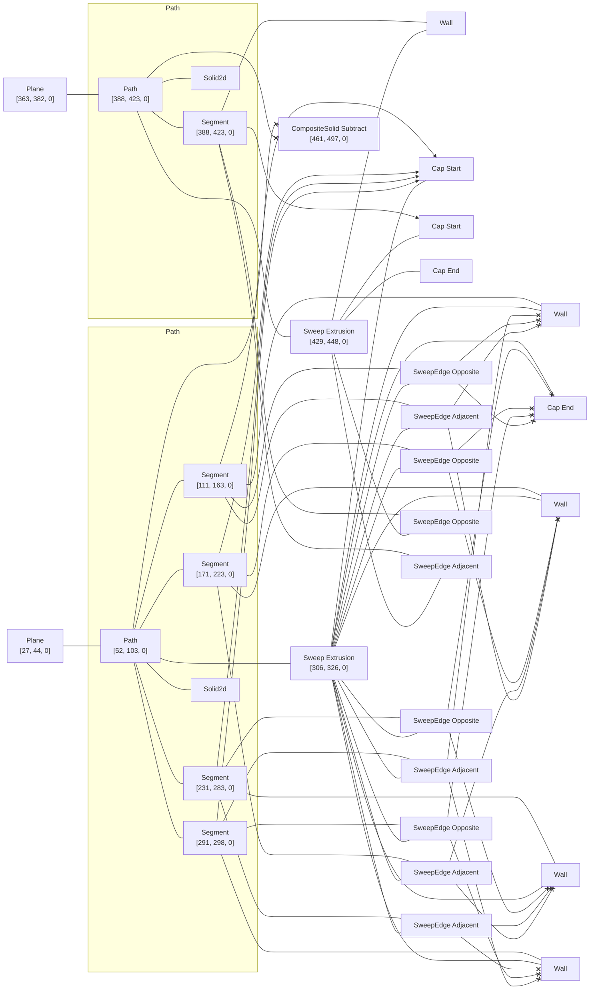

```mermaid
flowchart LR
  subgraph path3 [Path]
    3["Path<br>[52, 103, 0]"]
    5["Segment<br>[111, 163, 0]"]
    6["Segment<br>[171, 223, 0]"]
    7["Segment<br>[231, 283, 0]"]
    8["Segment<br>[291, 298, 0]"]
    11[Solid2d]
  end
  subgraph path4 [Path]
    4["Path<br>[388, 423, 0]"]
    9["Segment<br>[388, 423, 0]"]
    10[Solid2d]
  end
  1["Plane<br>[27, 44, 0]"]
  2["Plane<br>[363, 382, 0]"]
  12["Sweep Extrusion<br>[306, 326, 0]"]
  13["Sweep Extrusion<br>[429, 448, 0]"]
  14["CompositeSolid Subtract<br>[461, 497, 0]"]
  15[Wall]
  16[Wall]
  17[Wall]
  18[Wall]
  19[Wall]
  20["Cap Start"]
  21["Cap End"]
  22["Cap Start"]
  23["Cap End"]
  24["SweepEdge Opposite"]
  25["SweepEdge Adjacent"]
  26["SweepEdge Opposite"]
  27["SweepEdge Adjacent"]
  28["SweepEdge Opposite"]
  29["SweepEdge Adjacent"]
  30["SweepEdge Opposite"]
  31["SweepEdge Adjacent"]
  32["SweepEdge Opposite"]
  33["SweepEdge Adjacent"]
  1 --- 3
  2 --- 4
  3 --- 5
  3 --- 6
  3 --- 7
  3 --- 8
  3 --- 11
  3 ---- 12
  3 <--x 14
  4 --- 9
  4 --- 10
  4 ---- 13
  4 <--x 14
  5 --- 18
  5 x--> 20
  5 --- 30
  5 --- 31
  6 --- 16
  6 x--> 20
  6 --- 26
  6 --- 27
  7 --- 15
  7 x--> 20
  7 --- 24
  7 --- 25
  8 --- 17
  8 x--> 20
  8 --- 28
  8 --- 29
  9 --- 19
  9 x--> 22
  9 --- 32
  9 --- 33
  12 --- 15
  12 --- 16
  12 --- 17
  12 --- 18
  12 --- 20
  12 --- 21
  12 --- 24
  12 --- 25
  12 --- 26
  12 --- 27
  12 --- 28
  12 --- 29
  12 --- 30
  12 --- 31
  13 --- 19
  13 --- 22
  13 --- 23
  13 --- 32
  13 --- 33
  24 <--x 15
  25 <--x 15
  27 <--x 15
  26 <--x 16
  27 <--x 16
  31 <--x 16
  25 <--x 17
  28 <--x 17
  29 <--x 17
  29 <--x 18
  30 <--x 18
  31 <--x 18
  24 <--x 21
  26 <--x 21
  28 <--x 21
  30 <--x 21
```
