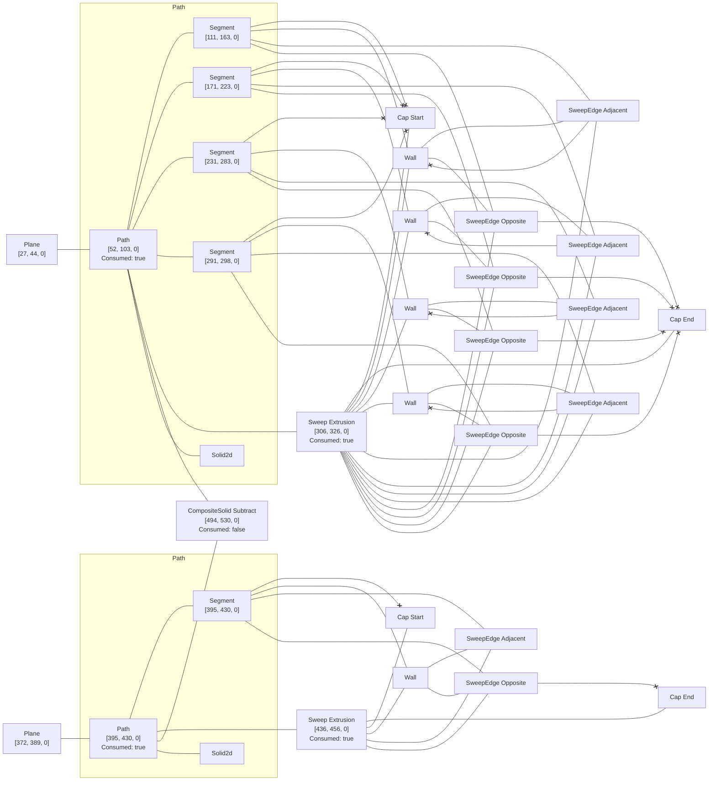

```mermaid
flowchart LR
  subgraph path11 [Path]
    11["Path<br>[52, 103, 0]<br>Consumed: true"]
      %% [ProgramBodyItem { index: 0 }, VariableDeclarationDeclaration, VariableDeclarationInit, FunctionExpressionBody, FunctionExpressionBodyItem { index: 0 }, ReturnStatementArg, PipeBodyItem { index: 1 }]
    12["Segment<br>[111, 163, 0]"]
      %% [ProgramBodyItem { index: 0 }, VariableDeclarationDeclaration, VariableDeclarationInit, FunctionExpressionBody, FunctionExpressionBodyItem { index: 0 }, ReturnStatementArg, PipeBodyItem { index: 2 }]
    13["Segment<br>[171, 223, 0]"]
      %% [ProgramBodyItem { index: 0 }, VariableDeclarationDeclaration, VariableDeclarationInit, FunctionExpressionBody, FunctionExpressionBodyItem { index: 0 }, ReturnStatementArg, PipeBodyItem { index: 3 }]
    14["Segment<br>[231, 283, 0]"]
      %% [ProgramBodyItem { index: 0 }, VariableDeclarationDeclaration, VariableDeclarationInit, FunctionExpressionBody, FunctionExpressionBodyItem { index: 0 }, ReturnStatementArg, PipeBodyItem { index: 4 }]
    15["Segment<br>[291, 298, 0]"]
      %% [ProgramBodyItem { index: 0 }, VariableDeclarationDeclaration, VariableDeclarationInit, FunctionExpressionBody, FunctionExpressionBodyItem { index: 0 }, ReturnStatementArg, PipeBodyItem { index: 5 }]
    23[Solid2d]
  end
  subgraph path18 [Path]
    18["Path<br>[395, 430, 0]<br>Consumed: true"]
      %% [ProgramBodyItem { index: 2 }, VariableDeclarationDeclaration, VariableDeclarationInit, PipeBodyItem { index: 1 }]
    19["Segment<br>[395, 430, 0]"]
      %% [ProgramBodyItem { index: 2 }, VariableDeclarationDeclaration, VariableDeclarationInit, PipeBodyItem { index: 1 }]
    22[Solid2d]
  end
  1["Cap End"]
    %% face_code_ref=Missing NodePath
  2["Cap End"]
    %% face_code_ref=Missing NodePath
  3["Cap Start"]
    %% face_code_ref=Missing NodePath
  4["Cap Start"]
    %% face_code_ref=Missing NodePath
  5[Wall]
    %% face_code_ref=Missing NodePath
  6[Wall]
    %% face_code_ref=Missing NodePath
  7[Wall]
    %% face_code_ref=Missing NodePath
  8[Wall]
    %% face_code_ref=Missing NodePath
  9[Wall]
    %% face_code_ref=Missing NodePath
  10["Plane<br>[27, 44, 0]"]
    %% [ProgramBodyItem { index: 0 }, VariableDeclarationDeclaration, VariableDeclarationInit, FunctionExpressionBody, FunctionExpressionBodyItem { index: 0 }, ReturnStatementArg, PipeBodyItem { index: 0 }]
  16["Sweep Extrusion<br>[306, 326, 0]<br>Consumed: true"]
    %% [ProgramBodyItem { index: 0 }, VariableDeclarationDeclaration, VariableDeclarationInit, FunctionExpressionBody, FunctionExpressionBodyItem { index: 0 }, ReturnStatementArg, PipeBodyItem { index: 6 }]
  17["Plane<br>[372, 389, 0]"]
    %% [ProgramBodyItem { index: 2 }, VariableDeclarationDeclaration, VariableDeclarationInit, PipeBodyItem { index: 0 }]
  20["Sweep Extrusion<br>[436, 456, 0]<br>Consumed: true"]
    %% [ProgramBodyItem { index: 2 }, VariableDeclarationDeclaration, VariableDeclarationInit, PipeBodyItem { index: 2 }]
  21["CompositeSolid Subtract<br>[494, 530, 0]<br>Consumed: false"]
    %% [ProgramBodyItem { index: 3 }, VariableDeclarationDeclaration, VariableDeclarationInit]
  24["SweepEdge Adjacent"]
  25["SweepEdge Adjacent"]
  26["SweepEdge Adjacent"]
  27["SweepEdge Adjacent"]
  28["SweepEdge Adjacent"]
  29["SweepEdge Opposite"]
  30["SweepEdge Opposite"]
  31["SweepEdge Opposite"]
  32["SweepEdge Opposite"]
  33["SweepEdge Opposite"]
  16 --- 1
  29 <--x 1
  30 <--x 1
  31 <--x 1
  32 <--x 1
  20 --- 2
  33 <--x 2
  12 <--x 3
  13 <--x 3
  14 <--x 3
  15 <--x 3
  16 --- 3
  19 <--x 4
  20 --- 4
  12 --- 5
  16 --- 5
  5 --- 24
  24 <--x 5
  5 --- 29
  13 --- 6
  16 --- 6
  6 --- 25
  25 <--x 6
  6 --- 30
  14 --- 7
  16 --- 7
  7 --- 26
  26 <--x 7
  7 --- 31
  15 --- 8
  16 --- 8
  8 --- 27
  27 <--x 8
  8 --- 32
  19 --- 9
  20 --- 9
  9 --- 28
  9 --- 33
  10 --- 11
  11 --- 12
  11 --- 13
  11 --- 14
  11 --- 15
  11 ---- 16
  11 --- 21
  11 --- 23
  12 --- 24
  12 --- 29
  13 --- 25
  13 --- 30
  14 --- 26
  14 --- 31
  15 --- 27
  15 --- 32
  16 --- 24
  16 --- 25
  16 --- 26
  16 --- 27
  16 --- 29
  16 --- 30
  16 --- 31
  16 --- 32
  17 --- 18
  18 --- 19
  18 ---- 20
  18 --- 21
  18 --- 22
  19 --- 28
  19 --- 33
  20 --- 28
  20 --- 33
```
