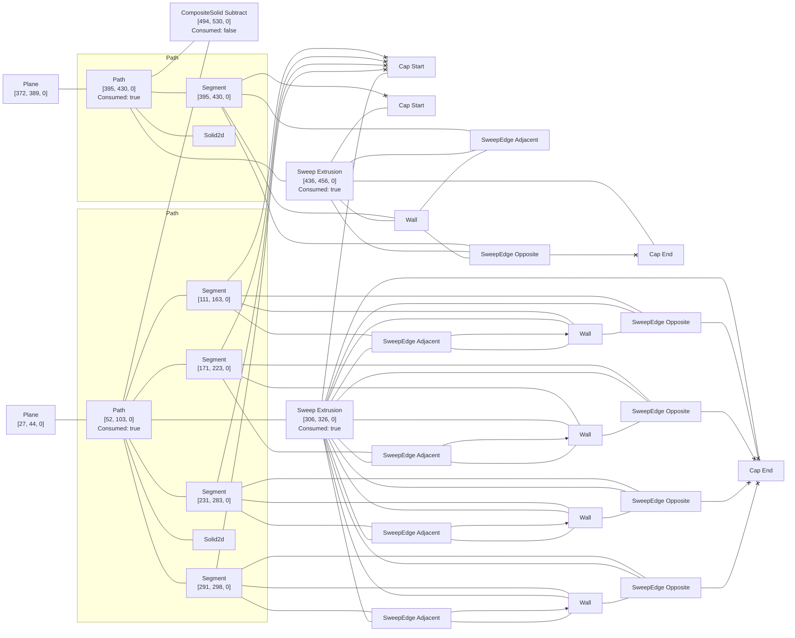

```mermaid
flowchart LR
  subgraph path7 [Path]
    7["Path<br>[52, 103, 0]<br>Consumed: true"]
      %% [ProgramBodyItem { index: 0 }, VariableDeclarationDeclaration, VariableDeclarationInit, FunctionExpressionBody, FunctionExpressionBodyItem { index: 0 }, ReturnStatementArg, PipeBodyItem { index: 1 }]
    10["Segment<br>[111, 163, 0]"]
      %% [ProgramBodyItem { index: 0 }, VariableDeclarationDeclaration, VariableDeclarationInit, FunctionExpressionBody, FunctionExpressionBodyItem { index: 0 }, ReturnStatementArg, PipeBodyItem { index: 2 }]
    11["Segment<br>[171, 223, 0]"]
      %% [ProgramBodyItem { index: 0 }, VariableDeclarationDeclaration, VariableDeclarationInit, FunctionExpressionBody, FunctionExpressionBodyItem { index: 0 }, ReturnStatementArg, PipeBodyItem { index: 3 }]
    12["Segment<br>[231, 283, 0]"]
      %% [ProgramBodyItem { index: 0 }, VariableDeclarationDeclaration, VariableDeclarationInit, FunctionExpressionBody, FunctionExpressionBodyItem { index: 0 }, ReturnStatementArg, PipeBodyItem { index: 4 }]
    13["Segment<br>[291, 298, 0]"]
      %% [ProgramBodyItem { index: 0 }, VariableDeclarationDeclaration, VariableDeclarationInit, FunctionExpressionBody, FunctionExpressionBodyItem { index: 0 }, ReturnStatementArg, PipeBodyItem { index: 5 }]
    16[Solid2d]
  end
  subgraph path6 [Path]
    6["Path<br>[395, 430, 0]<br>Consumed: true"]
      %% [ProgramBodyItem { index: 2 }, VariableDeclarationDeclaration, VariableDeclarationInit, PipeBodyItem { index: 1 }]
    14["Segment<br>[395, 430, 0]"]
      %% [ProgramBodyItem { index: 2 }, VariableDeclarationDeclaration, VariableDeclarationInit, PipeBodyItem { index: 1 }]
    15[Solid2d]
  end
  8["Plane<br>[27, 44, 0]"]
    %% [ProgramBodyItem { index: 0 }, VariableDeclarationDeclaration, VariableDeclarationInit, FunctionExpressionBody, FunctionExpressionBodyItem { index: 0 }, ReturnStatementArg, PipeBodyItem { index: 0 }]
  17["Sweep Extrusion<br>[306, 326, 0]<br>Consumed: true"]
    %% [ProgramBodyItem { index: 0 }, VariableDeclarationDeclaration, VariableDeclarationInit, FunctionExpressionBody, FunctionExpressionBodyItem { index: 0 }, ReturnStatementArg, PipeBodyItem { index: 6 }]
  29[Wall]
    %% face_code_ref=Missing NodePath
  30[Wall]
    %% face_code_ref=Missing NodePath
  31[Wall]
    %% face_code_ref=Missing NodePath
  32[Wall]
    %% face_code_ref=Missing NodePath
  3["Cap Start"]
    %% face_code_ref=Missing NodePath
  1["Cap End"]
    %% face_code_ref=Missing NodePath
  24["SweepEdge Opposite"]
  19["SweepEdge Adjacent"]
  25["SweepEdge Opposite"]
  20["SweepEdge Adjacent"]
  26["SweepEdge Opposite"]
  21["SweepEdge Adjacent"]
  27["SweepEdge Opposite"]
  22["SweepEdge Adjacent"]
  9["Plane<br>[372, 389, 0]"]
    %% [ProgramBodyItem { index: 2 }, VariableDeclarationDeclaration, VariableDeclarationInit, PipeBodyItem { index: 0 }]
  18["Sweep Extrusion<br>[436, 456, 0]<br>Consumed: true"]
    %% [ProgramBodyItem { index: 2 }, VariableDeclarationDeclaration, VariableDeclarationInit, PipeBodyItem { index: 2 }]
  33[Wall]
    %% face_code_ref=Missing NodePath
  4["Cap Start"]
    %% face_code_ref=Missing NodePath
  2["Cap End"]
    %% face_code_ref=Missing NodePath
  28["SweepEdge Opposite"]
  23["SweepEdge Adjacent"]
  5["CompositeSolid Subtract<br>[494, 530, 0]<br>Consumed: false"]
    %% [ProgramBodyItem { index: 3 }, VariableDeclarationDeclaration, VariableDeclarationInit]
  17 --- 1
  24 <--x 1
  25 <--x 1
  26 <--x 1
  27 <--x 1
  18 --- 2
  28 <--x 2
  10 <--x 3
  11 <--x 3
  12 <--x 3
  13 <--x 3
  17 --- 3
  14 <--x 4
  18 --- 4
  6 --- 5
  7 --- 5
  9 --- 6
  6 --- 14
  6 --- 15
  6 ---- 18
  8 --- 7
  7 --- 10
  7 --- 11
  7 --- 12
  7 --- 13
  7 --- 16
  7 ---- 17
  10 --- 19
  10 --- 24
  10 --- 29
  11 --- 20
  11 --- 25
  11 --- 30
  12 --- 21
  12 --- 26
  12 --- 31
  13 --- 22
  13 --- 27
  13 --- 32
  14 --- 23
  14 --- 28
  14 --- 33
  17 --- 19
  17 --- 20
  17 --- 21
  17 --- 22
  17 --- 24
  17 --- 25
  17 --- 26
  17 --- 27
  17 --- 29
  17 --- 30
  17 --- 31
  17 --- 32
  18 --- 23
  18 --- 28
  18 --- 33
  29 --- 19
  19 x--> 29
  30 --- 20
  20 x--> 30
  31 --- 21
  21 x--> 31
  32 --- 22
  22 x--> 32
  33 --- 23
  29 --- 24
  30 --- 25
  31 --- 26
  32 --- 27
  33 --- 28
```
