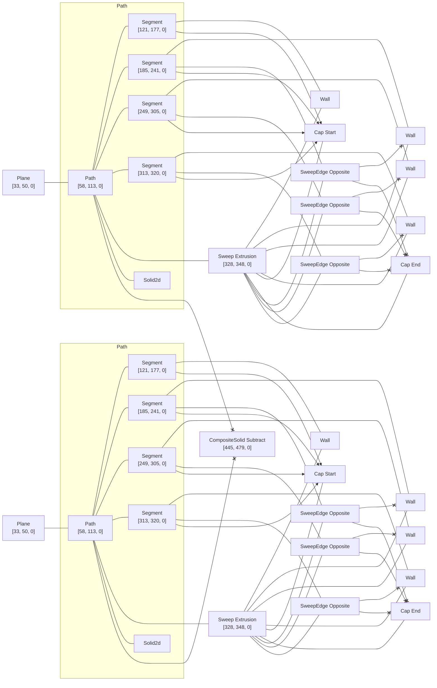

```mermaid
flowchart LR
  subgraph path2 [Path]
    2["Path<br>[58, 113, 0]"]
    3["Segment<br>[121, 177, 0]"]
    4["Segment<br>[185, 241, 0]"]
    5["Segment<br>[249, 305, 0]"]
    6["Segment<br>[313, 320, 0]"]
    7[Solid2d]
  end
  subgraph path19 [Path]
    19["Path<br>[58, 113, 0]"]
    20["Segment<br>[121, 177, 0]"]
    21["Segment<br>[185, 241, 0]"]
    22["Segment<br>[249, 305, 0]"]
    23["Segment<br>[313, 320, 0]"]
    24[Solid2d]
  end
  1["Plane<br>[33, 50, 0]"]
  8["Sweep Extrusion<br>[328, 348, 0]"]
  9[Wall]
  10[Wall]
  11[Wall]
  12[Wall]
  13["Cap Start"]
  14["Cap End"]
  15["SweepEdge Opposite"]
  16["SweepEdge Opposite"]
  17["SweepEdge Opposite"]
  18["Plane<br>[33, 50, 0]"]
  25["Sweep Extrusion<br>[328, 348, 0]"]
  26[Wall]
  27[Wall]
  28[Wall]
  29[Wall]
  30["Cap Start"]
  31["Cap End"]
  32["SweepEdge Opposite"]
  33["SweepEdge Opposite"]
  34["SweepEdge Opposite"]
  35["CompositeSolid Subtract<br>[445, 479, 0]"]
  1 --- 2
  2 --- 3
  2 --- 4
  2 --- 5
  2 --- 6
  2 ---- 8
  2 --- 7
  3 --- 9
  3 x--> 13
  4 --- 10
  4 --- 15
  4 x--> 13
  5 --- 11
  5 --- 16
  5 x--> 13
  6 --- 12
  6 --- 17
  6 x--> 13
  8 --- 9
  8 --- 10
  8 --- 11
  8 --- 12
  8 --- 13
  8 --- 14
  8 --- 15
  8 --- 16
  8 --- 17
  15 <--x 10
  15 <--x 14
  16 <--x 11
  16 <--x 14
  17 <--x 12
  17 <--x 14
  18 --- 19
  19 --- 20
  19 --- 21
  19 --- 22
  19 --- 23
  19 ---- 25
  19 --- 24
  20 --- 26
  20 x--> 30
  21 --- 27
  21 --- 32
  21 x--> 30
  22 --- 28
  22 --- 33
  22 x--> 30
  23 --- 29
  23 --- 34
  23 x--> 30
  25 --- 26
  25 --- 27
  25 --- 28
  25 --- 29
  25 --- 30
  25 --- 31
  25 --- 32
  25 --- 33
  25 --- 34
  32 <--x 27
  32 <--x 31
  33 <--x 28
  33 <--x 31
  34 <--x 29
  34 <--x 31
  2 <--x 35
  19 <--x 35
```
