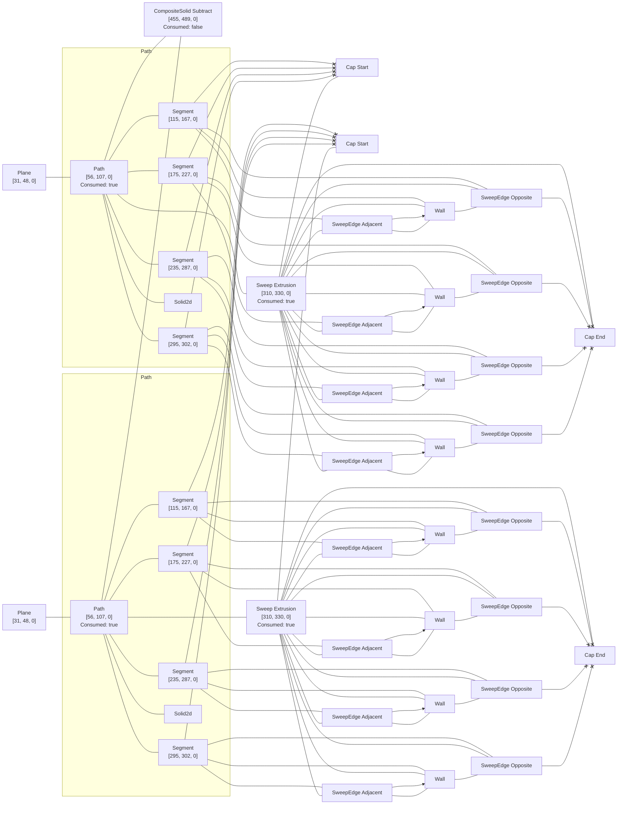

```mermaid
flowchart LR
  subgraph path6 [Path]
    6["Path<br>[56, 107, 0]<br>Consumed: true"]
      %% [ProgramBodyItem { index: 0 }, VariableDeclarationDeclaration, VariableDeclarationInit, FunctionExpressionBody, FunctionExpressionBodyItem { index: 0 }, ReturnStatementArg, PipeBodyItem { index: 1 }]
    10["Segment<br>[115, 167, 0]"]
      %% [ProgramBodyItem { index: 0 }, VariableDeclarationDeclaration, VariableDeclarationInit, FunctionExpressionBody, FunctionExpressionBodyItem { index: 0 }, ReturnStatementArg, PipeBodyItem { index: 2 }]
    12["Segment<br>[175, 227, 0]"]
      %% [ProgramBodyItem { index: 0 }, VariableDeclarationDeclaration, VariableDeclarationInit, FunctionExpressionBody, FunctionExpressionBodyItem { index: 0 }, ReturnStatementArg, PipeBodyItem { index: 3 }]
    14["Segment<br>[235, 287, 0]"]
      %% [ProgramBodyItem { index: 0 }, VariableDeclarationDeclaration, VariableDeclarationInit, FunctionExpressionBody, FunctionExpressionBodyItem { index: 0 }, ReturnStatementArg, PipeBodyItem { index: 4 }]
    16["Segment<br>[295, 302, 0]"]
      %% [ProgramBodyItem { index: 0 }, VariableDeclarationDeclaration, VariableDeclarationInit, FunctionExpressionBody, FunctionExpressionBodyItem { index: 0 }, ReturnStatementArg, PipeBodyItem { index: 5 }]
    18[Solid2d]
  end
  subgraph path7 [Path]
    7["Path<br>[56, 107, 0]<br>Consumed: true"]
      %% [ProgramBodyItem { index: 0 }, VariableDeclarationDeclaration, VariableDeclarationInit, FunctionExpressionBody, FunctionExpressionBodyItem { index: 0 }, ReturnStatementArg, PipeBodyItem { index: 1 }]
    11["Segment<br>[115, 167, 0]"]
      %% [ProgramBodyItem { index: 0 }, VariableDeclarationDeclaration, VariableDeclarationInit, FunctionExpressionBody, FunctionExpressionBodyItem { index: 0 }, ReturnStatementArg, PipeBodyItem { index: 2 }]
    13["Segment<br>[175, 227, 0]"]
      %% [ProgramBodyItem { index: 0 }, VariableDeclarationDeclaration, VariableDeclarationInit, FunctionExpressionBody, FunctionExpressionBodyItem { index: 0 }, ReturnStatementArg, PipeBodyItem { index: 3 }]
    15["Segment<br>[235, 287, 0]"]
      %% [ProgramBodyItem { index: 0 }, VariableDeclarationDeclaration, VariableDeclarationInit, FunctionExpressionBody, FunctionExpressionBodyItem { index: 0 }, ReturnStatementArg, PipeBodyItem { index: 4 }]
    17["Segment<br>[295, 302, 0]"]
      %% [ProgramBodyItem { index: 0 }, VariableDeclarationDeclaration, VariableDeclarationInit, FunctionExpressionBody, FunctionExpressionBodyItem { index: 0 }, ReturnStatementArg, PipeBodyItem { index: 5 }]
    19[Solid2d]
  end
  8["Plane<br>[31, 48, 0]"]
    %% [ProgramBodyItem { index: 0 }, VariableDeclarationDeclaration, VariableDeclarationInit, FunctionExpressionBody, FunctionExpressionBodyItem { index: 0 }, ReturnStatementArg, PipeBodyItem { index: 0 }]
  20["Sweep Extrusion<br>[310, 330, 0]<br>Consumed: true"]
    %% [ProgramBodyItem { index: 0 }, VariableDeclarationDeclaration, VariableDeclarationInit, FunctionExpressionBody, FunctionExpressionBodyItem { index: 0 }, ReturnStatementArg, PipeBodyItem { index: 6 }]
  38[Wall]
    %% face_code_ref=Missing NodePath
  40[Wall]
    %% face_code_ref=Missing NodePath
  42[Wall]
    %% face_code_ref=Missing NodePath
  44[Wall]
    %% face_code_ref=Missing NodePath
  3["Cap Start"]
    %% face_code_ref=Missing NodePath
  1["Cap End"]
    %% face_code_ref=Missing NodePath
  30["SweepEdge Opposite"]
  22["SweepEdge Adjacent"]
  32["SweepEdge Opposite"]
  24["SweepEdge Adjacent"]
  34["SweepEdge Opposite"]
  26["SweepEdge Adjacent"]
  36["SweepEdge Opposite"]
  28["SweepEdge Adjacent"]
  9["Plane<br>[31, 48, 0]"]
    %% [ProgramBodyItem { index: 0 }, VariableDeclarationDeclaration, VariableDeclarationInit, FunctionExpressionBody, FunctionExpressionBodyItem { index: 0 }, ReturnStatementArg, PipeBodyItem { index: 0 }]
  21["Sweep Extrusion<br>[310, 330, 0]<br>Consumed: true"]
    %% [ProgramBodyItem { index: 0 }, VariableDeclarationDeclaration, VariableDeclarationInit, FunctionExpressionBody, FunctionExpressionBodyItem { index: 0 }, ReturnStatementArg, PipeBodyItem { index: 6 }]
  39[Wall]
    %% face_code_ref=Missing NodePath
  41[Wall]
    %% face_code_ref=Missing NodePath
  43[Wall]
    %% face_code_ref=Missing NodePath
  45[Wall]
    %% face_code_ref=Missing NodePath
  4["Cap Start"]
    %% face_code_ref=Missing NodePath
  2["Cap End"]
    %% face_code_ref=Missing NodePath
  31["SweepEdge Opposite"]
  23["SweepEdge Adjacent"]
  33["SweepEdge Opposite"]
  25["SweepEdge Adjacent"]
  35["SweepEdge Opposite"]
  27["SweepEdge Adjacent"]
  37["SweepEdge Opposite"]
  29["SweepEdge Adjacent"]
  5["CompositeSolid Subtract<br>[455, 489, 0]<br>Consumed: false"]
    %% [ProgramBodyItem { index: 3 }, VariableDeclarationDeclaration, VariableDeclarationInit]
  20 --- 1
  30 <--x 1
  32 <--x 1
  34 <--x 1
  36 <--x 1
  21 --- 2
  31 <--x 2
  33 <--x 2
  35 <--x 2
  37 <--x 2
  10 <--x 3
  12 <--x 3
  14 <--x 3
  16 <--x 3
  20 --- 3
  11 <--x 4
  13 <--x 4
  15 <--x 4
  17 <--x 4
  21 --- 4
  6 --- 5
  7 --- 5
  8 --- 6
  6 --- 10
  6 --- 12
  6 --- 14
  6 --- 16
  6 --- 18
  6 ---- 20
  9 --- 7
  7 --- 11
  7 --- 13
  7 --- 15
  7 --- 17
  7 --- 19
  7 ---- 21
  10 --- 22
  10 --- 30
  10 --- 38
  11 --- 23
  11 --- 31
  11 --- 39
  12 --- 24
  12 --- 32
  12 --- 40
  13 --- 25
  13 --- 33
  13 --- 41
  14 --- 26
  14 --- 34
  14 --- 42
  15 --- 27
  15 --- 35
  15 --- 43
  16 --- 28
  16 --- 36
  16 --- 44
  17 --- 29
  17 --- 37
  17 --- 45
  20 --- 22
  20 --- 24
  20 --- 26
  20 --- 28
  20 --- 30
  20 --- 32
  20 --- 34
  20 --- 36
  20 --- 38
  20 --- 40
  20 --- 42
  20 --- 44
  21 --- 23
  21 --- 25
  21 --- 27
  21 --- 29
  21 --- 31
  21 --- 33
  21 --- 35
  21 --- 37
  21 --- 39
  21 --- 41
  21 --- 43
  21 --- 45
  38 --- 22
  22 x--> 38
  39 --- 23
  23 x--> 39
  40 --- 24
  24 x--> 40
  41 --- 25
  25 x--> 41
  42 --- 26
  26 x--> 42
  43 --- 27
  27 x--> 43
  44 --- 28
  28 x--> 44
  45 --- 29
  29 x--> 45
  38 --- 30
  39 --- 31
  40 --- 32
  41 --- 33
  42 --- 34
  43 --- 35
  44 --- 36
  45 --- 37
```
