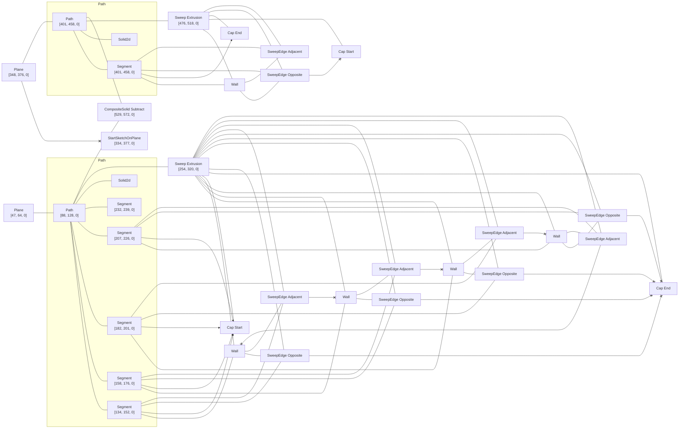

```mermaid
flowchart LR
  subgraph path4 [Path]
    4["Path<br>[88, 128, 0]"]
      %% [ProgramBodyItem { index: 1 }, VariableDeclarationDeclaration, VariableDeclarationInit, PipeBodyItem { index: 0 }]
    6["Segment<br>[134, 152, 0]"]
      %% [ProgramBodyItem { index: 1 }, VariableDeclarationDeclaration, VariableDeclarationInit, PipeBodyItem { index: 1 }]
    7["Segment<br>[158, 176, 0]"]
      %% [ProgramBodyItem { index: 1 }, VariableDeclarationDeclaration, VariableDeclarationInit, PipeBodyItem { index: 2 }]
    8["Segment<br>[182, 201, 0]"]
      %% [ProgramBodyItem { index: 1 }, VariableDeclarationDeclaration, VariableDeclarationInit, PipeBodyItem { index: 3 }]
    9["Segment<br>[207, 226, 0]"]
      %% [ProgramBodyItem { index: 1 }, VariableDeclarationDeclaration, VariableDeclarationInit, PipeBodyItem { index: 4 }]
    10["Segment<br>[232, 239, 0]"]
      %% [ProgramBodyItem { index: 1 }, VariableDeclarationDeclaration, VariableDeclarationInit, PipeBodyItem { index: 5 }]
    13[Solid2d]
  end
  subgraph path5 [Path]
    5["Path<br>[401, 458, 0]"]
      %% [ProgramBodyItem { index: 4 }, VariableDeclarationDeclaration, VariableDeclarationInit]
    11["Segment<br>[401, 458, 0]"]
      %% [ProgramBodyItem { index: 4 }, VariableDeclarationDeclaration, VariableDeclarationInit]
    12[Solid2d]
  end
  1["Plane<br>[47, 64, 0]"]
    %% [ProgramBodyItem { index: 0 }, VariableDeclarationDeclaration, VariableDeclarationInit]
  2["Plane<br>[348, 376, 0]"]
    %% [ProgramBodyItem { index: 3 }, VariableDeclarationDeclaration, VariableDeclarationInit, CallKwUnlabeledArg]
  3["StartSketchOnPlane<br>[334, 377, 0]"]
    %% [ProgramBodyItem { index: 3 }, VariableDeclarationDeclaration, VariableDeclarationInit]
  14["Sweep Extrusion<br>[254, 320, 0]"]
    %% [ProgramBodyItem { index: 2 }, VariableDeclarationDeclaration, VariableDeclarationInit]
  15["Sweep Extrusion<br>[476, 518, 0]"]
    %% [ProgramBodyItem { index: 5 }, VariableDeclarationDeclaration, VariableDeclarationInit]
  16["CompositeSolid Subtract<br>[529, 572, 0]"]
    %% [ProgramBodyItem { index: 6 }, VariableDeclarationDeclaration, VariableDeclarationInit]
  17[Wall]
    %% face_code_ref=Missing NodePath
  18[Wall]
    %% face_code_ref=Missing NodePath
  19[Wall]
    %% face_code_ref=Missing NodePath
  20[Wall]
    %% face_code_ref=Missing NodePath
  21[Wall]
    %% face_code_ref=Missing NodePath
  22["Cap Start"]
    %% face_code_ref=Missing NodePath
  23["Cap Start"]
    %% face_code_ref=Missing NodePath
  24["Cap End"]
    %% face_code_ref=Missing NodePath
  25["Cap End"]
    %% face_code_ref=Missing NodePath
  26["SweepEdge Opposite"]
  27["SweepEdge Opposite"]
  28["SweepEdge Opposite"]
  29["SweepEdge Opposite"]
  30["SweepEdge Opposite"]
  31["SweepEdge Adjacent"]
  32["SweepEdge Adjacent"]
  33["SweepEdge Adjacent"]
  34["SweepEdge Adjacent"]
  35["SweepEdge Adjacent"]
  1 --- 4
  2 <--x 3
  2 --- 5
  4 --- 6
  4 --- 7
  4 --- 8
  4 --- 9
  4 --- 10
  4 --- 13
  4 ---- 14
  4 --- 16
  5 --- 11
  5 --- 12
  5 ---- 15
  5 --- 16
  6 --- 20
  6 x--> 22
  6 --- 26
  6 --- 31
  7 --- 18
  7 x--> 22
  7 --- 27
  7 --- 32
  8 --- 17
  8 x--> 22
  8 --- 28
  8 --- 33
  9 --- 19
  9 x--> 22
  9 --- 29
  9 --- 34
  11 --- 21
  11 x--> 25
  11 --- 30
  11 --- 35
  14 --- 17
  14 --- 18
  14 --- 19
  14 --- 20
  14 --- 22
  14 --- 24
  14 --- 26
  14 --- 27
  14 --- 28
  14 --- 29
  14 --- 31
  14 --- 32
  14 --- 33
  14 --- 34
  15 --- 21
  15 --- 23
  15 --- 25
  15 --- 30
  15 --- 35
  17 --- 28
  32 <--x 17
  17 --- 33
  18 --- 27
  31 <--x 18
  18 --- 32
  19 --- 29
  33 <--x 19
  19 --- 34
  20 --- 26
  20 --- 31
  34 <--x 20
  21 --- 30
  21 --- 35
  30 <--x 23
  26 <--x 24
  27 <--x 24
  28 <--x 24
  29 <--x 24
```
